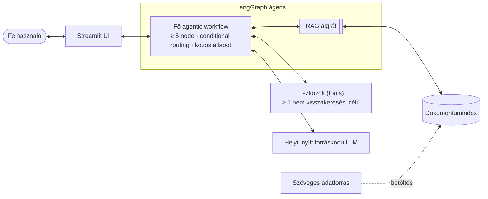

# Agentic RAG Chatbot – Proof of Concept

[English](README.md) | **Magyar**

Agentic RAG (Retrieval-Augmented Generation) alapú chatbot prototípus Pythonban – [LangGraph](https://github.com/langchain-ai/langgraph) frameworkkel, helyben futó, nyílt forráskódú LLM-mel és [Streamlit](https://streamlit.io/) felülettel, Dockerrel teljesen konténerizálva.

> **Állapot:** kész (2026. 10. 03.): a [felépítési sorrend](docs/project-structure-plan.hu.md#8-felépítési-sorrend) minden fázisa elkészült. [Frontend fejlesztői asszisztens](#problémafelvetés-és-motiváció) az MDN, a React, a Vue, a Next.js, a Nuxt és a TypeScript hivatalos dokumentációja felett, három nem visszakeresési eszközzel (a [projektstruktúra-terv](docs/project-structure-plan.hu.md) 8–9. döntése): az `agentic-rag ingest --download` rögzített commitokról letölti a dokumentációt, megtisztítja, feldarabolja, és felépíti belőle a vektorindexet; a RAG algráf a kérdést angol keresőkifejezéssé alakítja, visszakeresi és szűri a chunkokat, és hivatkozásokkal ellátott kontextust ad vissza; a fő workflow minden kérdést a megfelelő útra irányít, az összetetteket párhuzamos keresésekre és eszközhívásokra bontja (kontraszt, specificitás, böngészőtámogatás), hivatkozott választ ír, és ellenőrzi azt; a Streamlit UI élőben mutatja a lépéseket, minden keresés alatt a RAG algráf lépéseit, valamint a válasz forrásait; a `docker compose up --build` friss klónból elindítja a teljes stacket, és magától letölti a modellt és a korpuszt, valamint felépíti az indexet. Egy 17 kérdéses funkcionális értékelés méri a routingot, a visszakeresést, a válaszok helyességét és hűségét, egy terheléses teszt pedig megtalálja a szűk keresztmetszetet (lásd [Értékelés](#értékelés)). A CI minden pushnál lefuttatja a lintet, az offline teszteket és a képfájl buildjét.

> **RAG-megbízhatósági frissítés (2026. 10. 04.):** a hibrid BM25/vektoros keresés 20 jelöltet vizsgál, és legfeljebb négy releváns chunkot tart meg. Ha az ellenőrzés válasza olvashatatlan, a piszkozat nem jelenik meg; a pontos, egyetlen eszközös válaszok két modellhívást megspórolnak. A hivatkozások a forrásukra mutatnak, és újraindexelés után az indexelt pillanatkép adatait is mutatják. Az értékelést egy külön, 24 kérdéses holdout-készlet és egy teljes-bizonyíték (complete evidence) metrika bővíti. Újramérve ugyanazokkal a modellekkel, mint a 10. 03-i alapmérés: a visszakeresési hit@4 0,90 → 1,00, a hűség 0,94 → 1,00, a helyesség a korábbi 0,91 (az elvesztett két félpont a bíró hibája), az áteresztőképesség változatlan; a holdout megmutatja, hol hibázik még a rendszer (lásd [Értékelés](#értékelés)). Részletek és átállás: [docs/rag-improvements.md](docs/rag-improvements.md) (angolul).

## Tartalom

1. [Áttekintés](#áttekintés)
2. [A feladat követelményei](#a-feladat-követelményei)
3. [Problémafelvetés és motiváció](#problémafelvetés-és-motiváció)
4. [Rendszerarchitektúra](#rendszerarchitektúra)
5. [Tervezési döntések](#tervezési-döntések)
6. [Értékelés](#értékelés)
7. [Telepítés és futtatás](#telepítés-és-futtatás)
8. [Projektstruktúra](#projektstruktúra)
9. [Licenc](#licenc)

## Áttekintés

A cél egy működőképes, jól dokumentált és reprodukálható prototípus, amely bemutatja:

- **az agentic workflow tervezését LangGraph-ban** – autonóm döntéshozatal feltételes elágazással (conditional routing), az összetett kérések részfeladatokra bontása és azok önálló végrehajtása, valamint a köztes eredmények explicit állapotkezelése;
- **egy moduláris RAG alrendszert** – dedikált LangGraph algráf (subgraph), amelyet a fő workflow hív meg;
- **a visszakeresésen túlmutató eszközhasználatot** – legalább egy olyan eszköz (tool), amely többre képes a tudásbázisban való keresésnél;
- **a teljesen helyi futtatást** – nyílt forráskódú LLM, fizetős API-k nélkül;
- **a mérhető minőséget és teljesítményt** – mini értékelő készlet, valamint terheléses teszt a szűk keresztmetszet azonosításával.

**Technológiák:** Python, LangGraph, Streamlit, Docker / Docker Compose és egy helyben futó, nyílt forráskódú LLM (lásd: [Tervezési döntések](#tervezési-döntések)).

A projekt egy Medior AI Engineer pozícióra kiírt technikai feladat megoldása; az eredeti feladatkiírás a helyi, gitignore-olt `task/` mappában található.

## A feladat követelményei

A feladatkiírás egyes követelményeinek állapota:

**Probléma és adatforrás**

- [x] Valós probléma (domain / use case) választása, írásos indoklással
- [x] Szabadon választott szöveges adatforrás – a hangsúly a minőségi feldolgozáson és a skálázható adatintegráción van, nem a mennyiségen

**Agentic architektúra (LangGraph)**

- [x] Legalább 5 node-ból álló agentic workflow
- [x] Autonóm döntéshozatal (pl. conditional routing)
- [x] Részfeladatokra bontás és önálló végrehajtás
- [x] Állapotkezelés a köztes eredmények tárolására
- [x] Legalább 2 eszköz (tool), amelyek közül legalább egy nem pusztán visszakeresési célú
- [x] Dedikált, moduláris RAG algráf (subgraph), amely a fő workflow-ból hívható (nem számít bele a node-ok számába)

**Modell, UI és futtatási környezet**

- [x] A helyi erőforrásokhoz illeszkedő, nyílt forráskódú LLM (fizetős API-k nélkül), a trade-offok indoklásával
- [x] Streamlit prototípus UI, amely bemutatja az ágens működésének főbb lépéseit és a RAG folyamat eredményét
- [x] Konténerizálás: `Dockerfile` (kötelező) és `docker-compose.yml` (több komponens esetén előny)

**Értékelés és teljesítmény**

- [x] Funkcionális értékelés egy 10–20 kérdésből álló mini készleten (egyetlen node-ra vagy a teljes workflow-ra)
- [x] Terheléses teszt 50–200 lekérdezéssel: alapvető latency metrikák, a fő szűk keresztmetszet azonosítása, 1–2 konkrét optimalizálási javaslat

**Dokumentáció**

- [x] Ez a README: a probléma és a célkitűzés, az architektúra és a tervezési döntések indoklása, az értékelés és a terheléses teszt eredményei, telepítési és futtatási útmutató

## Problémafelvetés és motiváció

**Use case: frontend fejlesztői asszisztens.** A chatbot a hivatalos dokumentáció alapján válaszol a webes frontend fejlesztés kérdéseire: HTML, CSS, JavaScript és TypeScript, akadálymentesség, valamint a React, a Vue, a Next.js és a Nuxt keretrendszer. A konkrét tényeket determinisztikus eszközök ellenőrzik: a böngészőtámogatást, a színkontrasztot és a CSS specificitást. Az üzemeltetési bővítés (a Kubernetes és a Docker dokumentációja, manifest- és ütemezés-ellenőrzéssel) akkor következik, amikor a frontend rész már működik; ez forrásokat és eszközöket ad hozzá, nem új architektúrát.

- **Miért releváns a probléma?** A frontend tudás sok, gyorsan változó forrásban van szétszórva: a webplatform referenciájában (MDN), az egyes keretrendszerek és verzióik dokumentációjában, valamint az akadálymentességi irányelvekben. Az általános LLM-ek az ilyen kérdésekre gördülékenyen, de megbízhatatlanul válaszolnak. Kitalálnak API-kat, összekeverik a keretrendszer-verziókat (a Next.js Pages és App Routerét, a Nuxt 2-t és a mostani Nuxtot), valamint az azonos nevű API-kat (a React `useState` hookját és a Nuxt `useState` composable-jét), és nem tudják megmondani, hogy egy funkció működik-e azokban a böngészőkben, amelyeket a projektnek támogatnia kell.
- **Milyen felhasználói igényt elégít ki?** A fejlesztőknek rövid, helyes, forrásra hivatkozó válasz kell, és pontos eredmény azokra a kérdésekre, amelyekre van ilyen: *működik-e a `:has()` Safari 15-ben?*, *megfelel-e ez a szürke szöveg a WCAG AA szintjének?*, *miért nem érvényesül ez a szabály?* Az asszisztens a hivatalos dokumentáció rögzített verzióiból válaszol, minden állítását forrással támasztja alá, és jelzi, ha a dokumentáció nem fedi le a kérdést.
- **Miért előnyös rá az agentic RAG megközelítés?** A valódi kérdések magyarázatot és ellenőrzést kevernek, és gyakran több keretrendszert érintenek, ezért egyetlen „visszakeresés, majd generálás” lépés nem elég:
  - egy olyan kérés, mint a *Hogyan kérek le adatot szerveroldalon Next.js-ben és Nuxtban, és mi a különbség?*, keretrendszerenként egy-egy visszakeresésre bomlik, ezek párhuzamosan futnak, és egyetlen összehasonlításban állnak össze;
  - amit ki lehet számolni, azt egy eszköz számolja ki, nem a modell találgatja: a `#777777` színű szöveg kontrasztaránya fehér háttéren 4,47:1, éppen az AA szinthez szükséges 4,5:1 alatt, és ezt a különbséget egy modell könnyen eltéveszti;
  - az ellenőrző lépés a visszakeresett dokumentációhoz méri a választervezetet, és újratervez, ha a tervezet nincs alátámasztva; így a kitalált API-k még azelőtt kiszűrődnek, hogy a felhasználóhoz érnének.

## Rendszerarchitektúra

Magas szintű célarchitektúra:



| Komponens | Szerep |
|---|---|
| Streamlit UI | Chatfelület, amely megjeleníti az ágens lépéseit és a visszakeresett forrásokat |
| Fő agentic workflow | Megtervezi, irányítja és végrehajtja a részfeladatokat; a köztes eredményeket a gráf állapotában tárolja |
| RAG algráf | Moduláris visszakeresési folyamat a dokumentumindex felett, a fő workflow-ból hívva |
| Eszközök (tools) | A visszakeresésen túlmutató képességek – legalább egy nem visszakeresési célú eszköz |
| Helyi LLM | Helyben kiszolgált, nyílt forráskódú modell, fizetős API-k nélkül |
| Dokumentumindex | A választott szöveges adatforrás feldarabolt (chunking) és beágyazott (embedding) dokumentumai |

Ami már elkészült:

- **Adatbetöltési folyamat:** `data/sources.toml` → ritkított git-letöltés rögzített commitokról → a dialektusok tisztítása, H2/H3 szakaszonként egy dokumentum → szerkezetkövető chunkok kontextussorral → Chroma, amely csak az új vagy megváltozott chunkokat ágyazza be.
- **RAG algráf** (`rewrite_query` → `retrieve` → `grade_documents` → `build_context`, lineáris): a chatmodell a kérdést egyetlen angol keresőkifejezéssé alakítja; a Chroma és egy helyi BM25 kulcsszavas index rangsorolja a chunkokat, a reciprok rangfúzió (reciprocal-rank fusion) pedig `RETRIEVAL_CANDIDATES` (20) jelöltet tart meg; egy pontszámküszöb a csak vektoros találatokra és egyetlen LLM-es értékelőhívás kiszűri a nem relevánsakat, a maradékból legfeljebb `TOP_K` (4) chunk `[1]`, `[2]`, … hivatkozásjelekkel ellátott kontextus és a hozzájuk tartozó források lesznek. Minden lépés egy trace-eseményt rögzít az időtartamával és egysoros összefoglalóval.

- **Fő workflow** (hét node): az `analyze_request` besorolja az üzenetet (`direct`, `single`, `tool`, `complex`); egy egyszerű kérdés egyetlen keresésre, egy eszközkérdés egyetlen eszközhívásra, egy összetett pedig a `plan_subtasks` lépéshez kerül, amely legfeljebb öt független részfeladatot tervez, ezeket a LangGraph párhuzamosan futtatja (`Send`); a `synthesize_answer` az eredményekből hivatkozott választ ír (egyetlen sikeres determinisztikus eszközhívás után nem hív modellt, és az ellenőrzés is elmarad: a válasz maga a pontos eszközkimenet), a `verify_answer` ellenőrzi, és legfeljebb `MAX_RETRIES` alkalommal újratervezi a hiányzó részt (ha az ellenőrzés válasza olvashatatlan, a piszkozat nem jelenik meg), a `finalize_response` pedig visszaadja a választ, a számozott forrásokat és az eszközök szó szerinti kimenetét.
- **Eszközök:** `search_knowledge_base` (a RAG algráf), `check_contrast` (WCAG 2.2 kontraszt), `css_specificity` (Selectors Level 4) és `browser_support` (MDN browser-compat-data, rögzített verzió).

A részletes tervezés (a hét fő node és a routing, a RAG algráf négy lépése a promptokkal és a küszöbökkel, az adatbetöltési folyamat, az eszközök), az állapotsémák a kód jelenlegi állapota szerint, a modulokon átívelő szerződések (függőséginjektálás, végrehajtási modell, trace-események, az újratervezési ciklus, a hivatkozások számozása, hibák és kilépési kódok), valamint a konfigurációs referencia a [docs/architecture.md](docs/architecture.md) fájlban található (angolul).

> Tipp: az `uv run agentic-rag export-graph` Mermaid formátumban kiírja mindkét lefordított (compiled) gráfot (a `graph.get_graph(xray=True).draw_mermaid()` segítségével); a [docs/architecture.md](docs/architecture.md) diagramjai így készülnek. A RAG algráf külön diagramot kap: a fő workflow a `run_rag_subtask` node-on belül, a `search_knowledge_base` eszközön keresztül hívja, ahol az `xray=True` nem bontja ki.

## Tervezési döntések

A [projektstruktúra-terv](docs/project-structure-plan.hu.md#3-a-váz-elkészítése-előtt-eldöntendő-kérdések) 1–7. döntése beépült a kódba. A 8–9. döntés, a domain és a nem visszakeresési eszközök, 2026. 10. 02-án született meg: a korpusz és a betöltése (2. fázis), valamint az eszközök (4. fázis) elkészültek. Az LLM és az embedding modell (4. és 5. döntés), valamint a darabolás paraméterei ideiglenesek, amíg az értékelés és a terheléses teszt meg nem méri őket.

| Terület | Fő szempontok (trade-offok) | Választás és indoklás |
|---|---|---|
| Domain és adatforrás | Relevancia, elérhetőség és licenc, előfeldolgozási igény | **Frontend fejlesztői asszisztens** a hivatalos dokumentáció felett (2. fázis): MDN Web Docs (válogatott rész a CSS-ről, a HTML-ről, az akadálymentességről és a JavaScriptről; a szöveg CC BY-SA 2.5, a kódpéldák CC0), React (CC BY 4.0), Vue (CC BY 4.0), Next.js (MIT), Nuxt (MIT) és a TypeScript Handbook (CC BY 4.0). Az `agentic-rag ingest --download` rögzített commitokról tölti le őket, a `data/sources.toml` listája alapján: minden futás ugyanazokat a verziókat indexeli, és a repositoryba nem kerül share-alike licencű szöveg. A dokumentáció verziózott, strukturált, és azokat a kérdéseket fedi le, amelyeket a fejlesztők ténylegesen feltesznek. Az üzemeltetési bővítés (Kubernetes, CC BY 4.0; Docker, Apache 2.0) két újabb bejegyzés ugyanebben a listában |
| Nem visszakeresési eszközök | Illeszkedés a domainhez; determinisztikus, helyi és tesztelhető | **Három eszköz** (4. fázis), `browser_support`, `check_contrast` és `css_specificity`: a *böngészőtámogatás* az MDN `browser-compat-data` adatbázisában (CC0; a korpuszhoz hasonlóan rögzített commitról töltődik le, `index = false` forrásként) keres meg egy funkciót, feloldja a BCD `mirror` állításait, és a verzióit a célböngészőkhöz hasonlítja; a *színkontraszt* kiszámolja két szín WCAG 2.x szerinti kontrasztarányát, és hogy megfelel-e az AA és az AAA szintnek normál és nagy szövegméretnél; a *CSS specificitás* a Selectors Level 4 szabályai szerint kiszámolja a szelektorok specificitását, és megmondja, melyik érvényesül. Mindegyik számítás vagy rögzített adatban való keresés, ezért pontosan tesztelhető, és olyan tényeket ad a modellnek, amelyeket az különben találgatna |
| Csomagkezelés és Python-verzió | Reprodukálható build, az ML stack wheel-lefedettsége, beüzemelési igény | **uv** (`pyproject.toml` + `uv.lock`), **Python 3.12**, `src/` elrendezés: a lock fájl minden csomagot rögzít a helyi futtatáshoz és a képfájlhoz egyaránt, az uv maga telepíti a rögzített Pythont, és a 3.12-höz érhető el a legszélesebb wheel-lefedettség a torch és a chromadb számára |
| LLM | Válaszminőség vs. válaszidő vs. memóriaigény (RAM/VRAM); eszközhívás (tool calling) támogatása; licenc | **`qwen3.5:4b` kikapcsolt gondolkodó móddal** (`OLLAMA_REASONING=false`), az értékelés és a terheléses teszt alapján: többnyelvű, Apache 2.0 licencű modell, 4 biten 3,4 GB, így bőven elfér a fejlesztői gép 8 GB-os VRAM-jában. Az ideiglenes `qwen2.5:7b-instruct`-hoz képest minden értékelő kérdést jól irányít (1,00 a 0,88 helyett), jobban válaszol magyarul (helyesség 0,90 a 0,80 helyett), és minden futásban ugyanazt az eredményt adja; négy egyidejű felhasználónál 28%-kal több kérést szolgál ki percenként, 39%-kal kisebb p95-tel. A gondolkodó módja kikapcsolva marad: minden hívást kb. tízszer lassabbá tett, jobb válaszok nélkül. Kompromisszum: az Ollama nem köteg-feldolgozza a hibrid architektúráját, ezért párhuzamos slotokkal a 7B-s transzformer jobban skálázódik több felhasználóra ([docs/performance.md](docs/performance.md), angolul) |
| LLM kiszolgálás | Beüzemelési igény, konténerizálhatóság, áteresztőképesség | **Ollama** (Compose szolgáltatásként vagy a gépen futtatva) és egy **szkriptelt fake provider**: az Ollama HTTP API-t és GPU-támogatást ad anélkül, hogy bármit a képfájlba kellene fordítani; a fake (`LLM_PROVIDER=fake`) a feladatkiírás szerinti dummy LLM, és modell nélkül tartja a teszteket |
| Eszközhívás módja | Megbízhatóság kis helyi modellekkel vs. a natív eszközhívás rugalmassága | **Strukturált kimenetű tervező + explicit eszköz-node-ok**: a tervező tipizált részfeladatokat ad vissza JSON-ként, amit a kis helyi modellek megbízhatóbban állítanak elő, mint a natív eszközhívást; az eszközök LangChain toolok maradnak, így a `bind_tools` később is lehetséges |
| Embedding modell | Visszakeresési minőség vs. sebesség; nyelvi lefedettség | **`intfloat/multilingual-e5-small`**, ideiglenesen, helyben, sentence-transformers-szel futtatva: többnyelvű (a magyart is lefedi) és kicsi (384 dimenzió), így CPU-n fut, a GPU pedig az LLM-é marad |
| Visszakeresés és szűrés | Teljesség (recall) vs. pontosság; az extra LLM-hívások válaszideje; magyar kérdések angol korpusz felett | **Átírás, hibrid keresés, küszöb, LLM-es értékelés** (3. fázis; a RAG-megbízhatósági frissítés óta hibrid): a chatmodell minden kérdést egyetlen angol keresőkifejezéssé alakít (a többnyelvű embedding önmagában elvétette a magyar kérdéseket, lásd lent: *Nyelvek közötti visszakeresés*); a Chroma és ugyanazon chunkok feletti BM25 kulcsszavas index (SQLite FTS5, az első kereséskor a memóriában épül fel, extra modell nélkül) külön-külön rangsorolja a chunkokat, a reciprok rangfúzió pedig 20 jelöltet tart meg (`RETRIEVAL_CANDIDATES`); egy embedding-providerenkénti pontszámküszöb (E5-nél 0,83, az indexen mérve) kiszűri az egyértelműen idegen, csak vektoros találatokat; egyetlen strukturált kimenetű hívás együtt értékeli a maradék chunkokat, így visszakeresésenként egy LLM-hívás a költség, nem chunkonként egy (a `GRADE_WITH_LLM=false` kikapcsolja); legfeljebb `TOP_K` (4) releváns chunk marad. A kulcsszavas rangsor megtalálja azt az oldalt, amelyet a vektorok elvétettek (hit@4 0,90 → 1,00); a hosszabb jelöltlista lassítja az értékelőhívást. Qwen3.5-4B-vel, egyszerre egy kéréssel mérve: átírás 0,31 s (medián), értékelés 4 jelölttel 0,26 s, 20-szal 0,48 s, keresés 20 ms. A `HYBRID_SEARCH=false RETRIEVAL_CANDIDATES=4` visszaállítja a tisztán vektoros keresést |
| Vektoradatbázis | Perzisztencia, metaadat-alapú szűrés, skálázhatóság | **Chroma** perzisztens klienssel a `data/chroma_db/` könyvtárban (Compose-ban nevesített volume): perzisztencia és metaadat-alapú szűrés pickle-deszerializálás nélkül |
| Darabolás (chunking) | Chunkméret és átfedés vs. visszakeresési pontosság és kontextushossz | **Szerkezetkövető:** a loaderek minden oldalt a H2 és H3 fejléceinél vágnak szakaszokra, a fejlécláncból `section` metaadat lesz. A szakaszokat bekezdéshatárokon legfeljebb 900 karakteres chunkokba csomagoljuk; egy kódblokk 1800 karakterig egyben marad, egy fejléc soha nem zár le chunkot, a rövid záró bekezdések (legfeljebb 150 karakter) pedig a következő chunkban megismétlődnek. Minden chunk egy kontextussorral kezdődik: a cím és a fejlécek (`useState – React > Reference > useState(initialState)`), így egy *Parameters* chunk is megnevezi a tárgyát az embedding modellnek és a promptnak. Eredmény: 18 654 chunk 1160 oldalból, a medián 602 karakter. Az értékelés (7. fázis) ezekkel a méretekkel 0,90-es hit@4-et mért; egyetlen tévedése rangsorolási, nem darabolási hiba |

Megjegyzések az alapértelmezésekhez:

- **Modellek.** Az LLM-et az értékelés és a terheléses teszt alapján választottuk (4. döntés, fent). Az embedding modell az 5. döntés ideiglenes alapértelmezése marad: önmagában vele az értékelés mindkét nyelven 10-ből 9 kérdésnél találta meg a jó oldalt, egyetlen tévedését, egy rangsorolási hibát, pedig a RAG-megbízhatósági frissítés hibrid kulcsszavas keresése kijavítja (10-ből 10). A dokumentáció angol, a kérdések lehetnek magyarok vagy angolok, ezért az értékelő készlet magyar kérdéseket is tartalmaz az angol korpusz felett.
- **Modellbuildek.** Az értékelés és a terheléses teszt a `qwen3.5:4b` `2a654d98e6fb` buildjével (letöltve 2026. 08. 27-én) és a `hf.co/bartowski/Qwen2.5-7B-Instruct-GGUF:Q4_K_M` (`eb180556ed65`) bíróval futott. Az Ollama-tagek változhatnak: 2026. 10. 04-én egy friss `ollama pull qwen3.5:4b` – ahogy a Compose stack is teszi – a `d8b0f5e9760c` buildet töltötte le, amelyet külön vision projectorral csomagoltak újra; a füstteszt kérdésére helyesen válaszolt, de nem ez a mért build. Az `ollama list` megmutatja, melyik build van egy szerveren.
- **A korpusz terjedelme.** A keretrendszerek dokumentációja verziókat és elavult részeket is kever. A forráslista a jelenlegi útmutatókat és API-referenciákat tartja meg, például a Next.js App Routerét, és kihagyja a Pages Routert, a Nuxt Bridge-et, a migrációs útmutatókat és az MDN gyártóspecifikus szelektorait: összesen 1160 oldal (MDN 573, Nuxt 172, Next.js 165, React 151, Vue 80, TypeScript 19). Minden forrás saját könyvtárba kerül a `data/raw/` alatt (`mdn/`, `react/`, `vue/`, `nextjs/`, `nuxt/`, `typescript/`), és a neve minden oldal címéhez hozzákerül (`useState – React`, `useState – Nuxt`), így minden hivatkozásból látszik, melyik dokumentációból származik, és az azonos nevű API-k nem keverednek.
- **Tisztítás.** Minden dokumentáció a saját Markdown-dialektusában íródott. A loaderek az MDN makróit, a React és a Next.js JSX komponenseit, a Vue VitePress-konténereit és a Nuxt MDC komponenseit sima Markdownná alakítják, kihagyják a Next.js oldalak Pages Router blokkjait, a linkeket a szövegükre cserélik, a kódblokkokat pedig szó szerint megtartják (részletek: `src/agentic_rag/ingestion/markdown.py`).
- **Nyelvek közötti visszakeresés.** Egy első ellenőrzés a felépített indexen megerősíti, hogy egy angol korpusz feletti magyar kérdés kockázatos. Az angol kérdések megtalálják a megfelelő oldalt: a *Which CSS pseudo-class selects a parent element that contains a specific child?* kérdésre az MDN `:has()` oldala az első, a *How do I add state to a React component?* kérdésre pedig a `Component` és a `useState` állapotkezelési szakaszai jönnek. A *Hogyan kérek le adatot szerveroldalon Next.js App Routerben?* kérdésre viszont a *Fetching Data* oldal nincs az első három találat között. Ezért a RAG algráf `rewrite_query` lépése (3. fázis) minden kérdést angol keresőkifejezéssé alakít a visszakeresés előtt. Ezzel a kérdésből *How do I fetch data on the server in Next.js App Router?* lesz, és a *Fetching Data* oldalt találja meg; a *How do I create a dynamic route in the Next.js App Router?* kérdés, amely először egy React-oldalt hozott, *next.js app router dynamic route* lesz, és a *Dynamic Route Segments* oldalt találja meg. Az értékelés (7. fázis) több kérdésen is megerősíti: a magyar kérdések ugyanolyan gyakran találják meg a jó oldalt, mint az angolok.
- **Embedding.** A fizetős API-k tilalma kizárja a hosztolt embedding API-kat, ezért az embedding helyben fut. Az alapértelmezett modell egyszer töltődik le (kb. 0,5 GB, a Hugging Face cache-be, `HF_HOME`), utána offline működik; néhány másodperc alatt töltődik be, az E5 modellek `query:` / `passage:` előtagjait a kód automatikusan hozzáadja, és CPU-s torch-ot visz a képfájlba (a 2,9 GB-os képfájlból kb. 0,8 GB-ot). Az `EMBEDDING_PROVIDER=fake` determinisztikus, hash-elt szózsák- (bag-of-words) vektorokkal helyettesíti: offline és azonnali, de tisztán lexikális, ezért csak tesztekhez és modell nélküli bemutatókhoz való.
- **Az index újraépítése.** A különböző modellek vektorai nem összehasonlíthatók: az `EMBEDDING_PROVIDER` vagy az `EMBEDDING_MODEL` módosítása után az indexet újra kell építeni az `agentic-rag ingest --rebuild` paranccsal.

## Értékelés

### Funkcionális értékelés

**Készlet:** 17 kérdés a dokumentációról a [data/eval/questions.jsonl](data/eval/questions.jsonl) fájlban: 8 egyszerű keresés mind a hat forrásból, 3 többrészes kérdés, 4 eszközkérdés, egy köszönés és egy témán kívüli kérdés; közülük 5 magyarul. Mindegyikhez tartozik referenciaválasz, a választ tartalmazó dokumentumok és az elvárt útvonal ([data/eval/README.md](data/eval/README.md), angolul). Egy külön, 24 kérdéses **holdout-készlet**, a [data/eval/holdout.jsonl](data/eval/holdout.jsonl), kimarad a fejlesztésből: rögzített beszélgetési előzményű követő kérdések, magyar kérdések, keretrendszer szerint kétértelmű kérdések, verzióhatárok, egy nem létező API, valamint vegyes eszköz- és keresési kérések. A referenciaválaszai vázlatok, amelyeket szakértő még nem nézett át.

**Metrikák:** routing-pontosság, visszakeresési hit@4 (visszakeresési részfeladatonként, a szűrés után), teljes bizonyíték (complete evidence@4: egy összehasonlításnak minden keretrendszerre, amelyről kérdez, kell találat), valamint a válasz helyessége és hűsége (faithfulness), amelyet egy helyi LLM pontoz három ítélet egyikével (1, 0,5 vagy 0). Az `agentic-rag eval` a teljes gráfot futtatja, vagy egyetlen node-ot: `--node analyze_request` a routingot, `--node run_rag_subtask` a visszakeresést méri önmagában. Minden futás JSON-riportot és Markdown-összefoglalót ír a `data/eval/results/` mappába.

**Eredmények** (modellenként három futás átlaga, RTX 5070 Laptop GPU, minden futásban a Qwen2.5-7B a bíró):

| Modell | Routing | hit@4 | Helyesség | Hűség | Helyesség magyarul | Válaszidő mediánja |
|---|---|---|---|---|---|---|
| `qwen2.5:7b-instruct` (a korábbi alapértelmezett) | 0,88 | 0,90 | 0,88 | 0,91 | 0,80 | 8,4 s |
| `qwen3.5:4b`, gondolkodás nélkül (a 8. fázis óta alapértelmezett), 10. 03. | 1,00 | 0,90 | 0,91 | 0,94 | 0,90 | 12 s (a bíró miatti modellcserék növelik; a terheléses tesztben 3,6 s) |
| `qwen3.5:4b`, gondolkodással (egy futás) | 1,00 | 0,90 | 0,91 | 0,94 | 0,90 | 143 s |
| `qwen3.5:4b`, gondolkodás nélkül, **RAG-megbízhatósági frissítés**, 10. 04. | 1,00 | **1,00** | 0,91 | **1,00** | 0,90 | 13 s (ugyanígy növelve; a terheléses tesztben 3,9 s) |

A complete evidence@4 minden futásban 1,00, a frissítés előtt is (a tárolt rangsorokból újraszámolva): a tervező egy összehasonlítás minden keretrendszerének külön keresést ad. Egy Qwen3.5-konfiguráció három futása azonos pontszámot ad.

**Holdout** (egy futás, ugyanazokkal a modellekkel és bíróval): routing 0,94, hit@4 0,81, complete evidence@4 1,00, helyesség 0,67, hűség 0,73. Az 1 alatti pontszámú válaszok kézi átnézése három bírói hibát talál (két pontos eszközkimenet és egy helyes elutasítás kapott 0 pontot; nélkülük a helyesség 0,79), és olyan valódi hibákat, amelyeket a fejlesztési készlet nem vált ki: verzióhatáron átnyúló kérdésekre (Nuxt 2, a Next.js Pages Router) alá nem támasztott részletekkel felelt, egy keretrendszer szerint kétértelmű kérdésre visszakérdezés helyett egyetlen keretrendszerre válaszolt, hibásan magyarázta, hogyan köteg-feldolgozza a React az állapotfrissítéseket, és egy angol kérdésre magyarul válaszolt.

**Következtetések:**

- A workflow azt teszi, amire készült: a visszakeresés a fejlesztési készlet minden kérdésénél megtalálja a jó oldalt mindkét nyelven, a témán kívüli kérdést elutasítja, az eszközök pontos ítéletet adnak, amelyet minden válasz szó szerint is mutat.
- A korábbi alapértelmezett, 7B-s modell gyenge pontjai az eszközkérdések irányítása (ötből kettő keresésre vagy egyetlen eszközhívásra megy; ezeket az ellenőrzés többnyire kijavítja) és a magyar válaszok (0,12-vel kisebb helyesség és 0,20-szal kisebb hűség, mint angolul).
- A gondolkodás nélküli `qwen3.5:4b` mindkettőt kijavítja, és futásról futásra stabil; miután a terheléses teszt megerősítette, ez lett az alapértelmezés (4. döntés).
- A RAG-megbízhatósági frissítés minden pontszámot megtart, kettőt javít: a kulcsszavas rangsor megtalálja azt az oldalt, amelyet a vektorok elvétettek (hit@4 1,00; `HYBRID_SEARCH=false RETRIEVAL_CANDIDATES=4` mellett ugyanez a kód még elvéti), és minden válasz hű (1,00). A helyesség azért marad 0,91, mert a bíró két helyes választ fél ponttal értékelt: az egyik egy olyan részlettel bővül, amely szó szerint szerepel a Nuxt dokumentációjában, a másik a `browser_support` pontos kimenete.
- A holdout nehezebb a fejlesztési készletnél, és megmutatja a következő feladatokat: a verzióhatárokon átnyúló válaszok, a kétértelmű kérdéseknél a visszakérdezés és a válasz nyelve; a bírónak is óvatosan kell bánnia a rövid, pontos válaszokkal.
- Az értékelés előbb hibákat talált és javított: egy témán kívüli kérdés általános tudásból kapott választ, egy kétszínpáros kontrasztkérdés egy sikertelen eszközhívás után kitalált arányokat közölt, az eszközkimenetek hibás címkét kaptak, és a bíró mindezt jutalmazta.

A részletek a [docs/evaluation.md](docs/evaluation.md) fájlban vannak (angolul): a kérdésenkénti megfigyelések, a bíró kézi ellenőrzése (az első futás 17 ítéletéből 15-tel egyezik, és inkább szigorú; a frissítés utáni és a holdouton elkövetett tévedései is fel vannak sorolva), a javítások és a korlátok. Reprodukálás:

```bash
uv run agentic-rag eval                                         # teljes gráf, az OLLAMA_MODEL modellel és bíróval
uv run agentic-rag eval --target node --node analyze_request     # csak a routing
OLLAMA_MODEL=qwen3.5:4b OLLAMA_REASONING=false uv run agentic-rag eval --judge-model qwen2.5:7b-instruct
uv run agentic-rag eval --dataset data/eval/holdout.jsonl --judge-model qwen2.5:7b-instruct   # a holdout
```

### Terheléses teszt és a szűk keresztmetszet elemzése

**Módszer:** az `agentic-rag loadtest` az értékelő készlet kérdéseit sorban küldi a lefordított gráfnak, `--concurrency` számú szálból, amelyek mindegyike a `graph.invoke`-ot hívja; előbb három bemelegítő kérés fut, ezek külön szerepelnek. Minden futás JSON-riportot és Markdown-összefoglalót ír a `data/eval/results/` mappába: válaszidő (átlag, minimum, p50, p95, p99, maximum), áteresztőképesség, hibaarány és a node-onkénti válaszidő.

**Eredmények** (RTX 5070 Laptop GPU, az Ollama alapbeállításaival, ha nincs másképp jelölve, 100 kérés, ha nincs másképp jelölve; egyik futásban sem volt hiba):

| Futás | Párhuzamosság | Áteresztőképesség | p50 | p95 |
|---|---|---|---|---|
| Fake LLM és embedding (csak a keretrendszer) | 4 | 4520 / perc | 0,01 s | 0,06 s |
| `qwen2.5:7b-instruct` | 4 | 9,5 / perc | 20,2 s | 58,0 s |
| `qwen3.5:4b`, gondolkodás nélkül (alapértelmezett) | 4 | 12,2 / perc | 17,6 s | 35,4 s |
| `qwen3.5:4b`, egyszerre egy kérés (50 kérés) | 1 | 11,5 / perc | 3,6 s | 14,9 s |
| `qwen2.5:7b-instruct`, Ollama 4 párhuzamos slottal | 4 | 20,0 / perc | 10,3 s | 25,0 s |
| `qwen3.5:4b` LLM-alapú relevancia-pontozás nélkül | 4 | 10,7 / perc | 18,2 s | 41,4 s |
| `qwen3.5:4b`, **RAG-megbízhatósági frissítés** | 4 | 12,0 / perc | 20,4 s | 39,7 s |
| `qwen3.5:4b`, **RAG-megbízhatósági frissítés**, egyszerre egy kérés (50 kérés) | 1 | 11,7 / perc | 3,9 s | 12,9 s |

**Szűk keresztmetszet:** az LLM-következtetés egy olyan szerveren, amely egyszerre egy kérést szolgál ki. Egy kérés átlagosan 5,3 LLM-hívást tesz, ezek viszik az idő 99%-át; a visszakeresés 20 ms, az eszközök és a vezérlés ezredmásodpercek. Egy helyett négy egyidejű kérésnél az áteresztőképesség csak 6%-kal nő, a medián válaszidő viszont ötszörösére, mert minden hívás az Ollama sorában vár; a GPU végig dolgozik. A RAG-megbízhatósági frissítés nem mozdítja el a szűk keresztmetszetet: egy kérés 5,3 helyett kb. 4,7 LLM-hívást tesz, mert a pontos eszközválaszoknál elmarad a válaszírás és az ellenőrzés, az értékelőhívás viszont 4 helyett legfeljebb 20 jelöltet olvas. Egy felhasználónál a medián 3,9 s (korábban 3,6 s), a p95 12,9 s (14,9 s); négynél az áteresztőképesség változatlan (percenként 12,0 a 12,2 helyett), a medián viszont 16%-kal nő (20,4 s a 17,6 s helyett), mert a hosszabb promptok ugyanabban a sorban várnak.

**Javaslatok:**

1. **Párhuzamos dekódolási slotok egy köteg-feldolgozható modellel** (mérve): az `OLLAMA_NUM_PARALLEL=4` megduplázza a 7B-s transzformer áteresztőképességét (percenként 20,0 a 9,5 helyett), és 57%-kal csökkenti a p95-öt, VRAM árán; a Qwen3.5 hibrid architektúráját az Ollama nem köteg-feldolgozza, így nála a beállítás semmit nem változtat. Több felhasználós telepítésnél ezért a modellt a kiszolgáló réteggel együtt kell megválasztani (párhuzamos slotok, vagy folyamatos kötegelés nagyobb GPU-n).
2. **Kevesebb és rövidebb hívás a kritikus úton:** a válasz megírása a kiszolgálási idő fele, az ellenőrzés és az újratervezések egyötöde. A pontos eszközválaszok ellenőrzésének kihagyása már elkészült, és mérve is van: kérésenként 1,14 helyett 0,86 ellenőrzés, az értékelés eszközkérdései 9,5 s helyett kb. 7 s alatt futnak le. A válasz streamelése a UI-ba még nyitott. A jelöltkészlet az új mozgatórugó: egy kisebb `RETRIEVAL_CANDIDATES` rövidíti az értékelő promptot (még nincs mérve; a 4-es érték visszahozza a régi válaszidőt, de az elvétett oldalt is). A relevancia-pontozás elhagyása nem segít: mérve lassabb volt (percenként 10,7 a 12,2 helyett), mert több chunk kerül a válasz promptjába.

A node-onkénti bontás, a párhuzamos slotok mikro-mérése és a parancsok a [docs/performance.md](docs/performance.md) fájlban vannak (angolul). A fő futás reprodukálása:

```bash
uv run agentic-rag loadtest --requests 100 --concurrency 4
```

## Telepítés és futtatás

### Előfeltételek

- Git.
- Helyi fejlesztéshez [uv](https://docs.astral.sh/uv/getting-started/installation/); a Python 3.12-t is telepíti, ha hiányzik.
- A konténerekhez Docker és Docker Compose 2.24 vagy újabb (a `compose.yaml` az opcionális `env_file` szintaxist használja).
- Valódi válaszokhoz helyi LLM, amelyet az [Ollama](https://ollama.com/) szolgál ki: a Compose szolgáltatás vagy a gépre telepített Ollama. Az alapértelmezett modell, a `qwen3.5:4b` (4 bites, 3,4 GB, gondolkodás nélkül) bőven elfér egy 8 GB-os GPU-n, és CPU-n is fut, lassabban; egyszerre egy kéréssel egy RTX 5070 Laptop GPU-n 3,6 s volt a medián válaszidő. A korábbi alapértelmezett, 7B-s modellel a Compose stackben mérve: CPU-n az `ollama` konténer 7,7 GB RAM-ot használt, és 20–60 s alatt válaszolt; a GPU-s override-dal a meleg válaszok 3–10 s-ig tartottak. A fake módhoz nem kell sem modell, sem GPU.
- Lemezterület a teljes stackhez: az alkalmazás képfájlja (mérve 3,02 GB), az Ollama képfájlja (9,3 GB), a chatmodell (3,4 GB), az embedding modell, valamint a korpusz az indexével (együtt kb. 640 MB).

### Ami működik

A fejlesztői gépen végponttól végpontig ellenőrizve (Windows 11, 24 magos CPU, RTX 5070 Laptop GPU):

- a tesztek offline, a fake LLM-mel és a fake embeddinggel átmennek;
- a parancssori felület kilistázza a parancsait, a `config` kiírja az érvényes beállításokat;
- az `ingest --download` letölti a korpuszt és felépíti a vektorindexet, a sima `ingest` pedig szinkronban tartja az indexet a korpusszal. A fejlesztői gépen (24 magos CPU) mérve: a letöltés kb. 25 s, az első felépítés kb. 6 perc (a 18 654 chunk beágyazása az alapértelmezett modellel, CPU-n), egy ismételt `ingest` pedig 8 s, mert a változatlan chunkokat nem ágyazza be újra. Egy lekérdezés kb. 10 ms, miután a modell betöltődött (ez kb. 11 s);
- a RAG algráf az `invoke({"query": ...})` hívásra hivatkozásokkal ellátott kontextust és forrásokat ad vissza. Fake módban kihagyja a modellhívásokat, Ollamával átír és értékel (a korábbi alapértelmezett Qwen2.5-7B-Instruct modellel, laptop GPU-n mérve, lásd: *Tervezési döntések*). A korpuszon kívüli kérdésre, például a *What is the capital of France?* kérdésre üres kontextus a válasz;
- az `eval` a kérdéskészletet a gráfon vagy egy node-on futtatja, a `loadtest` pedig terhelés alatt küldi; mindkettő JSON-riportot és Markdown-összefoglalót ír, és kiírja az összefoglalót;
- a fő workflow válaszol: fake módban szkriptelt válaszokkal, amelyek minden útvonalat bejárnak (köszönés, egy keresés, két párhuzamos keresés, eszközhívás), Ollamával valódi válaszokkal. Az alapértelmezett `qwen3.5:4b` modellel, egyszerre egy kéréssel a medián 3,6 s (terheléses teszt); a korábbi alapértelmezett Qwen2.5-7B-Instruct modellel, laptop GPU-n, melegen mérve: közvetlen válasz 0,5–3 s, eszközkérdés 2–9 s, keresést igénylő kérdés 8–30 s (egy folyamat első keresése az embedding modellt is betölti, kb. 16 s); a részletek a [docs/architecture.md](docs/architecture.md#measured-with-ollama) fájlban;
- a Streamlit UI a fő workflow-t streameli: a lépéspanel minden lépést megmutat, amint elkészül, a párhuzamosakat LangGraph-lépés szerint csoportosítja, és minden keresés alatt felsorolja a RAG algráf lépéseit (az angol keresőkifejezést, a visszakeresett és a megtartott chunkokat); a visszakeresett kontextus panel a számozott forrásokat mutatja, mindegyiket az oldala linkjével. Az üres chat útvonalanként egy példakérdést kínál (egy keresés, egy magyarul feltett összehasonlítás, eszközönként egy kérdés), amelyek a fake LLM-mel is működnek. A hiányzó indexet, a más embeddinggel épített indexet, az elérhetetlen Ollamát és a le nem töltött modellt a chat a javítás módjával együtt elmagyarázza. A felhasználó által megállított futás a *Stopped before an answer was produced.* üzenetet kapja, az ágens az új kérdés mellett csak a korábbi megválaszolt kérdéseket kapja meg, a válaszok `$` jelei szövegként jelennek meg (LaTeX nélkül), érvénytelen beállítás vagy olvashatatlan `.env` esetén pedig a chat helyén *Invalid configuration* hiba áll;
- friss klónból a `docker compose up --build` minden további lépés nélkül letölti a chatmodellt és a korpuszt, felépíti az indexet, és kiszolgálja a UI-t (mérve a fejlesztői gépen: első indítás 25 perc, újraindítás 11 s); fake módban egyetlen konténer kb. 45 s alatt áll készen.

### Helyi fejlesztés uv-vel

Az uv telepítése (további lehetőségek a [telepítési útmutatóban](https://docs.astral.sh/uv/getting-started/installation/)):

```bash
curl -LsSf https://astral.sh/uv/install.sh | sh      # Linux és macOS
```

```powershell
powershell -ExecutionPolicy ByPass -c "irm https://astral.sh/uv/install.ps1 | iex"   # Windows
```

A repository klónozása és beállítása:

```bash
git clone https://github.com/Csabikahhh/agentic-rag-chatbot-poc.git
cd agentic-rag-chatbot-poc
uv sync --locked                                 # .venv Python 3.12-vel, a rögzített függőségekkel és a fejlesztői eszközökkel
uv run pytest                                    # offline tesztek; a végén: "... passed, 1 deselected"
uv run ruff check .                              # lint
uv run ruff format --check .                     # formázás
uv run python -m agentic_rag --help              # a parancsok (vagy: uv run agentic-rag --help)
uv run python -m agentic_rag config              # az érvényes beállítások
uv run agentic-rag ingest --download             # a korpusz letöltése és a vektorindex felépítése
uv run streamlit run src/agentic_rag/ui/app.py   # a UI a http://localhost:8501 címen
```

**A tudásbázis.** Az `ingest --download` git-et és hálózati hozzáférést igényel. A [`data/sources.toml`](data/sources.toml) minden forrását a rögzített commitjáról tölti le a `data/raw/<id>/` könyvtárba (gitignore-olva), a már naprakész forrásokat kihagyja, majd felépíti az indexet a `data/chroma_db/` könyvtárban. A `--download` nélkül az `ingest` csak a meglévő korpuszból frissíti az indexet: beágyazza az új és a megváltozott chunkokat, és törli a törölt oldalak chunkjait. Az `EMBEDDING_PROVIDER` vagy az `EMBEDDING_MODEL` módosítása után az `ingest --rebuild` építi újra. A korpusz módosításához a `data/sources.toml`-t kell szerkeszteni (új commit, más minták vagy új forrás), majd újra futtatni az `ingest --download` parancsot.

**Fake módban** az alkalmazás Ollama és modell-letöltés nélkül fut: a szkriptelt fake LLM-mel (`LLM_PROVIDER=fake`) és az offline, hash-alapú embeddinggel (`EMBEDDING_PROVIDER=fake`). A két változó a shellben vagy a `.env` fájlban állítható be (lásd: [Konfiguráció](#konfiguráció)):

```bash
LLM_PROVIDER=fake EMBEDDING_PROVIDER=fake uv run streamlit run src/agentic_rag/ui/app.py
```

```powershell
$env:LLM_PROVIDER="fake"; $env:EMBEDDING_PROVIDER="fake"; uv run streamlit run src/agentic_rag/ui/app.py
```

Az `uv sync --locked` hibával leáll, ahelyett hogy átírná az `uv.lock` fájlt, ha a lock fájl nem egyezik a `pyproject.toml`-lal; a képfájl buildje ugyanezt az ellenőrzést használja.

A tesztek fake módban futnak, és figyelmen kívül hagyják a shell beállításait és a `.env` fájlt. Az egyetlen kivétel az élő Ollama-teszt (`ollama` marker): a sima `uv run pytest` kihagyja (deselect), ezért az összesítés `807 passed, 1 deselected` (2026. 10. 03-án mérve). A letöltési tesztek egy ideiglenes könyvtárban létrehozott git repositoryból töltenek le, és kimaradnak, ha a git nincs telepítve. Az `uv run pytest -m ollama` futtatja, ahogy lent látható.

**CI.** A [`.github/workflows/ci.yml`](.github/workflows/ci.yml) minden pull requestnél és a `main` ágra küldött minden pushnál ugyanezeket az ellenőrzéseket futtatja: `uv sync --locked`, `ruff check`, `ruff format --check` és `pytest` fake módban, majd `docker build` és a képfájl `agentic-rag --version` parancsa. Ehhez nem kell sem modell, sem GPU, sem korpusz.

**A gépen futó Ollama** a leggyorsabb fejlesztési kör valódi modellel. Az [Ollama](https://ollama.com/download) telepítése és elindítása (az asztali alkalmazással vagy az `ollama serve` paranccsal) után le kell tölteni a modellt; az alapértelmezett `OLLAMA_BASE_URL` (`http://localhost:11434`) eléri:

```bash
ollama pull qwen3.5:4b
uv run pytest -m ollama       # élő ellenőrzés a helyi szerverrel; kimarad, ha a szerver nem érhető el
```

Az élő teszt a shell `OLLAMA_BASE_URL` és `OLLAMA_MODEL` értékét követi, így másik szervert vagy modellt is ellenőrizhet.

### Futtatás Docker Compose-zal

A feladatkiírás `docker-compose.yml`-t kér; a repository ezt `compose.yaml` néven tartalmazza, ahogy a Compose dokumentációja ajánlja, és a `docker compose` automatikusan felismeri.

| Szolgáltatás | Képfájl | Szerep |
|---|---|---|
| `app` | A `Dockerfile` alapján épül | Streamlit UI a <http://localhost:8501> címen (csak a 127.0.0.1-en publikálva); nem root felhasználóként fut |
| `ollama` | `ollama/ollama:0.35.0` | Az LLM kiszolgálója; a stacken belül a `http://ollama:11434` címen érhető el, a gépre nincs publikálva |
| `ollama-pull` | `ollama/ollama:0.35.0` | Egyszeri futás: letölti az `OLLAMA_MODEL` modellt, ha az `ollama-data` volume-ban még nincs meg |

A nevesített volume-ok az újraépítések között is megőrzik a letöltéseket és az indexet: `ollama-data` (Ollama modellek), `corpus-data` (a korpusz), `chroma-data` (a vektorindex, embedding providerenként külön könyvtárban, így a teljes stack és a fake mód közti váltás nem építi újra) és `hf-cache` (Hugging Face modellek). A gépről egyetlen könyvtár sincs csatolva.

**A tudásbázis a konténerben.** Az alkalmazás parancsa, az `agentic-rag serve`, a UI indítása előtt előkészíti a tudásbázist (`INGEST_ON_START=true`, az alapérték): letölti azokat a korpuszforrásokat, amelyek még nincsenek a `corpus-data` volume-ban (gittel, a `data/sources.toml` rögzített commitjairól), majd felépíti az indexet, vagy a korpuszhoz igazítja; a más embeddinggel épített indexet újraépíti. A gépen semmit nem kell előkészíteni, egy újraindítás pedig néhány másodperc alatt ellenőrzi a korpuszt és az indexet. Az index újraépítése nulláról:

```bash
docker compose run --rm --no-deps app agentic-rag ingest --rebuild
```

**Teljes stack:**

```bash
docker compose up --build
```

Az első indítás felépíti a képfájlt (meleg cache-sel kb. egy perc, nélküle több perc), letölti az Ollama képfájlját és a chatmodellt (több GB), majd az alkalmazás letölti a korpuszt (kb. 20 s) és az embedding modellt, és CPU-n beágyazza a 18 654 chunkot (kb. 6 perc, az embedding modell letöltésével együtt), mielőtt a UI elindul. A fejlesztői gépen mérve: 25 perc a `docker compose up --build` parancstól az egészséges alkalmazásig, ennek nagy része a letöltés (19 perc az Ollama képfájl és a modell, kb. 7 MB/s-mal). Közben az alkalmazás konténere `health: starting` állapotot mutat; a `docker compose logs -f app` követi a haladást. A későbbi indítások újrahasznosítják a volume-okat: a UI 11 s múlva válaszol a `docker compose up` után.

**Fake mód** (csak az `app` szolgáltatás, Ollama és modell-letöltés nélkül):

```bash
LLM_PROVIDER=fake EMBEDDING_PROVIDER=fake docker compose up --build --no-deps app
```

```powershell
$env:LLM_PROVIDER="fake"; $env:EMBEDDING_PROVIDER="fake"; docker compose up --build --no-deps app
```

A `--no-deps` kihagyja a két Ollama szolgáltatást. A korpusz ekkor is letöltődik, a fake embeddingek indexe pedig kb. 20 s alatt elkészül, így a UI az első indítás után kb. 45 s-mal válaszol. PowerShellben a változók a munkamenet végéig beállítva maradnak; a `.env` fájlban is megadhatók.

**NVIDIA GPU az Ollamához** (opcionális override fájl):

```bash
docker compose -f compose.yaml -f compose.gpu.yaml up --build
```

NVIDIA driver és Docker GPU-támogatás kell hozzá: Windowson Docker Desktop WSL 2 backenddel, Linuxon az NVIDIA Container Toolkit. Alapértelmezetté a `.env` fájlban megadott `COMPOSE_FILE=compose.yaml:compose.gpu.yaml` beállítással tehető (Windowson `;` az elválasztó). Az override nélkül az Ollama CPU-n fut. A korábbi alapértelmezett, 7B-s modellel mérve: CPU-n 20–60 s egy válasz, egy RTX 5070 Laptop GPU-n melegen 3–10 s (az első válasz a modelleket is betölti, kb. 45 s).

**A gépen futó Ollama** az `ollama` szolgáltatás helyett:

```bash
docker compose run --rm --no-deps --service-ports -e OLLAMA_BASE_URL=http://host.docker.internal:11434 app
```

**Parancssori parancsok a konténerben:**

```bash
docker compose run --rm --no-deps app agentic-rag config
```

Az `eval` és a `loadtest` a gépen futtatandó (`uv run agentic-rag eval`, `uv run agentic-rag loadtest`); ez az ajánlott út. A stack egyetlen könyvtárat sem csatol a gépről, ezért a konténerben futtatásukhoz egy `./data/eval:/app/data/eval` bind mount kell, és a riportok csak akkor íródnak ki, ha a konténer felhasználója írhatja a `data/eval/results` mappát.

**Linuxos gépek és a 10001-es UID.** Az `app` konténer 10001-es UID-dal és GID-dal fut. A bind mount megtartja a gépen lévő könyvtár tulajdonosát, ezért Linuxos Docker Engine-en az alkalmazás csak akkor írhat egy bind mountba, ha a könyvtár a 10001-es UID számára írható; a Windowsos és macOS-es Docker Desktop ezt elfedi, mert a bind mountokat mindenki számára írhatónak mutatja. Vagy írhatóvá kell tenni a könyvtárat a 10001-es UID számára, vagy a saját azonosítóinkkal kell felépíteni a képfájlt az `APP_UID` és `APP_GID` build argumentumokkal:

```bash
APP_UID=$(id -u) APP_GID=$(id -g) docker compose up --build
```

A nevesített volume-ok (`corpus-data`, `chroma-data`, `hf-cache`) csak addig veszik át a tulajdonosukat a képfájlból, amíg üresek. Az azonosítók módosítása után ezért vagy helyben kell átállítani a tulajdonosukat (a parancs a [`compose.yaml`](compose.yaml) `app` szolgáltatásánál, a megjegyzésben található), vagy újra kell létrehozni őket a `docker compose down -v` paranccsal, amely a korpuszt, az indexet és a letöltött modelleket is törli.

**A képfájl önmagában** (a kötelező `Dockerfile`, Compose nélkül):

```bash
docker build -t agentic-rag-chatbot:dev .
docker run --rm -p 127.0.0.1:8501:8501 -e LLM_PROVIDER=fake -e EMBEDDING_PROVIDER=fake agentic-rag-chatbot:dev
```

Minden új konténer újra letölti a korpuszt és felépíti az indexet (fake módban kb. 45 s). A megőrzésükhöz két volume adható hozzá: `--mount type=volume,source=agentic-rag-corpus,target=/app/data/raw --mount type=volume,source=agentic-rag-index,target=/app/data/chroma_db`. A `docker stop` azonnal leállítja a konténert, a tudásbázis előkészítése közben is. Sima `docker build` esetén más azonosítókhoz a `--build-arg APP_UID=... --build-arg APP_GID=...` kapcsolók adhatók meg.

**A képfájl rétegei.** A `Dockerfile` két lépcsős. A `deps` lépcső csak az `uv.lock`-ban rögzített függőségeket telepíti (`uv sync --locked --no-dev --no-install-project`); a `--locked` leállítja a buildet, ha az `uv.lock` nem egyezik a `pyproject.toml`-lal. A futtató lépcső két, a kódtól független rétegben átmásolja ezt a virtuális környezetet (1,71 GB), és lefordítja a bytecode-ját (415 MB), majd hozzáadja az `src/` mappát (348 kB) és a projekt kis, szerkeszthető (editable) telepítését (115 kB). Az `src/` módosítása ezért csak a két kis réteget építi újra: mérve 7 s, szemben a szétválasztás előtti kb. 53 s-mal és egy új, 2,11 GB-os réteggel. A képfájl 3,02 GB (`python:3.12.14-slim-trixie`, csak CPU-s torch, valamint a korpusz letöltéséhez git, 105 MB); nincs benne uv, buildfájl és fejlesztői függőség, a kód és a függőségek pedig root tulajdonúak, az alkalmazás felhasználója számára csak olvashatók.

**Leállítás és takarítás:**

```bash
docker compose down      # törli a konténereket és a hálózatot, a volume-ok megmaradnak
docker compose down -v   # a volume-okat is törli
```

> **Figyelem:** a `docker compose down -v` törli a letöltött modelleket (`ollama-data`, `hf-cache`), a korpuszt (`corpus-data`) és a vektorindexet (`chroma-data`); a következő indítás újra letölti, illetve felépíti őket.

További lehetőségek, például az Ollama API publikálása a gépre egy helyi `compose.override.yaml` fájllal, a [`compose.yaml`](compose.yaml) fejlécében olvashatók.

> Ellenőrizve: a képfájl buildje (beállított `APP_UID`/`APP_GID` értékkel is, valamint a `--locked` hibája elavult lock fájl esetén), a rétegek újrahasznosítása az `src/` módosítása után, a `docker build .` önmagában, mindkét Compose konfiguráció, egy 1000-es UID tulajdonában lévő, szimulált linuxos bind mount, valamint Windowson, Docker Desktoppal: a teljes stack friss klónból (25 perc után egészséges, utána valódi válaszok a konténerből), egy újraindítás, a fake mód `--no-deps` kapcsolóval és egy sima `docker run` (a korpusz letöltése és az index felépítése induláskor, a UI válaszol), a `docker stop` a tudásbázis előkészítése közben (azonnal leáll, 130-as kilépési kóddal), valamint a GPU-s override (mind a 29 réteg egy NVIDIA RTX 5070 Laptop GPU-n). Még nem futott: natív Linux gép és macOS. Git Bashből a `docker compose run -e NAME=/útvonal` alakhoz `MSYS_NO_PATHCONV=1` kell, különben a Git Bash az útvonalat Windows-útvonallá írja át.

### Konfiguráció

Minden beállítás környezeti változó, amelyet az `agentic_rag.config.Settings` olvas be. A [`.env.example`](.env.example) minden változót felsorol az alapértékével és egy megjegyzéssel; `.env` néven (ez gitignore-olva van) lemásolva a szükséges értékek módosíthatók:

```bash
cp .env.example .env    # PowerShell: Copy-Item .env.example .env
```

A valódi környezeti változók elsőbbséget élveznek a `.env`-del szemben, az üres érték (`KEY=`) pedig az alapértéket jelenti. A `.env` legyen UTF-8 kódolású: a Windows PowerShell 5.1 a `>` operátorral és az `Out-File` paranccsal UTF-16-ot ír, ezért a fájlt a fenti `Copy-Item` paranccsal érdemes lemásolni. Az `uv run agentic-rag config` kiírja az érvényes értékeket; érvénytelen érték, illetve olvashatatlan vagy nem UTF-8 kódolású `.env` esetén a parancssori felület 2-es kilépési kóddal leáll, és megnevezi a problémát, a UI pedig a chat helyén mutatja.

| Változó | Alapértelmezés | Cél |
|---|---|---|
| `LLM_PROVIDER` | `ollama` | `ollama`, vagy `fake` a szkriptelt offline modellhez |
| `OLLAMA_BASE_URL` | `http://localhost:11434` | Az Ollama szerver címe |
| `OLLAMA_MODEL` | `qwen3.5:4b` | Az Ollama chatmodell tagje (4. döntés) |
| `OLLAMA_NUM_CTX` | `8192` | A kontextusablak tokenben, 512–131072, az Ollama `num_ctx` paramétereként elküldve; a prompt és a válasz osztozik rajta, a hosszabb promptot az Ollama szó nélkül levágja |
| `OLLAMA_TIMEOUT_S` | `120.0` | Az egyes Ollama-kérések HTTP-időkorlátja másodpercben, 0-nál nagyobb |
| `OLLAMA_REASONING` | `false` | A gondolkodó modellek (pl. Qwen3.5) gondolkodó módja: a `false` kikapcsolja, a `true` bekapcsolja; a gondolkodó mód nélküli modellek figyelmen kívül hagyják. Az értékelésben a gondolkodás kb. tízszer lassabbá tette a `qwen3.5:4b` modellt, jobb válaszok nélkül |
| `LLM_TEMPERATURE` | `0.0` | Mintavételi hőmérséklet, 0,0–2,0 |
| `EMBEDDING_PROVIDER` | `huggingface` | `huggingface`, vagy `fake` az offline, hash-alapú embeddinghez |
| `EMBEDDING_MODEL` | `intfloat/multilingual-e5-small` | Hugging Face embedding modell (ideiglenes) |
| `DATA_DIR` | `data/raw` | A korpusz könyvtára |
| `CHROMA_DIR` | `data/chroma_db` | A vektorindex könyvtára |
| `CHROMA_COLLECTION` | `documents` | A Chroma kollekció neve: 3–63 karakter (szándékos projektszintű korlát), nem lehet IPv4-cím |
| `TOP_K` | `4` | Lekérdezésenként visszakeresett chunkok száma |
| `GRADE_WITH_LLM` | `true` | A chatmodell kiszűri azokat a visszakeresett chunkokat, amelyek nem segítenek a válaszban (visszakeresésenként egy extra LLM-hívás; fake módban nincs hatása) |
| `MAX_RETRIES` | `2` | Az ellenőrzés → újratervezés ciklus korlátja |
| `INGEST_ON_START` | `true` | Induláskor (`agentic-rag serve`, a konténer parancsa) letölti a hiányzó korpuszforrásokat, és naprakészre hozza az indexet; a más embeddinggel épített indexet újraépíti |
| `LOG_LEVEL` | `INFO` | `DEBUG`, `INFO`, `WARNING` vagy `ERROR` |

A Compose stackben a `compose.yaml` az `app` szolgáltatásnak az `OLLAMA_BASE_URL=http://ollama:11434` értéket adja, így a `.env`-ben megadott érték ezt nem változtatja meg; az `LLM_PROVIDER`, az `EMBEDDING_PROVIDER` és az `OLLAMA_MODEL` értékét pedig a shellből vagy a `.env`-ből veszi át. Minden más változó csak a `.env` fájlon keresztül jut be a konténerbe. A teljes referencia az érvényességi szabályokkal a [docs/architecture.md](docs/architecture.md#configuration-reference) fájlban található (angolul).

### Parancssori felület

`agentic-rag <parancs>` (vagy `python -m agentic_rag <parancs>`); a `--help` minden parancs kapcsolóit megmutatja.

| Parancs | Cél | Elérhető |
|---|---|---|
| `config` | Az érvényes beállítások kiírása `KEY=value` sorokként | Most |
| `serve [--address HOST] [--port PORT]` | A UI indítása; `INGEST_ON_START` esetén előbb letölti a hiányzó korpuszt és frissíti az indexet (a konténer parancsa) | Most |
| `ingest [--rebuild] [--download] [--sources PATH]` | A vektorindex felépítése vagy frissítése a `DATA_DIR` tartalmából; `--download` esetén előbb letölti a korpusz forrásait (git kell hozzá) | Most |
| `export-graph [--graph {all,agent,rag}] [--format {markdown,mermaid}] [--output PATH]` | A lefordított gráfok Mermaid diagramjai | Most |
| `eval [--target {graph,node}] [--node NAME] [--dataset PATH] [--output-dir PATH] [--judge-model NAME]` | Funkcionális értékelés: JSON-riportot és Markdown-összefoglalót ír, az összefoglalót ki is írja | Most |
| `loadtest [--requests N] [--concurrency C] [--warmup W] [--output-dir PATH] [--dataset PATH]` | Terheléses teszt a lefordított gráfon: JSON-riportot és Markdown-összefoglalót ír, az összefoglalót ki is írja | Most |

Kilépési kódok:

- 0 siker esetén;
- 1, ha a parancs hibára futott: egy későbbi fázisra tervezett funkció (`PlannedFeatureError`), a hiányzó korpusz és a sikertelen letöltés (`ingest`), valamint a hiányzó vagy hibás kérdéskészlet és a hiányzó index (`eval`, `loadtest`) csak az üzenetét írja ki, minden más hiba a traceback-jét;
- 2 használati és konfigurációs hibák esetén: érvénytelen kapcsolók (ide tartozik az `InvalidArgumentError` is, például egy `NODE_TARGETS`-en kívüli `eval --node`), érvénytelen beállítások, vagy `ConfigurationError` (olvashatatlan vagy nem UTF-8 kódolású `.env`, érvénytelen `data/sources.toml`, vagy más embeddinggel épített index, `EmbeddingMismatchError`);
- 130 megszakításkor.

A részletek a [docs/architecture.md](docs/architecture.md#errors-and-exit-codes) fájlban találhatók (angolul).


## Projektstruktúra

```text
agentic-rag-chatbot-poc/
├── .claude/                        # a fejlesztéshez használt Claude Code ágensek és skillek
├── .github/workflows/ci.yml        # CI: lint, formázás, offline tesztek, képfájl-build
├── .streamlit/config.toml          # a UI témája (PwC-ihlette színek, Georgia és Arial); titkok nélkül
├── data/
│   ├── README.md                   # az adatok elrendezése, a korpusz szabályai, az index újraépítése
│   ├── sources.toml                # a korpusz forrásai: repositoryk, rögzített commitok, minták, licencek
│   ├── raw/                        # a letöltött korpusz (DATA_DIR), forrásonként egy könyvtár, és a
│   │                               #   browser_support eszköz browser-compat-data adatai; gitignore-olva
│   └── eval/
│       ├── README.md               # az értékelő készlet sémája és a riportok formátuma
│       ├── questions.jsonl         # a fejlesztési készlet: 17 kérdés
│       ├── holdout.jsonl           # a holdout: 24, a fejlesztésből kihagyott kérdés
│       └── results/                # commitolt értékelési és terheléses riportok (JSON és Markdown)
├── docs/
│   ├── architecture.md             # célgráfok, állapot- és átívelő szerződések, konfigurációs referencia (angol)
│   ├── evaluation.md               # funkcionális értékelés: módszer, eredmények, modellek, következtetések (angol)
│   ├── performance.md              # terheléses teszt: eredmények, node-onkénti bontás, szűk keresztmetszet, javaslatok (angol)
│   ├── rag-improvements.md         # a RAG-megbízhatósági frissítés: változások, mérések, átállás (angol)
│   ├── developer-guide.en.md       # fejlesztői útmutató, oldalanként egy fejezet (a PDF forrása; angol)
│   ├── developer-guide.hu.md       # a fejlesztői útmutató magyarul
│   ├── build_developer_pdfs.py     # mindkét PDF-et legenerálja (ReportLab; csak dokumentációs eszköz)
│   ├── project-structure-plan.md   # a repository terve és felépítési sorrendje (angol)
│   └── project-structure-plan.hu.md  # ugyanez magyarul
├── output/pdf/                     # developer-guide-en.pdf és developer-guide-hu.pdf, a docs/ forrásaiból
├── src/
│   └── agentic_rag/
│       ├── __init__.py             # a csomag verziója
│       ├── __main__.py             # `python -m agentic_rag`
│       ├── cli.py                  # parancsok: ingest · eval · loadtest · export-graph · config · serve
│       ├── config.py               # Settings környezeti változókból és .env-ből; a naplózás beállítása
│       ├── errors.py               # PlannedFeatureError, ConfigurationError, InvalidArgumentError, planned()
│       ├── llm.py                  # chatmodell factory: Ollama vagy a szkriptelt fake
│       ├── embeddings.py           # embedding factory: sentence-transformers vagy offline, hash-alapú fake
│       ├── tracing.py              # TraceEvent és a @traced node-dekorátor
│       ├── reports.py              # RESULTS_DIR; RunReport, az EvalReport és a LoadTestReport alapja
│       ├── agent/                  # fő agentic workflow
│       │   ├── types.py            # Intent, Verdict, SubtaskKind, LangGraph nélkül
│       │   ├── state.py            # AgentState, Subtask, SubtaskResult
│       │   ├── prompts.py          # a négy prompt, a kimeneti sémáik, az eszközkatalógus
│       │   ├── nodes.py            # a hét node függvénye
│       │   ├── routing.py          # feltételes élek és a Send szétosztás
│       │   ├── tools.py            # search_knowledge_base és a három nem visszakeresési eszköz
│       │   ├── contrast.py         # WCAG 2.2 kontrasztarány és ítéletek
│       │   ├── specificity.py      # Selectors Level 4 specificitás
│       │   ├── compat.py           # böngészőtámogatás az MDN browser-compat-data alapján
│       │   └── graph.py            # NODE_NAMES és build_agent_graph()
│       ├── rag/                    # RAG algráf: átírás, visszakeresés, szűrés, hivatkozott kontextus
│       │   ├── state.py            # RagState, RagInput, RagOutput, Source (kész sémák)
│       │   ├── nodes.py            # rewrite_query · retrieve · grade_documents · build_context, promptok
│       │   ├── lexical.py          # BM25 kulcsszavas keresés (SQLite FTS5) és reciprok rangfúzió
│       │   └── graph.py            # RAG_NODE_NAMES, MIN_SCORES és build_rag_graph()
│       ├── ingestion/              # adatbetöltés: letöltés, tisztítás, darabolás, beágyazás és tárolás
│       │   ├── sources.py          # a forráslista, a fájlminták, a manifestek és az oldal-URL-ek
│       │   ├── download.py         # minden forrás ritkított git checkoutja a rögzített commitról
│       │   ├── markdown.py         # front matter, a dialektusok tisztítása (MDN, MDX, VitePress, MDC), szakaszok
│       │   ├── loaders.py          # korpuszfájlok → szakaszonként egy Document hivatkozási metaadatokkal
│       │   ├── chunking.py         # szerkezetkövető chunkok kontextussorral (900/150, kód 1800-ig)
│       │   ├── index.py            # a Chroma index felépítése, frissítése, megnyitása, ellenőrzése
│       │   └── prepare.py          # indulási előkészítés: a hiányzók letöltése, az index frissítése
│       ├── evaluation/
│       │   ├── dataset.py          # EvalItem és a questions.jsonl betöltője
│       │   ├── metrics.py          # hit@k, routing-pontosság, LLM-mel pontozott helyesség és hűség
│       │   └── runner.py           # run_evaluation(), a riportmodellek és a Markdown-összefoglaló
│       ├── loadtest/
│       │   └── runner.py           # run_load_test(), a válaszidő-statisztikák, a riport és összefoglalója
│       └── ui/
│           ├── app.py              # Streamlit belépési pont
│           └── components.py       # lépéspanel, kontextus panel, hibamagyarázatok, példák
├── task/                           # a feladatkiírás; csak helyben, gitignore-olva
├── tests/                          # offline pytest tesztek (fake providerekkel)
│   ├── conftest.py                 # távol tartja a shellt és a .env-et a tesztektől; `settings` fixture
│   ├── test_cli.py                 # parancsok, kapcsolók és kilépési kódok
│   ├── test_config.py              # alapértékek, környezeti változók és .env, ellenőrzés, naplózás
│   ├── test_embeddings.py          # offline fake és Hugging Face ág, letöltés nélkül
│   ├── test_agent_graph.py         # fő workflow: szerződés, routing, node-ok, minden útvonal fake módban
│   ├── test_evaluation.py          # kérdésbetöltő, metrikák, bíró, run_evaluation és a riportok
│   ├── test_ingestion.py           # források, letöltés (helyi git repository), tisztítás, darabolás, index
│   ├── test_llm.py                 # provider-választás, szkriptelt fake; élő Ollama-ellenőrzés (`ollama` marker, alapból kihagyva)
│   ├── test_loadtest.py            # percentilisek, run_load_test kis indexen, a riport és összefoglalója
│   ├── test_rag_subgraph.py        # a RAG node-ok helyettesítőkkel; a lefordított algráf egy kis indexen
│   ├── test_rag_improvements.py    # megbízhatósági frissítés: kulcsszavas index és fúzió, a szűrés jelöltkészlete,
│   │                               #   eszközös gyors út, ellenőrzési tartalék, bizonyítékcsoportok, hivatkozások, holdout
│   ├── test_state.py               # állapotsémák és reducerek
│   ├── test_tools.py               # kontraszt, specificitás, böngészőtámogatás és az eszközréteg
│   ├── test_tracing.py             # a lépésnyomkövetés elemei
│   └── test_ui.py                  # a Streamlit UI AppTest-tel
├── .dockerignore                   # a build context engedélylistája (allowlist)
├── .env.example                    # minden beállítás az alapértékével
├── .gitattributes                  # LF sorvégek minden checkoutban, Windowson is
├── .gitignore
├── .python-version                 # 3.12
├── compose.gpu.yaml                # opcionális NVIDIA GPU override az ollama szolgáltatáshoz
├── compose.yaml                    # app + ollama + egyszeri modell-letöltés
├── Dockerfile                      # deps és futtató lépcső, uv sync --locked, nem root futtatás, healthcheck
├── LICENSE
├── pyproject.toml                  # függőségek, konzolos belépési pont, ruff és pytest beállítások
├── README.md                       # dokumentáció (angol)
├── README.hu.md                    # dokumentáció (magyar)
└── uv.lock                         # rögzített függőségverziók
```

Minden csomagkönyvtárban `__init__.py` is van. A generált és csak helyi útvonalak nem szerepelnek: a `.venv/`, az eszközök cache-ei és a `data/chroma_db/` (a vektorindex, amelyet az `agentic-rag ingest` hoz létre). A [data/README.md](data/README.md) az adatok elrendezését, a korpusz szabályait és az index újraépítésének eseteit, a [data/eval/README.md](data/eval/README.md) az értékelés formátumait írja le (mindkettő angolul).

A terv [felépítési sorrendje](docs/project-structure-plan.hu.md#8-felépítési-sorrend) rögzíti, melyik fázis mit adott hozzá, a [12. szakasza](docs/project-structure-plan.hu.md#12-eltérések-a-tervtől) pedig azt, hol tér el az eredmény a tervtől.

## Licenc

A projekt [MIT licenc](LICENSE) alatt érhető el. © 2026 Csaba Ovari

**Harmadik féltől származó részek:** a `Dockerfile`, a `.dockerignore` és a `compose.yaml` részben a [docker/skills](https://github.com/docker/skills) `docker-project-foundations` skilljének mintafájljaiból készült (maga a skill a `.claude/skills/docker-project-foundations/` mappában található), amelyek az [Apache License 2.0](https://www.apache.org/licenses/LICENSE-2.0) alatt érhetők el. Mindhárom fájl a fejlécében megnevezi a forrását, és jelzi, hogy módosított változat; az átvett részeket az Apache License 2.0 feltételei szerint használjuk.
