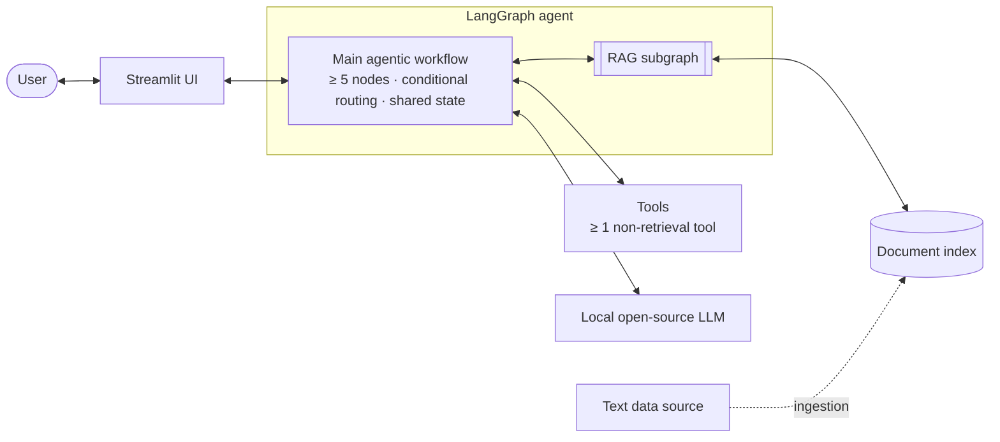

# Agentic RAG Chatbot – Proof of Concept

**English** | [Magyar](README.hu.md)

An agentic Retrieval-Augmented Generation (RAG) chatbot prototype in Python — built with [LangGraph](https://github.com/langchain-ai/langgraph), powered by a locally hosted open-source LLM, with a [Streamlit](https://streamlit.io/) UI, and fully containerized with Docker.

> **Status:** 🚧 Work in progress. The foundation is in place: the [Phase 1](docs/project-structure-plan.md#8-build-order) scaffold (package, CLI, configuration, tests, linting), the shared infrastructure (settings, the LLM and embedding factories with offline fakes, step traces, the state contracts, the Streamlit shell) and the container setup (`Dockerfile`, `compose.yaml`). The agent, the RAG subgraph, the ingestion pipeline and the evaluation and load-test runners are typed skeletons that report the phase they are planned for. Next: the open decisions 8–9 of the [project structure plan](docs/project-structure-plan.md) (domain and corpus, non-retrieval tool), then Phase 2 (ingestion and index). Sections marked *To be completed* are filled in as the implementation progresses.

## Contents

1. [Overview](#overview)
2. [Assignment requirements](#assignment-requirements)
3. [Problem statement and motivation](#problem-statement-and-motivation)
4. [System architecture](#system-architecture)
5. [Design decisions](#design-decisions)
6. [Evaluation](#evaluation)
7. [Getting started](#getting-started)
8. [Repository structure](#repository-structure)
9. [License](#license)

## Overview

The goal is a working, well-documented and reproducible prototype that demonstrates:

- **Agentic workflow design with LangGraph** — autonomous decisions through conditional routing, splitting complex requests into sub-tasks that are executed independently, and explicit state management for intermediate results.
- **A modular RAG subsystem** — a dedicated LangGraph subgraph, invoked from the main workflow.
- **Tool use beyond retrieval** — at least one tool that does more than search the knowledge base.
- **Fully local inference** — an open-source LLM, no paid APIs.
- **Measured quality and performance** — a mini evaluation set and a load test with bottleneck analysis.

**Tech stack:** Python, LangGraph, Streamlit, Docker / Docker Compose and a local open-source LLM (see [Design decisions](#design-decisions)).

This project is a solution to a technical assignment for a Medior AI Engineer position; the original brief (in Hungarian) is in the local `task/` folder, which is gitignored.

## Assignment requirements

Status of each requirement from the brief:

**Problem & data**

- [ ] Real-world problem (domain / use case) with a written justification
- [ ] Freely chosen text data source, with the focus on quality processing and scalable data integration rather than volume

**Agentic architecture (LangGraph)**

- [ ] Agentic workflow with at least 5 nodes
- [ ] Autonomous decision-making (e.g. conditional routing)
- [ ] Decomposition into sub-tasks and their independent execution
- [ ] State management for storing intermediate results
- [ ] At least 2 tools, at least one of which is not purely retrieval-based
- [ ] Dedicated, modular RAG subgraph callable from the main workflow (not counted towards the node count)

**Model, UI & deployment**

- [ ] Open-source LLM that fits the local resources (no paid APIs), with the trade-offs justified
- [ ] Streamlit prototype UI that shows the agent's main steps and the result of the RAG process
- [ ] Containerized: `Dockerfile` (required) and `docker-compose.yml` (a plus for multi-component setups)

**Evaluation & performance**

- [ ] Functional evaluation on a mini set of 10–20 questions (a single node or the full workflow)
- [ ] Load test with 50–200 queries: basic latency metrics, the main bottleneck, 1–2 concrete optimization proposals

**Documentation**

- [ ] This README: problem & goals, architecture & design rationale, evaluation & load-test results, setup & run guide

## Problem statement and motivation

> 🚧 *To be completed* — the chosen domain / use case and the goal of the chatbot, answering three questions:
>
> - **Why is the problem relevant?**
> - **What user need does it address?**
> - **Why is an agentic RAG approach a good fit** — compared to a single retrieve-then-generate pass?

## System architecture

High-level target architecture:



| Component | Role |
|---|---|
| Streamlit UI | Chat interface that visualizes the agent's steps and the retrieved sources |
| Main agentic workflow | Plans, routes and executes sub-tasks; keeps intermediate results in the graph state |
| RAG subgraph | Modular retrieval pipeline over the document index, called from the main workflow |
| Tools | Capabilities beyond retrieval — at least one non-retrieval tool |
| Local LLM | Open-source model served locally, no paid APIs |
| Document index | Chunked and embedded documents from the chosen text data source |

The detailed target design (the seven main nodes and their routing, the four steps of the RAG subgraph, the tools), the state contracts as they exist in the code and the configuration reference are in [docs/architecture.md](docs/architecture.md).

> 🚧 *To be completed:* the main workflow's nodes and routing logic, the RAG subgraph's steps, the tools, the state schema and the ingestion pipeline.
>
> Tip: `uv run agentic-rag export-graph` prints the compiled graphs as Mermaid (through `graph.get_graph(xray=True).draw_mermaid()`) once they are built in Phases 3–4. The RAG subgraph gets a diagram of its own: the main workflow calls it inside the `run_rag_subtask` node, through the `search_knowledge_base` tool, where `xray=True` does not expand it.

## Design decisions

Decisions 1–7 of the [project structure plan](docs/project-structure-plan.md#3-decisions-to-lock-in-before-scaffolding) are built into the code. The LLM and the embedding model (decisions 4 and 5) are provisional defaults until the evaluation and the load test have measured them; the domain, the non-retrieval tool and the chunking are still open.

| Area | Key trade-offs | Choice & rationale |
|---|---|---|
| Domain & data source | Relevance, availability and licensing, preprocessing effort | *TBD* (plan decision 8, before Phase 2) |
| Non-retrieval tool | Fit to the domain; deterministic, local and testable | *TBD* together with the domain (decision 9) |
| Packaging & Python version | Reproducible builds, wheel coverage of the ML stack, setup effort | **uv** (`pyproject.toml` + `uv.lock`), **Python 3.12**, `src/` layout: the lock file pins every package for local runs and the image alike, uv installs the pinned Python itself, and 3.12 has the widest wheel coverage for torch and chromadb |
| LLM | Answer quality vs. latency vs. memory (RAM/VRAM); tool-calling support; license | **`qwen2.5:7b-instruct`**, provisional: a multilingual 7B instruct model under the Apache 2.0 license whose 4-bit build (about 4.7 GB) fits in the 8 GB of VRAM of the development machine; confirmed or replaced by the evaluation and the load test |
| LLM serving | Setup effort, containerization, throughput | **Ollama** (a Compose service, or Ollama on the host) plus a **scripted fake provider**: Ollama gives an HTTP API and GPU support without compiling anything into the image; the fake (`LLM_PROVIDER=fake`) is the brief's dummy LLM and keeps the tests model-free |
| Tool-calling style | Reliability with small local models vs. flexibility of native tool calling | **Structured-output planner + explicit tool nodes**: the planner emits typed sub-tasks as JSON, which small local models produce more reliably than native tool calls; the tools stay LangChain tools, so `bind_tools` remains possible |
| Embedding model | Retrieval quality vs. speed; language coverage | **`intfloat/multilingual-e5-small`**, provisional, run locally with sentence-transformers: multilingual (Hungarian included) and small (384 dimensions), so it runs on the CPU and leaves the GPU to the LLM |
| Vector store | Persistence, metadata filtering, scalability | **Chroma** with a persistent client in `data/chroma_db/` (a named volume in Compose): persistence and metadata filtering without pickle deserialization |
| Chunking | Chunk size and overlap vs. retrieval precision and context length | *TBD* in Phase 2, tuned against the evaluation set; the code starts from 900-character chunks with a 150-character overlap |

Notes on the provisional defaults:

- **Models.** Both models are defaults, not final choices (plan decisions 4 and 5): they are confirmed or replaced once the domain is chosen and the evaluation and the load test have measured them. Whether a 7B model handles Hungarian well enough is checked on the evaluation set.
- **Embeddings.** The no-paid-API rule rules out hosted embedding APIs, so the embeddings run locally. The default model is downloaded once (about 0.5 GB, into the Hugging Face cache, `HF_HOME`) and then works offline; it takes a few seconds to load, its E5 `query:` / `passage:` prefixes are added automatically, and it brings CPU-only torch into the image (about 0.8 GB of the 2.9 GB image). `EMBEDDING_PROVIDER=fake` replaces it with deterministic, hashed bag-of-words vectors: offline and instant, but purely lexical, so only for tests and model-free demos.
- **Rebuilding the index.** Vectors of different models are not comparable: after changing `EMBEDDING_PROVIDER` or `EMBEDDING_MODEL`, rebuild the index with `agentic-rag ingest --rebuild`.

## Evaluation

### Functional evaluation

**Approach:** a mini evaluation set of 10–20 domain questions — each with a reference answer and, where relevant, the expected source documents — used to evaluate a single node or the full agentic workflow.

**Candidate metrics:** answer correctness against the reference, faithfulness to the retrieved context, retrieval hit rate@k, and routing / tool-selection accuracy.

**In place:** the question-set format (`data/eval/questions.jsonl`, one JSON object per question, validated by `agentic_rag.evaluation.dataset`) is described in [data/eval/README.md](data/eval/README.md). Retrieval hit@k and routing accuracy are implemented; the LLM-judged correctness and faithfulness, the runner and the questions themselves follow in Phase 7. The reports will be written as JSON to `data/eval/results/`.

> 🚧 *To be completed:* location of the evaluation set, scoring method, results, conclusions and the command to reproduce them.

### Load test & bottleneck analysis

**Scenario:** 50–200 queries against the running system, with the concurrency level, query mix and hardware documented.

**Reported metrics:** latency (mean, p50, p95, p99, max), throughput and error rate, plus a per-node latency breakdown to pinpoint the main bottleneck — followed by 1–2 concrete optimization proposals.

**In place:** the latency statistics and the report format (`agentic_rag.loadtest.runner`). Percentiles use linear interpolation between the closest ranks (the default of `numpy.percentile`), warm-up requests are reported separately, and per-node shares must not add `run_rag_subtask` to the RAG subgraph nodes it ran, because its time includes theirs. The runner follows in Phase 8.

> 🚧 *To be completed:* results, bottleneck analysis, optimization proposals and the command to reproduce them.

## Getting started

### Prerequisites

- Git.
- [uv](https://docs.astral.sh/uv/getting-started/installation/) for local development; it also installs Python 3.12 when it is missing.
- Docker with Docker Compose 2.24 or newer for the containers (`compose.yaml` uses the optional `env_file` syntax).
- For real answers, a local LLM served by [Ollama](https://ollama.com/): the Compose service, or Ollama installed on the host. The provisional default model, `qwen2.5:7b-instruct` (4-bit, about 4.7 GB), fits in an 8 GB GPU and also runs on the CPU, more slowly (*exact RAM/VRAM requirements TBD*). Fake mode needs neither a model nor a GPU.
- Disk space for the full stack: the application image (about 2.9 GB), the Ollama image and the chat model.

### What works today

The foundation runs end to end, but it does not answer questions yet:

- the tests pass offline, with the fake LLM and the fake embeddings;
- the CLI lists its commands and `config` prints the effective settings; `ingest`, `eval`, `loadtest` and `export-graph` print the phase they are planned for (`… is planned for Phase N (see docs/project-structure-plan.md, section 8)`) and exit with code 1;
- the Streamlit UI starts, shows the configuration and answers every question with a notice that the agent is planned for Phase 4;
- the image builds, and the `app` service starts healthy in fake mode.

### Local development with uv

Install uv (other options are in its [installation guide](https://docs.astral.sh/uv/getting-started/installation/)):

```bash
curl -LsSf https://astral.sh/uv/install.sh | sh      # Linux and macOS
```

```powershell
powershell -ExecutionPolicy ByPass -c "irm https://astral.sh/uv/install.ps1 | iex"   # Windows
```

Clone the repository and set it up:

```bash
git clone https://github.com/Csabikahhh/agentic-rag-chatbot-poc.git
cd agentic-rag-chatbot-poc
uv sync                                          # .venv with Python 3.12, the locked dependencies and the dev tools
uv run pytest                                    # offline test suite
uv run ruff check .                              # lint
uv run ruff format --check .                     # formatting
uv run python -m agentic_rag --help              # the commands (or: uv run agentic-rag --help)
uv run python -m agentic_rag config              # the effective settings
uv run streamlit run src/agentic_rag/ui/app.py   # the UI on http://localhost:8501
```

**Fake mode** runs without Ollama and without model downloads: the scripted fake LLM (`LLM_PROVIDER=fake`) and the offline hashing embeddings (`EMBEDDING_PROVIDER=fake`). Set the two variables in the shell, or put them in `.env` (see [Configuration](#configuration)):

```bash
LLM_PROVIDER=fake EMBEDDING_PROVIDER=fake uv run streamlit run src/agentic_rag/ui/app.py
```

```powershell
$env:LLM_PROVIDER="fake"; $env:EMBEDDING_PROVIDER="fake"; uv run streamlit run src/agentic_rag/ui/app.py
```

The tests always run in fake mode; they ignore the shell's settings and `.env`.

**Ollama on the host** is the fastest loop with a real model. Install [Ollama](https://ollama.com/download), start it (the desktop app, or `ollama serve`) and pull the model; the default `OLLAMA_BASE_URL` (`http://localhost:11434`) reaches it:

```bash
ollama pull qwen2.5:7b-instruct
uv run pytest -m ollama       # live check against the local server; skipped when it is not reachable
```

### Run with Docker Compose

The brief asks for a `docker-compose.yml`; the repository provides it as `compose.yaml`, the file name the Compose documentation prefers, which `docker compose` picks up automatically.

| Service | Image | Role |
|---|---|---|
| `app` | Built from the `Dockerfile` | Streamlit UI on <http://localhost:8501> (published on 127.0.0.1 only); runs as a non-root user |
| `ollama` | `ollama/ollama:0.35.0` | Serves the LLM; reachable as `http://ollama:11434` inside the stack, not published on the host |
| `ollama-pull` | `ollama/ollama:0.35.0` | One-shot: pulls `OLLAMA_MODEL` unless the `ollama-data` volume already has it |

The corpus, `./data/raw`, is mounted read-only. The named volumes `ollama-data` (Ollama models), `chroma-data` (vector index) and `hf-cache` (Hugging Face models) keep the downloads and the index across rebuilds.

**Full stack:**

```bash
docker compose up --build
```

The first start builds the image (a few minutes) and downloads the Ollama image and the chat model (several GB); the UI starts once the model pull has finished. The embedding model is downloaded into `hf-cache` the first time it is used (from Phase 2 on). Later starts reuse the volumes.

**Fake mode** (only the `app` service; no Ollama, no model downloads):

```bash
LLM_PROVIDER=fake EMBEDDING_PROVIDER=fake docker compose up --build --no-deps app
```

```powershell
$env:LLM_PROVIDER="fake"; $env:EMBEDDING_PROVIDER="fake"; docker compose up --build --no-deps app
```

`--no-deps` leaves out the two Ollama services. In PowerShell the variables stay set for the rest of the session; setting them in `.env` works as well.

**NVIDIA GPU for Ollama** (an optional override file):

```bash
docker compose -f compose.yaml -f compose.gpu.yaml up --build
```

It needs an NVIDIA driver and GPU support in Docker: Docker Desktop with the WSL 2 backend on Windows, or the NVIDIA Container Toolkit on Linux. To make it the default, set `COMPOSE_FILE=compose.yaml:compose.gpu.yaml` in `.env` (with `;` as the separator on Windows). Without the override, Ollama runs on the CPU.

**Ollama on the host** instead of the `ollama` service:

```bash
docker compose run --rm --no-deps --service-ports -e OLLAMA_BASE_URL=http://host.docker.internal:11434 app
```

**CLI commands in the container:**

```bash
docker compose run --rm --no-deps app agentic-rag config
```

The stack mounts only `data/raw`, so run `eval` and `loadtest` on the host (`uv run agentic-rag eval`), or add a `./data/eval:/app/data/eval` mount.

**The image on its own** (the required `Dockerfile`, without Compose):

```bash
docker build -t agentic-rag-chatbot:dev .
docker run --rm -p 127.0.0.1:8501:8501 -v ./data/raw:/app/data/raw:ro -e LLM_PROVIDER=fake -e EMBEDDING_PROVIDER=fake agentic-rag-chatbot:dev
```

**Stop and clean up:**

```bash
docker compose down      # remove the containers and the network; keep the volumes
docker compose down -v   # also delete the volumes
```

> **Warning:** `docker compose down -v` deletes the downloaded models (`ollama-data`, `hf-cache`) and the vector index (`chroma-data`); the next start downloads and builds them again.

More options, such as publishing the Ollama API on the host through a local `compose.override.yaml`, are described in the header of [`compose.yaml`](compose.yaml).

> Verified so far: the image build, both Compose configurations, and the `app` service in fake mode (healthy, the UI served on port 8501). Not run yet: the full stack with the Ollama services (model pull, GPU passthrough).

### Configuration

All settings are environment variables, read by `agentic_rag.config.Settings`. [`.env.example`](.env.example) lists every variable with its default and a comment; copy it to `.env` (gitignored) and change what you need:

```bash
cp .env.example .env    # PowerShell: Copy-Item .env.example .env
```

Real environment variables take precedence over `.env`, and an empty value (`KEY=`) means the default. `uv run agentic-rag config` prints the effective values; an invalid value stops the CLI with exit code 2 and names the variable.

| Variable | Default | Purpose |
|---|---|---|
| `LLM_PROVIDER` | `ollama` | `ollama`, or `fake` for the scripted offline model |
| `OLLAMA_BASE_URL` | `http://localhost:11434` | URL of the Ollama server |
| `OLLAMA_MODEL` | `qwen2.5:7b-instruct` | Ollama chat model tag (provisional) |
| `LLM_TEMPERATURE` | `0.0` | Sampling temperature, 0.0–2.0 |
| `EMBEDDING_PROVIDER` | `huggingface` | `huggingface`, or `fake` for the offline hashing embeddings |
| `EMBEDDING_MODEL` | `intfloat/multilingual-e5-small` | Hugging Face embedding model (provisional) |
| `DATA_DIR` | `data/raw` | Corpus directory |
| `CHROMA_DIR` | `data/chroma_db` | Vector index directory |
| `CHROMA_COLLECTION` | `documents` | Chroma collection name |
| `TOP_K` | `4` | Chunks retrieved per query |
| `MAX_RETRIES` | `2` | Bound on the verify → re-plan loop |
| `INGEST_ON_START` | `true` | Build the index at start-up when it is missing (no effect until Phase 6) |
| `LOG_LEVEL` | `INFO` | `DEBUG`, `INFO`, `WARNING` or `ERROR` |

In the Compose stack, `compose.yaml` sets `OLLAMA_BASE_URL=http://ollama:11434` for the `app` service, so a value in `.env` does not change it, and passes `LLM_PROVIDER`, `EMBEDDING_PROVIDER` and `OLLAMA_MODEL` from the shell or `.env`. Every other variable reaches the container only through `.env`. The full reference, with the validation rules, is in [docs/architecture.md](docs/architecture.md#configuration-reference).

### Command-line interface

`agentic-rag <command>` (or `python -m agentic_rag <command>`); `--help` shows the options of every command.

| Command | Purpose | Available |
|---|---|---|
| `config` | Print the effective settings as `KEY=value` lines | Now |
| `ingest [--rebuild]` | Build the vector index from `DATA_DIR` | Phase 2 |
| `export-graph [--graph {all,agent,rag}] [--format {markdown,mermaid}] [--output PATH]` | Mermaid diagrams of the compiled graphs | Phases 3–4 |
| `eval [--target {graph,node}] [--node NAME] [--dataset PATH] [--output-dir PATH]` | Functional evaluation | Phase 7 |
| `loadtest [--requests N] [--concurrency C] [--warmup W] [--output-dir PATH]` | Load test against the compiled graph | Phase 8 |

Exit codes: 0 on success, 1 when the command failed or is planned for a later phase, 2 for invalid arguments or settings, 130 when interrupted.

> 🚧 *To be completed:* data ingestion (Phase 2) and the evaluation and load-test runs (Phases 7–8).

## Repository structure

```text
agentic-rag-chatbot-poc/
├── .claude/                        # Claude Code agents and skills used while building the project
├── data/
│   ├── README.md                   # data layout, corpus rules, when to rebuild the index
│   ├── raw/                        # source corpus (DATA_DIR); only .gitkeep until Phase 2
│   └── eval/
│       ├── README.md               # evaluation question-set schema and report formats
│       └── results/                # committed evaluation and load-test reports; only .gitkeep until Phase 7
├── docs/
│   ├── architecture.md             # target graphs, state contracts, node and tool tables, configuration reference
│   ├── project-structure-plan.md   # repository plan and build order
│   └── project-structure-plan.hu.md  # the plan in Hungarian
├── src/
│   └── agentic_rag/
│       ├── __init__.py             # package version
│       ├── __main__.py             # `python -m agentic_rag`
│       ├── cli.py                  # commands: ingest · eval · loadtest · export-graph · config
│       ├── config.py               # Settings from environment variables and .env; logging set-up
│       ├── llm.py                  # chat model factory: Ollama, or the scripted fake
│       ├── embeddings.py           # embedding factory: sentence-transformers, or offline hashing
│       ├── tracing.py              # TraceEvent and the @traced node decorator
│       ├── agent/                  # main agentic workflow (skeleton until Phase 4)
│       │   ├── state.py            # AgentState, Subtask, SubtaskResult (implemented contracts)
│       │   ├── nodes.py            # the seven node functions
│       │   ├── routing.py          # conditional edges and the Send fan-out
│       │   ├── tools.py            # search_knowledge_base and the non-retrieval tool placeholder
│       │   └── graph.py            # NODE_NAMES and build_agent_graph()
│       ├── rag/                    # RAG subgraph (skeleton until Phase 3)
│       │   ├── state.py            # RagState, RagInput, RagOutput, Source (implemented contracts)
│       │   ├── nodes.py            # rewrite_query · retrieve · grade_documents · build_context
│       │   └── graph.py            # RAG_NODE_NAMES and build_rag_graph()
│       ├── ingestion/              # ingestion pipeline (skeleton until Phase 2)
│       │   ├── loaders.py          # corpus files → Documents with citation metadata
│       │   ├── chunking.py         # splitter configuration (starting point: 900/150 characters)
│       │   └── index.py            # build and open the Chroma index; IndexStats
│       ├── evaluation/
│       │   ├── dataset.py          # EvalItem and the questions.jsonl loader
│       │   ├── metrics.py          # hit@k and routing accuracy; LLM-judged metrics in Phase 7
│       │   └── runner.py           # report models; run_evaluation() in Phase 7
│       ├── loadtest/
│       │   └── runner.py           # latency statistics and report model; run_load_test() in Phase 8
│       └── ui/
│           ├── app.py              # Streamlit entrypoint
│           └── components.py       # step panel, retrieved-context panel, settings summary
├── task/                           # assignment brief (Hungarian); local only, gitignored
├── tests/                          # offline pytest suite (fake providers)
│   ├── conftest.py                 # keeps the shell and .env out of the tests; the `settings` fixture
│   ├── test_cli.py                 # commands, options and exit codes
│   ├── test_config.py              # defaults, environment and .env handling, validation, logging
│   ├── test_embeddings.py          # offline fake and Hugging Face branch, without downloads
│   ├── test_evaluation.py          # dataset loader, metrics and report models
│   ├── test_llm.py                 # provider selection, scripted fake; live Ollama check (marker `ollama`)
│   ├── test_loadtest.py            # percentiles, latency summaries and the report model
│   ├── test_skeletons_agent.py     # main workflow skeleton: nodes, routing, tools, graph
│   ├── test_skeletons_rag.py       # ingestion and RAG subgraph skeletons
│   ├── test_state.py               # state contracts and reducers
│   ├── test_tracing.py             # step-trace primitives
│   └── test_ui.py                  # Streamlit UI under AppTest
├── .dockerignore                   # build-context allowlist
├── .env.example                    # every setting with its default
├── .gitignore
├── .python-version                 # 3.12
├── compose.gpu.yaml                # optional NVIDIA GPU override for the ollama service
├── compose.yaml                    # app + ollama + one-shot model pull
├── Dockerfile                      # multi-stage uv build, non-root runtime, health check
├── LICENSE
├── pyproject.toml                  # dependencies, console script, ruff and pytest settings
├── README.md                       # documentation (English)
├── README.hu.md                    # documentation (Hungarian)
└── uv.lock                         # locked dependency versions
```

Every package directory also has an `__init__.py`. Generated and local-only paths are not shown: `.venv/`, the tool caches and `data/chroma_db/` (the vector index, created by `agentic-rag ingest`). [data/README.md](data/README.md) describes the data layout, the corpus rules and when to rebuild the index; [data/eval/README.md](data/eval/README.md) describes the evaluation formats.

The structure grows with the phases of the [build order](docs/project-structure-plan.md#8-build-order): the corpus, the evaluation set, the evaluation and performance reports in `docs/`, and the tests of each phase.

## License

Released under the [MIT License](LICENSE). © 2026 Csaba Ovari

**Third-party notice:** `Dockerfile`, `.dockerignore` and `compose.yaml` contain portions adapted from the assets of the `docker-project-foundations` skill of [docker/skills](https://github.com/docker/skills) (the skill itself is in `.claude/skills/docker-project-foundations/`), which is licensed under the [Apache License 2.0](https://www.apache.org/licenses/LICENSE-2.0). Each of these files names its source in its header and states that it was modified; the adapted portions are used under the Apache License 2.0.
