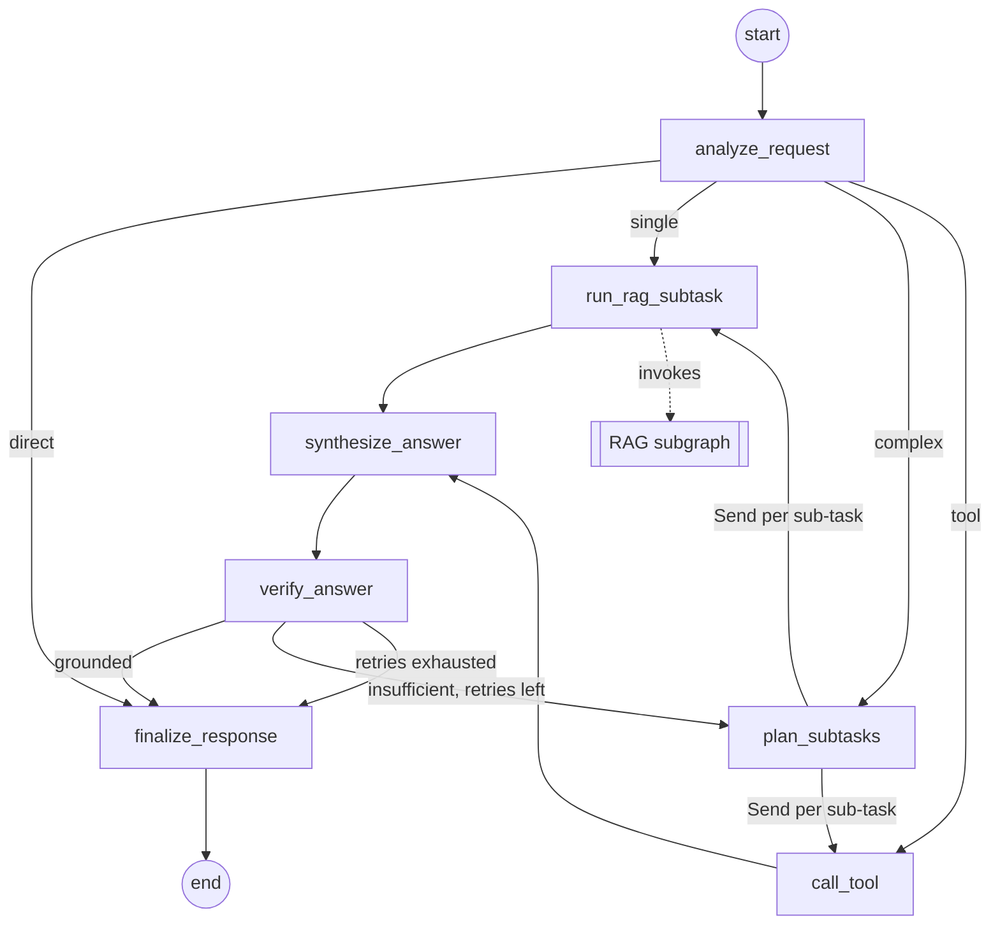
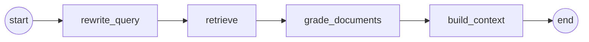

# Architecture

> **Status:** stub (plan Phase 0), written 2026-10-01 against the foundation. The two diagrams show the **target design** of the [project structure plan](project-structure-plan.md) (sections 5.1 and 5.2) and are drawn by hand; the graphs themselves are built in Phases 3–4. The generated export of `python -m agentic_rag export-graph` replaces them in Phase 4 (the RAG subgraph can already be exported in Phase 3). The state contracts, the node and tool tables and the configuration reference describe the code as it is now: the contracts and the shared modules are implemented, while the nodes, the routing functions, the tools and the graph builders are typed skeletons that raise `NotImplementedError` until their phase.
>
> To regenerate the diagrams, paste the output of `uv run agentic-rag export-graph` over them. Do not point `--output` at this file: it replaces the whole file, including the hand-written sections.

## Contents

1. [Overview](#overview)
2. [Main agentic workflow](#main-agentic-workflow)
3. [RAG subgraph](#rag-subgraph)
4. [Tools](#tools)
5. [State contracts](#state-contracts)
6. [Step traces](#step-traces)
7. [Configuration reference](#configuration-reference)
8. [Implementation status](#implementation-status)

## Overview

A request takes this path through the target design:

1. The Streamlit UI, or the evaluation or load-test harness, passes the conversation to the compiled main graph as an `AgentInput`: `{"messages": [...]}`.
2. `analyze_request` classifies the latest message into one of four intents, and the routing sends the request straight to the answer, to a single sub-task, or to the planner.
3. Sub-tasks run as parallel `Send` workers: `run_rag_subtask` answers a `retrieve` sub-task with the RAG subgraph, through the `search_knowledge_base` tool, and `call_tool` runs a `tool` sub-task with the non-retrieval tool.
4. `synthesize_answer` drafts an answer from the results of the round, and `verify_answer` checks the draft against them; an unsupported draft goes back to `plan_subtasks`, at most `MAX_RETRIES` times.
5. `finalize_response` produces the `AgentOutput`: the answer, its sources and the trace of every executed node, the RAG subgraph's nodes included.

| Component | Module | Role |
|---|---|---|
| Main workflow | `agentic_rag.agent` | Seven nodes with conditional routing and a `Send` fan-out |
| RAG subgraph | `agentic_rag.rag` | Four nodes with their own state; not counted towards the seven |
| Tools | `agentic_rag.agent.tools` | `search_knowledge_base` and the non-retrieval tool (decision 9) |
| Chat model | `agentic_rag.llm` | `ChatOllama`, or the scripted offline `ScriptedChatModel` |
| Embeddings | `agentic_rag.embeddings` | sentence-transformers on the CPU, or the offline `HashingEmbeddings` |
| Ingestion and index | `agentic_rag.ingestion` | Load, split, embed and store the corpus in Chroma |
| Step traces | `agentic_rag.tracing` | `TraceEvent` records and the `@traced` node decorator |
| UI | `agentic_rag.ui` | Streamlit chat with a step panel and a retrieved-context panel |
| CLI | `agentic_rag.cli` | `ingest`, `eval`, `loadtest`, `export-graph`, `config` |
| Settings | `agentic_rag.config` | One `Settings` object from environment variables and `.env` |

## Main agentic workflow

> **Target design**, copied from plan section 5.1. Phase 4 replaces this diagram with the generated export (`uv run agentic-rag export-graph --graph agent`).

### Nodes

The tables in this section are the contracts documented in the skeletons; the behaviour arrives in Phase 4. `agentic_rag.agent.graph.NODE_NAMES` fixes the names and their order. Every node is a plain function in `agentic_rag.agent.nodes`, named after its node and decorated with `@traced`. The state, or the `Send` payload, is its only positional parameter; its dependencies are keyword-only parameters that `build_agent_graph` binds once per compiled graph.

| # | Node | Kind | Reads | Writes | Dependencies |
|---|---|---|---|---|---|
| 1 | `analyze_request` | LLM, structured output | `messages` | `question` and `intent` on every route; `draft_answer` on `direct`; a one-step `subtasks` plan on `single` and `tool` | `chat_model`, `tools` |
| 2 | `plan_subtasks` | LLM, structured output | `question`; on a re-plan also `verdict`, `draft_answer` and the previous `subtask_results` | `subtasks` (never empty, size capped); `subtask_results` reset with `Overwrite(kept)` | `chat_model`, `tools` |
| 3 | `run_rag_subtask` | Subgraph call, `Send` worker | `SubtaskInput` | One `SubtaskResult` with `kind="retrieve"`; the RAG subgraph's `trace`, forwarded | `search_tool` |
| 4 | `call_tool` | Action, `Send` worker | `SubtaskInput` | One `SubtaskResult` with `kind="tool"` | `tools` |
| 5 | `synthesize_answer` | LLM | `question`, `subtask_results`, `messages` | `draft_answer` | `chat_model` |
| 6 | `verify_answer` | LLM, structured output | `question`, `draft_answer`, `subtask_results`; the previous `verdict` and `retry_count` | `verdict`, `retry_count` | `chat_model` |
| 7 | `finalize_response` | Data | `draft_answer`, `verdict`, `subtask_results` | `answer`, `sources` and the assistant message in `messages` | None |

`chat_model` comes from `agentic_rag.llm.get_chat_model`, `tools` maps the names of the non-retrieval tools to the tools, and `search_tool` is the `search_knowledge_base` tool bound to the compiled RAG subgraph. Planned failure handling: transient errors, such as an Ollama server that is still starting, are retried by a `RetryPolicy` on the LLM nodes and on `run_rag_subtask`; a failing tool becomes a `SubtaskResult` with `ok=False`, so the answer can still be written from the other results.

### Routing

`agentic_rag.agent.routing` holds the three routing points. Their return annotations list every destination: a node name is a `Literal`, and a fan-out is `SubtaskSends`, a list of `Send` objects that each target one of the `SubtaskWorker` nodes (`run_rag_subtask`, `call_tool`).

| Function | After | Destinations |
|---|---|---|
| `route_after_analyze` | `analyze_request` | `direct` → `finalize_response`; `complex` → `plan_subtasks`; `single` → one `Send` to `run_rag_subtask`; `tool` → one `Send` to `call_tool` |
| `dispatch_subtasks` | `plan_subtasks` | One `Send` per sub-task, each carrying `SubtaskInput(subtask, question)`: `retrieve` → `run_rag_subtask`, `tool` → `call_tool` |
| `route_after_verify` | `verify_answer` | `grounded` → `finalize_response`; `insufficient` with `retry_count < MAX_RETRIES` → `plan_subtasks`; otherwise → `finalize_response`, marked as only partially answered |

- **Decomposition and independent execution.** The sends of one round run in parallel in one LangGraph step. Each worker sees only its own `SubtaskInput`, and the results fan in through the `subtask_results` reducer, so `synthesize_answer` runs once per round, after the last worker.
- **Bounded loop.** A run re-plans at most `MAX_RETRIES` times (default 2; 0 disables re-planning). The loop always passes through the named node `plan_subtasks`, and the bound comes from the settings, not from LangGraph's recursion limit.
- **Self-contained graph.** The compiled graph needs nothing but its input: `invoke`, `ainvoke`, `stream` and `astream` take an `AgentInput`. Building it does not contact Ollama, load the embedding model or open the index, so `export-graph` stays fast.
- **The subgraph in the diagram.** The RAG subgraph runs inside `run_rag_subtask`, through the tool, so `get_graph(xray=True)` draws `run_rag_subtask` as a single node, and `export-graph` draws the RAG subgraph as a diagram of its own.

## RAG subgraph

> **Target design**, drawn from plan section 5.2 and the docstring of `agentic_rag.rag.graph`. Phase 3 replaces this diagram with the generated export (`uv run agentic-rag export-graph --graph rag`).

The subgraph is compiled as `StateGraph(RagState, input_schema=RagInput, output_schema=RagOutput)`, without a checkpointer: callers pass `{"query": ...}` and get exactly the `RagOutput` keys back. It is linear on purpose: retrying with a better query is the main workflow's job (`verify_answer` → `plan_subtasks`), and the linear path guarantees that `build_context` always runs. Its nodes do not count towards the main workflow's nodes. `agentic_rag.rag.graph.RAG_NODE_NAMES` fixes the names and their order, and the node functions in `agentic_rag.rag.nodes` are decorated with `@traced`. The table is the contract documented in the skeletons; the behaviour arrives in Phase 3.

| Node | Reads | Writes | Role |
|---|---|---|---|
| `rewrite_query` | `query` | `rewritten_query` | Rewrites the query into a standalone search query with the chat model; with the fake provider it keeps `query` unchanged |
| `retrieve` | `rewritten_query`, or `query` | `documents`, `scores` | The `TOP_K` most similar chunks from Chroma with their metadata, most relevant first |
| `grade_documents` | `documents`, `scores` (and the query, for an optional LLM grade) | `documents`, `scores` | Keeps the relevant subset: a score threshold first, then optionally an LLM grade |
| `build_context` | `documents`, `scores` | `context`, `sources` | De-duplicates, orders and formats the chunks with numbered citation markers; runs on every path, with an empty `context` and no `sources` when nothing is relevant |

The relevance scores are planned as `1 - cosine distance` over unit-length vectors, so a higher score means more relevant, as `Source.score` expects.

## Tools

The model does not call the tools natively (decision 7): the planner emits typed `Subtask` records and the nodes run the tools. Both tools are still regular LangChain tools with a name, a description and an argument schema, so a tool-calling model can be bound to them later with `bind_tools`.

| Tool | Kind | Interface | Status |
|---|---|---|---|
| `search_knowledge_base` | Retrieval | `SearchKnowledgeBaseTool`, a `BaseTool` that holds the compiled RAG subgraph (`rag_graph`, a `Runnable[RagInput, RagOutput]`). Argument: `query`, a non-empty, self-contained search query. `response_format="content_and_artifact"`: the content is `RagOutput["context"]`, the artifact the whole `RagOutput` | Interface final (its descriptions are reworded for the domain after decision 8); `_run` in Phase 4 |
| Non-retrieval tool | Action | Chosen with the domain (decision 9). It must be deterministic and local, be a LangChain tool with a precise argument schema, return text, raise `ToolException` for input it cannot handle, and have unit tests of its own. `get_non_retrieval_tools(settings)` returns it | Open; Phase 4 |

From Phase 4 on, `get_tools(settings, rag_graph=None)` returns `[search_knowledge_base, *non-retrieval tools]`, and `build_agent_graph` gives the search tool to `run_rag_subtask` and the non-retrieval tools, by name, to `analyze_request`, `plan_subtasks` and `call_tool`.

## State contracts

Implemented in `agentic_rag.agent.state`, `agentic_rag.rag.state` and `agentic_rag.tracing`.

- The graph states are `TypedDict`s with `total=False`. Only the start key is required (`AgentState.messages`, `RagState.query`); the keys with a reducer always exist and start as empty lists; every other key is absent until a node writes it, so nodes read it with `state.get(...)`.
- Nodes return partial updates and never mutate the state. A key without a reducer is overwritten by each write.
- The records are frozen (immutable) Pydantic v2 models. Raw data lives in the state; prompts are formatted inside the nodes.

### Literal types

| Type | Values | Meaning |
|---|---|---|
| `Intent` | `direct`, `single`, `complex`, `tool` | The route `analyze_request` chooses: answer without retrieval or tools; one knowledge-base lookup; a multi-part request to decompose; one non-retrieval tool call |
| `Verdict` | `grounded`, `insufficient` | The outcome of `verify_answer`: supported by the sub-task results; unsupported or incomplete |
| `SubtaskKind` | `retrieve`, `tool` | `retrieve` runs `run_rag_subtask`, `tool` runs `call_tool` |

### `AgentState`

The shared memory of the main graph's nodes; the graph is compiled with `input_schema=AgentInput` and `output_schema=AgentOutput`.

| Key | Type | Reducer | Written by |
|---|---|---|---|
| `messages` (required) | `list[AnyMessage]` | `add_messages` | The input; `finalize_response` appends the assistant message |
| `question` | `str` | None | `analyze_request`: the standalone question from the last user message |
| `intent` | `Intent` | None | `analyze_request` |
| `subtasks` | `list[Subtask]` | None; each plan replaces the previous one | `plan_subtasks`; `analyze_request` on the `single` and `tool` routes |
| `subtask_results` | `list[SubtaskResult]` | `operator.add`; reset with `Overwrite` by `plan_subtasks` at the start of every round | `run_rag_subtask`, `call_tool` |
| `draft_answer` | `str` | None | `synthesize_answer`; `analyze_request` on the `direct` route |
| `verdict` | `Verdict` or `None` | None | `verify_answer` |
| `retry_count` | `int` | None | `verify_answer`: the re-plans performed so far, bounded by `MAX_RETRIES` |
| `answer` | `str` | None | `finalize_response` |
| `sources` | `list[Source]` | None | `finalize_response`: the cited chunks, de-duplicated by `chunk_id` |
| `trace` | `list[TraceEvent]` | `operator.add` | `@traced` on every node; `run_rag_subtask` also forwards the RAG subgraph's events |

- `AgentInput` holds `messages`: the conversation, ending with the user's new message.
- `AgentOutput` always holds `messages`, `question`, `intent`, `answer`, `sources`, `subtask_results` and `trace`, and holds `subtasks`, `verdict` and `retry_count` when the route produced them.
- `SubtaskInput` is the payload of one `Send`: `subtask` (a `Subtask`) and `question` (`str`).
- Re-planning: `plan_subtasks` writes `{"subtask_results": Overwrite(kept)}` at the start of every planning round (`kept` is usually `[]`), so the results of a rejected round do not leak into the next one, while the append reducer still collects the parallel workers' results.

### `Subtask`

One independently executable step of a plan; the planner emits a list of them as structured output.

| Field | Type | Default | Meaning |
|---|---|---|---|
| `id` | `str`, non-empty | Required | Short identifier, unique within one plan, such as `s1` |
| `kind` | `SubtaskKind` | Required | `retrieve` searches the knowledge base; `tool` calls a non-retrieval tool |
| `input` | `str` | Required | For `retrieve`: a self-contained search query; for `tool`: what the tool should compute, in plain words |
| `tool_name` | `str` or `None` | `None` | Name of the tool to call; required when `kind` is `tool` |
| `tool_args` | `dict[str, Any]` | `{}` | Keyword arguments for the tool |

### `SubtaskResult`

The outcome of one sub-task, appended to `AgentState.subtask_results`.

| Field | Type | Default | Meaning |
|---|---|---|---|
| `subtask_id` | `str`, non-empty | Required | Id of the `Subtask` this result answers |
| `kind` | `SubtaskKind` | Required | Kind of the sub-task |
| `output` | `str` | Required | Text for synthesis: the RAG context or the tool output; may be empty |
| `sources` | `list[Source]` | `[]` | The chunks behind `output` (`retrieve` sub-tasks) |
| `ok` | `bool` | `True` | `False` when the sub-task failed |
| `error` | `str` or `None` | `None` | Short, user-safe reason; set exactly when `ok` is `False` |

### `RagState`

The shared memory of the RAG subgraph's nodes, private to the subgraph.

| Key | Type | Reducer | Written by |
|---|---|---|---|
| `query` (required) | `str` | None | The input (`RagInput`) |
| `rewritten_query` | `str` | None | `rewrite_query`; equal to `query` when rewriting is skipped |
| `documents` | `list[Document]` | None | `retrieve`; replaced by `grade_documents` with the relevant subset |
| `scores` | `list[float]` | None | `retrieve` and `grade_documents`; parallel to `documents`, higher is more relevant |
| `context` | `str` | None | `build_context`: the formatted context with citation markers |
| `sources` | `list[Source]` | None | `build_context`: the cited chunks |
| `trace` | `list[TraceEvent]` | `operator.add` | `@traced` on every node |

`RagInput` holds `query` (`str`). `RagOutput` holds `context`, `sources` and `trace`, all present after every run.

### `Source`

One retrieved chunk, as the UI shows it and the answers cite it. The RAG subgraph and the main workflow share it (`SubtaskResult.sources`, `AgentState.sources`).

| Field | Type | Default | Meaning |
|---|---|---|---|
| `chunk_id` | `str`, non-empty | Required | Stable id of the chunk in the index |
| `source` | `str`, non-empty | Required | The document the chunk comes from (its file name or URL); the ingestion pipeline stores the path relative to `DATA_DIR`, with forward slashes |
| `content` | `str` | Required | Text of the chunk as indexed |
| `title` | `str` or `None` | `None` | Document title, when known |
| `page` | `int` (≥ 1) or `None` | `None` | 1-based page number, for paged formats such as PDF |
| `section` | `str` or `None` | `None` | Heading of the section the chunk belongs to, when known |
| `score` | `float` or `None` | `None` | Relevance score; higher means more relevant |

The ingestion metadata (`DocumentMetadata` and `ChunkMetadata` in `agentic_rag.ingestion`) fills every field except `content` and `score`.

### `TraceEvent`

One successful execution of a graph node.

| Field | Type | Default | Meaning |
|---|---|---|---|
| `node` | `str`, non-empty | Required | Name of the node that produced the event |
| `started_at` | `float` | Required | Start time in seconds since the Unix epoch |
| `ended_at` | `float` | Required | End time in seconds since the Unix epoch; not earlier than `started_at` |
| `duration_ms` | `float` (≥ 0) | Required | Execution time in milliseconds, measured with `time.perf_counter` |
| `summary` | `str` | `""` | One-line, human-readable outcome for the UI step panel |
| `metadata` | `dict[str, Any]` | `{}` | Small JSON-serializable details, such as counts or scores |

`STATE_RECORD_TYPES` (`Source`, `Subtask`, `SubtaskResult`, `TraceEvent`) is the allowlist for a checkpointer's serializer, should one be added later.

## Step traces

- **Recording.** `@traced` (`agentic_rag.tracing`) times every successful call of a node and appends one `TraceEvent` to the node's partial update under `trace`, for dict and `Command` updates alike. The event's `node` defaults to the function name, which equals the registered node name. A node that raises records no event, and the exception propagates unchanged.
- **Final state.** Both graph states give `trace` an append reducer, so an `invoke` result holds every event of the run. `run_rag_subtask` forwards the RAG subgraph's events, so the main graph's trace includes them. Its own event is inclusive: never add it to the RAG nodes' durations when computing time shares.
- **Streaming.** Every `stream_mode="updates"` chunk carries the events of the node that has just finished, and `trace_events_from_chunk(chunk)` extracts them. With `subgraphs=True` the forwarded events arrive twice; `skip_forwarded=True` keeps each of them once.
- **Clock.** The timestamps are epoch seconds on a clock that anchors `time.perf_counter` to `time.time` once, at import: monotonic, with sub-microsecond resolution, whereas `time.time` advances in 15.6 ms steps on Windows. `epoch_now()` reads the same clock, for example for the request timestamps of the load test.
- **UI.** The Streamlit app streams with `stream_mode=["updates", "values"]` and `version="v2"`. The updates feed the step panel with the main graph's own steps (`skip_forwarded=True`), grouping steps whose time windows overlap into one parallel step; the last root `values` part gives the answer and the sources.

## Configuration reference

`agentic_rag.config.Settings` is the only reader of the environment.

- Each setting is read from the environment variable with the upper-case field name. A `.env` file in the working directory is read as well; real environment variables take precedence over it.
- An empty value (`KEY=`) means the default, unknown variables are ignored, and provider and log-level names accept any letter case.
- Relative paths resolve against the working directory: the repository root locally, `/app` in the container.
- The values are validated at start-up. The CLI then exits with code 2 and names the invalid variables; the UI lists them and stops.
- `get_settings()` returns one cached, immutable instance. `agentic-rag config` prints the effective values as `KEY=value` lines, and `.env.example` lists every variable with its default.

| Variable | Values | Default | Purpose | Used by |
|---|---|---|---|---|
| `LLM_PROVIDER` | `ollama`, `fake` | `ollama` | Chat model backend | `llm.get_chat_model` |
| `OLLAMA_BASE_URL` | URL | `http://localhost:11434` | Ollama server. Inside Compose it is `http://ollama:11434` (set by `compose.yaml`); for an Ollama on the host seen from a container, `http://host.docker.internal:11434` | `llm` |
| `OLLAMA_MODEL` | Ollama model tag | `qwen2.5:7b-instruct` | Chat model (provisional, decision 4); the Compose service `ollama-pull` pulls the same tag | `llm`, `compose.yaml` |
| `LLM_TEMPERATURE` | 0.0–2.0 | `0.0` | Sampling temperature; 0.0 keeps the answers as deterministic as the model allows | `llm` |
| `EMBEDDING_PROVIDER` | `huggingface`, `fake` | `huggingface` | Embedding backend | `embeddings.get_embeddings` |
| `EMBEDDING_MODEL` | Hugging Face model id | `intfloat/multilingual-e5-small` | Embedding model (provisional, decision 5); ignored by `fake`; the E5 query and passage prefixes are added automatically | `embeddings` |
| `DATA_DIR` | Path | `data/raw` | Corpus directory | `ingestion` (Phase 2) |
| `CHROMA_DIR` | Path | `data/chroma_db` | Directory of the persistent Chroma index | `ingestion.index` (Phase 2) |
| `CHROMA_COLLECTION` | 3–63 characters from `A-Z`, `a-z`, `0-9`, `.`, `_`, `-`; a letter or digit at both ends; no `..` | `documents` | Chroma collection name | `ingestion.index` (Phase 2) |
| `TOP_K` | Integer ≥ 1 | `4` | Chunks retrieved per query; also the k of hit@k | `rag` (Phase 3), `evaluation` (Phase 7) |
| `MAX_RETRIES` | Integer ≥ 0 | `2` | Bound on the verify → re-plan loop; 0 disables re-planning | `agent` (Phase 4) |
| `INGEST_ON_START` | `true`, `false` | `true` | Build the index at start-up when it is missing | Nothing yet: the container entrypoint (Phase 6) |
| `LOG_LEVEL` | `DEBUG`, `INFO`, `WARNING`, `ERROR` | `INFO` | Log level of the CLI and the UI | `config.configure_logging` |

Changing `EMBEDDING_PROVIDER` or `EMBEDDING_MODEL` requires rebuilding the index (`agentic-rag ingest --rebuild`), because vectors of different models are not comparable.

Variables outside `Settings`:

| Variable | Set in | Purpose |
|---|---|---|
| `HF_HOME` | `Dockerfile` | Hugging Face cache, `/home/app/.cache/huggingface`, backed by the `hf-cache` volume |
| `STREAMLIT_SERVER_HEADLESS`, `STREAMLIT_BROWSER_GATHER_USAGE_STATS`, `STREAMLIT_SERVER_FILE_WATCHER_TYPE`, `STREAMLIT_BROWSER_SERVER_ADDRESS` | `Dockerfile` | Headless Streamlit without usage statistics, file watcher or external-IP lookup |
| `OLLAMA_HOST` | `compose.yaml` (`ollama-pull`) | Points the one-shot model pull at the `ollama` service |
| `COMPOSE_FILE` | `.env`, read by Docker Compose | Optional: `compose.yaml:compose.gpu.yaml` (`;` as the separator on Windows) makes the GPU override the default |

In the Compose stack, the `app` service receives `LLM_PROVIDER`, `EMBEDDING_PROVIDER` and `OLLAMA_MODEL` from the shell or `.env` (with the `Settings` defaults as fallbacks), a fixed `OLLAMA_BASE_URL=http://ollama:11434`, and every other variable only from `.env`.

## Implementation status

| Area | Implemented | Skeleton, planned for |
|---|---|---|
| Settings and CLI | `config`, `cli`, `__main__` | None |
| Chat model | `get_chat_model`, `ScriptedChatModel` (ordered regex rules, JSON structured output) | The fake's rules for the real prompts, `DEFAULT_FAKE_RULES` (Phase 4) |
| Embeddings | `get_embeddings`, `HashingEmbeddings`, the E5 prefix detection | None |
| Step traces | `TraceEvent`, `traced`, `trace_events_from_chunk`, `epoch_now` | None |
| State contracts | `AgentState`, `RagState` and their records | None |
| Ingestion | `DocumentMetadata`, `ChunkMetadata`, `ChunkingConfig`, `IndexStats`, `IndexNotFoundError`, `EmbeddingMismatchError` | Loading, splitting, `build_index`, `load_index` (Phase 2) |
| RAG subgraph | `RAG_NODE_NAMES` | The four nodes and `build_rag_graph` (Phase 3) |
| Main workflow | `NODE_NAMES`, the routing types, the interface of the search tool | The seven nodes, the three routing functions, the tools and `build_agent_graph` (Phase 4) |
| UI | The chat page, the step panel, the retrieved-context panel, the settings summary | Answers, which need the main graph (Phase 4) |
| Evaluation | `EvalItem`, `load_dataset`, hit@k, routing accuracy, the report models | The LLM-judged correctness and faithfulness, `run_evaluation` (Phase 7) |
| Load test | `percentile`, the latency summaries, `LoadTestReport` | `run_load_test` (Phase 8) |

A skeleton raises `NotImplementedError` with the message `<qualified name> is planned for Phase <N> (see docs/project-structure-plan.md, section 8)`. The CLI prints that message and exits with code 1; the UI shows it as a notice.
