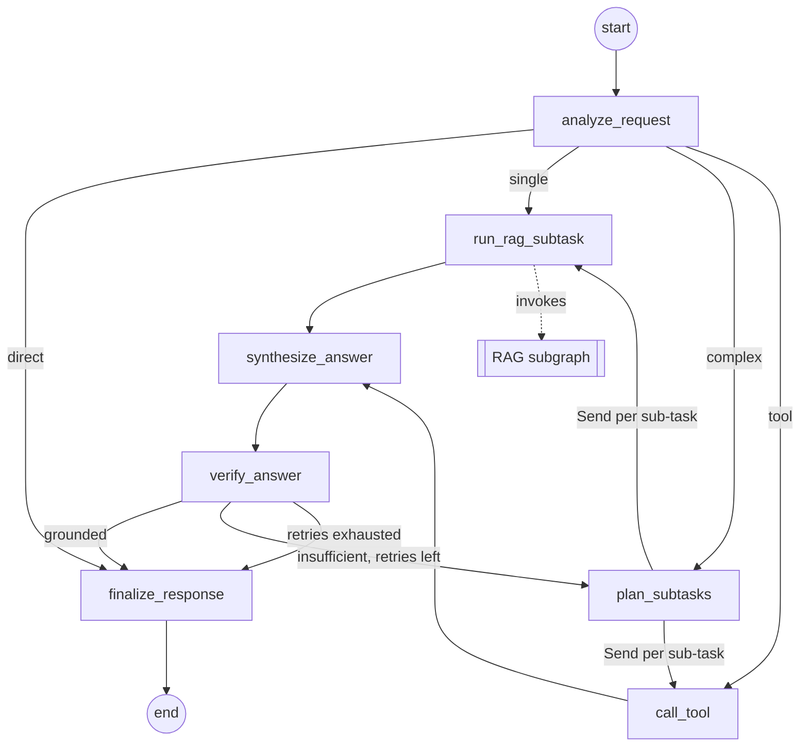
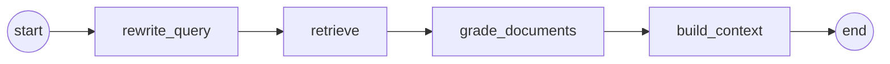

# Architecture

> **Status:** stub (plan Phase 0), written 2026-10-01 against the foundation and updated after the foundation review. The two diagrams show the **target design** of the [project structure plan](project-structure-plan.md) (sections 5.1 and 5.2) and are drawn by hand; the graphs themselves are built in Phases 3–4. The generated export of `python -m agentic_rag export-graph` replaces them in Phase 4 (the RAG subgraph can already be exported in Phase 3). Everything else describes the code as it is now: the contracts and the shared modules are implemented, while the nodes, the routing functions, the tools, the graph builders and the ingestion, evaluation and load-test runners are typed stubs that raise `agentic_rag.errors.PlannedFeatureError` until their phase (see [Errors and exit codes](#errors-and-exit-codes)).
>
> This document is the canonical home of the cross-cutting contracts: [dependency injection and cheap builds](#dependency-injection-and-cheap-builds), the [execution model](#execution-model), [trace events and forwarding](#trace-events-and-forwarding), the [subtask_results reset on re-plan](#re-planning-and-the-subtask_results-reset), the [bounded verify loop](#bounded-verify-loop), [citation numbering across sub-tasks](#citation-numbering-across-sub-tasks) and [errors and exit codes](#errors-and-exit-codes). The module docstrings still restate parts of them; consolidating the docstrings so that each contract is stated once, here or in its defining module, is planned together with Phase 4.
>
> To regenerate the diagrams, paste the output of `uv run agentic-rag export-graph` over them. Do not point `--output` at this file: it replaces the whole file, including the hand-written sections.

## Contents

1. [Overview](#overview)
2. [Main agentic workflow](#main-agentic-workflow)
3. [RAG subgraph](#rag-subgraph)
4. [Ingestion and index](#ingestion-and-index)
5. [Tools](#tools)
6. [State contracts](#state-contracts)
7. [Dependency injection and cheap builds](#dependency-injection-and-cheap-builds)
8. [Execution model](#execution-model)
9. [Trace events and forwarding](#trace-events-and-forwarding)
10. [Re-planning and the subtask_results reset](#re-planning-and-the-subtask_results-reset)
11. [Bounded verify loop](#bounded-verify-loop)
12. [Citation numbering across sub-tasks](#citation-numbering-across-sub-tasks)
13. [Errors and exit codes](#errors-and-exit-codes)
14. [Configuration reference](#configuration-reference)
15. [Implementation status](#implementation-status)

## Overview

A request takes this path through the target design:

1. The Streamlit UI, or the evaluation or load-test harness, passes the conversation to the compiled main graph as an `AgentInput`: `{"messages": [...]}`.
2. `analyze_request` classifies the latest message into one of four intents, and the routing sends the request straight to the answer, to a single sub-task, or to the planner.
3. Sub-tasks run as parallel `Send` workers: `run_rag_subtask` answers a `retrieve` sub-task with the RAG subgraph, through the `search_knowledge_base` tool, and `call_tool` runs a `tool` sub-task with one of the non-retrieval tools.
4. `synthesize_answer` drafts an answer from the results of the round, and `verify_answer` checks the draft against them; an unsupported draft goes back to `plan_subtasks`, at most `MAX_RETRIES` times.
5. `finalize_response` produces the `AgentOutput`: the answer, its sources and the trace of every executed node, the RAG subgraph's nodes included.

| Component | Module | Role |
|---|---|---|
| Main workflow | `agentic_rag.agent` | Seven nodes with conditional routing and a `Send` fan-out |
| Shared literal types | `agentic_rag.agent.types` | `Intent`, `Verdict` and `SubtaskKind`, without LangGraph imports; `agentic_rag.agent.state` re-exports them |
| RAG subgraph | `agentic_rag.rag` | Four nodes with their own state; not counted towards the seven |
| Tools | `agentic_rag.agent.tools` | `search_knowledge_base` and the three non-retrieval tools (decision 9) |
| Chat model | `agentic_rag.llm` | `ChatOllama`, or the scripted offline `ScriptedChatModel` |
| Embeddings | `agentic_rag.embeddings` | sentence-transformers on the CPU, or the offline `HashingEmbeddings` |
| Ingestion and index | `agentic_rag.ingestion` | Load, split, embed and store the corpus in Chroma |
| Step traces | `agentic_rag.tracing` | `TraceEvent` records and the `@traced` node decorator |
| UI | `agentic_rag.ui` | Streamlit chat with a step panel and a retrieved-context panel |
| Evaluation | `agentic_rag.evaluation` | Question-set loader, metrics, report models, `run_evaluation` |
| Load test | `agentic_rag.loadtest` | Latency statistics, report model, `run_load_test` |
| Run reports | `agentic_rag.reports` | `RESULTS_DIR` and `RunReport`, the base of `EvalReport` and `LoadTestReport` |
| Errors | `agentic_rag.errors` | `PlannedFeatureError`, `ConfigurationError`, `InvalidArgumentError` and `planned()` |
| CLI | `agentic_rag.cli` | `ingest`, `eval`, `loadtest`, `export-graph`, `config` |
| Settings | `agentic_rag.config` | One `Settings` object from environment variables and `.env` |

## Main agentic workflow

> **Target design**, copied from plan section 5.1. Phase 4 replaces this diagram with the generated export (`uv run agentic-rag export-graph --graph agent`).

### Nodes

The tables in this section are the contracts documented in the skeletons; the behaviour arrives in Phase 4. `agentic_rag.agent.graph.NODE_NAMES` fixes the names and their order. Every node is a plain sync function in `agentic_rag.agent.nodes`, named after its node and decorated with `@traced`. The state, or the `Send` payload, is its only positional parameter; its dependencies are keyword-only parameters that `build_agent_graph` binds once per compiled graph (see [Dependency injection and cheap builds](#dependency-injection-and-cheap-builds)).

| # | Node | Kind | Reads | Writes | Dependencies |
|---|---|---|---|---|---|
| 1 | `analyze_request` | LLM, structured output | `messages` | `question` and `intent` on every route; `draft_answer` on `direct`; a one-step `subtasks` plan on `single` and `tool` | `chat_model`, `tools` |
| 2 | `plan_subtasks` | LLM, structured output | `question`; on a re-plan also `verdict`, `draft_answer` and the previous `subtask_results` | `subtasks` (never empty, size capped); `subtask_results` reset with `Overwrite(kept)` | `chat_model`, `tools` |
| 3 | `run_rag_subtask` | Subgraph call, `Send` worker | `SubtaskInput` | One `SubtaskResult` with `kind="retrieve"`; the RAG subgraph's `trace`, forwarded | `search_tool` |
| 4 | `call_tool` | Action, `Send` worker | `SubtaskInput` | One `SubtaskResult` with `kind="tool"` | `tools` |
| 5 | `synthesize_answer` | LLM | `question`, `subtask_results`, `messages` | `draft_answer` | `chat_model` |
| 6 | `verify_answer` | LLM, structured output | `question`, `draft_answer`, `subtask_results`; the previous `verdict` and `retry_count` | `verdict`, `retry_count` | `chat_model` |
| 7 | `finalize_response` | Data | `draft_answer`, `verdict`, `subtask_results` | `answer`, `sources` and the assistant message in `messages` | None |

`chat_model` comes from `agentic_rag.llm.get_chat_model(settings)`, `tools` maps the names of the non-retrieval tools to the tools, and `search_tool` is the `search_knowledge_base` tool bound to the compiled RAG subgraph. Planned failure handling: transient errors, such as an Ollama server that is still starting, are retried by a `RetryPolicy` on the LLM nodes and on `run_rag_subtask`; a failing tool becomes a `SubtaskResult` with `ok=False`, so the answer can still be written from the other results; unexpected errors propagate.

### Routing

`agentic_rag.agent.routing` holds the three routing points. Their return annotations list every destination: a node name is a `Literal`, and a fan-out is `SubtaskSends`, a list of `Send` objects that each target one of the `SubtaskWorker` nodes (`run_rag_subtask`, `call_tool`). Routing functions are pure: they read the state, never call a model and never write to the state. `build_agent_graph` passes explicit path maps that match the annotations, because LangGraph cannot see a `Send`'s target.

| Function | After | Destinations |
|---|---|---|
| `route_after_analyze` | `analyze_request` | `direct` → `finalize_response`; `complex` → `plan_subtasks`; `single` → one `Send` to `run_rag_subtask`; `tool` → one `Send` to `call_tool` |
| `dispatch_subtasks` | `plan_subtasks` | One `Send` per sub-task, each carrying `SubtaskInput(subtask, question)`: `retrieve` → `run_rag_subtask`, `tool` → `call_tool` |
| `route_after_verify` | `verify_answer` | `grounded` → `finalize_response`; `insufficient` with `retry_count < max_retries` → `plan_subtasks`; otherwise → `finalize_response`, marked as only partially answered. `max_retries` is a keyword-only dependency, bound to `Settings.max_retries` |

- **Decomposition and independent execution.** The sends of one round run in parallel in one LangGraph step. Each worker sees only its own `SubtaskInput`, and the results fan in through the `subtask_results` reducer, so `synthesize_answer` runs once per round, after the last worker.
- **Bounded loop.** A run re-plans at most `MAX_RETRIES` times; see [Bounded verify loop](#bounded-verify-loop).
- **Self-contained graph.** The compiled graph needs nothing but its input: `invoke` and `stream` take an `AgentInput`. Building it does not contact Ollama, load the embedding model or open the index, so `export-graph` stays fast (see [Dependency injection and cheap builds](#dependency-injection-and-cheap-builds) and [Execution model](#execution-model)).
- **The subgraph in the diagram.** The RAG subgraph runs inside `run_rag_subtask`, through the tool, so `get_graph(xray=True)` draws `run_rag_subtask` as a single node, and `export-graph` draws the RAG subgraph as a diagram of its own.

## RAG subgraph

> **Target design**, drawn from plan section 5.2 and the docstring of `agentic_rag.rag.graph`. Phase 3 replaces this diagram with the generated export (`uv run agentic-rag export-graph --graph rag`).

The subgraph is compiled as `StateGraph(RagState, input_schema=RagInput, output_schema=RagOutput)`, without a checkpointer: callers pass `{"query": ...}` and get exactly the `RagOutput` keys back. It is linear on purpose: retrying with a better query is the main workflow's job (`verify_answer` → `plan_subtasks`), and the linear path guarantees that `build_context` always runs. Its nodes do not count towards the main workflow's nodes. `agentic_rag.rag.graph.RAG_NODE_NAMES` fixes the names and their order, and the node functions in `agentic_rag.rag.nodes` are decorated with `@traced`. The table is the contract documented in the skeletons; the behaviour arrives in Phase 3.

| Node | Reads | Writes | Role | Dependencies |
|---|---|---|---|---|
| `rewrite_query` | `query` | `rewritten_query` | Rewrites the query into a standalone search query with the chat model; without a chat model it keeps `query` unchanged | `chat_model` (`None` with the `fake` provider, which skips the rewrite) |
| `retrieve` | `rewritten_query`, or `query` | `documents`, `scores` | The `top_k` most similar chunks from Chroma with their metadata, most relevant first | `vector_store` (a lock-guarded lazy provider of `load_index(settings)`), `top_k` |
| `grade_documents` | `documents`, `scores` (and the query, for an optional LLM grade) | `documents`, `scores` | Keeps the relevant subset in rank order: a score threshold first, then optionally an LLM grade | `min_score`, `chat_model` (`None` with the `fake` provider, which skips the LLM grade) |
| `build_context` | `documents`, `scores` | `context`, `sources` | Drops chunks whose text repeats a higher-ranked chunk and formats the rest in rank order with the citation markers `[1]`, `[2]`, …; `sources[i]` is marker `[i + 1]`. Runs on every path, with an empty `context` and no `sources` when nothing is relevant | None |

`build_rag_graph(settings)` binds these dependencies with `functools.partial` and registers each node under its explicit name; building loads nothing (see [Dependency injection and cheap builds](#dependency-injection-and-cheap-builds)). `min_score` has no setting: Phase 3 calibrates it on the evaluation set for each embedding provider, because the score ranges of the E5 model and of the hashing fake differ. The relevance scores are planned as `1 - cosine distance` over unit-length vectors, so a higher score means more relevant, as `Source.score` expects. The markers are local to one RAG run; [Citation numbering across sub-tasks](#citation-numbering-across-sub-tasks) describes how the main workflow numbers them globally.

## Ingestion and index

`agentic_rag.ingestion` (Phase 2) loads the corpus in `DATA_DIR`, splits it and stores the chunks in the Chroma collection `CHROMA_COLLECTION` in `CHROMA_DIR`.

- **Documents and chunks.** The loaders attach `DocumentMetadata`: `source` (the path relative to `DATA_DIR` with forward slashes, or a URL), `title`, `page` and `section`. Chroma accepts only `str`, `int`, `float` and `bool` metadata values (or lists of them), so unknown values are left out instead of being stored as `None`. Each chunk adds `chunk_id` and `start_index`; the id is derived from the chunk's source, position and text, so an unchanged file gives the same ids and an edit gives new ids to the chunks it changes or shifts.
- **Reconciliation.** `build_index(settings, *, rebuild=False)` leaves the collection with exactly the chunks of the current corpus. It upserts every chunk the run produced, under its `chunk_id`, and once the upsert has succeeded it deletes every stored id the run did not produce (the set difference). Both steps send batches of at most the client's maximum batch size (5461 in chromadb 1.5.9). This handles added, edited, shortened, re-chunked and removed files; a run that fails never removes chunks, and an unchanged corpus leaves the collection as it was, so `agentic-rag ingest` is idempotent. `IndexStats.chunks` is the number of chunks the run produced, which is also the size of the collection afterwards.
- **Rebuild.** `agentic-rag ingest --rebuild` deletes the collection first. It is needed only after changing `EMBEDDING_PROVIDER` or `EMBEDDING_MODEL`: the collection records both, and a plain run or `load_index` with another model raises `EmbeddingMismatchError`.
- **Opening the index.** `load_index(settings)` opens the existing collection without creating it (`IndexNotFoundError` when it is missing). Apart from the embedding model nothing is loaded up front; the RAG subgraph calls it once per compiled graph, on its first query.

## Tools

The model does not call the tools natively (decision 7): the planner emits typed `Subtask` records and the nodes run the tools. Every tool is still a regular LangChain tool with a name, a description and an argument schema, so a tool-calling model can be bound to them later with `bind_tools`.

| Tool | Kind | Interface | Status |
|---|---|---|---|
| `search_knowledge_base` | Retrieval | `SearchKnowledgeBaseTool`, a `BaseTool` that holds the compiled RAG subgraph (`rag_graph`, a `Runnable[RagInput, RagOutput]`). Argument: `query`, a non-empty, self-contained search query. `response_format="content_and_artifact"`: the content is `RagOutput["context"]`, the artifact the whole `RagOutput` | Name, description and argument schema final; `_run` in Phase 4 |
| Non-retrieval tools | Action | Decision 9: *browser support* (a lookup in a pinned release of MDN's `browser-compat-data`, compared with the target browsers), *colour contrast* (the WCAG 2.x contrast ratio and the AA and AAA verdicts) and *CSS specificity* (Selectors Level 4). Each must be deterministic and local, be a LangChain tool with a precise argument schema, return text, raise `ToolException` for input it cannot handle, and have unit tests of its own. `get_non_retrieval_tools(settings)` returns them | Chosen; names and schemas in Phase 4 |

From Phase 4 on, `get_tools(settings, *, rag_graph=None)` returns `[search_knowledge_base, *non-retrieval tools]` (with `rag_graph=None` it builds the subgraph with `build_rag_graph(settings)`), and `build_agent_graph` gives the search tool to `run_rag_subtask` and the non-retrieval tools, by name, to `analyze_request`, `plan_subtasks` and `call_tool`. The tools run synchronously: there is no `_arun` override (see [Execution model](#execution-model)).

## State contracts

Implemented in `agentic_rag.agent.state`, `agentic_rag.rag.state` and `agentic_rag.tracing`; the literal types live in `agentic_rag.agent.types`.

- The graph states are `TypedDict`s with `total=False`. Only the start key is required (`AgentState.messages`, `RagState.query`); the keys with a reducer always exist and start as empty lists; every other key is absent until a node writes it, so nodes read it with `state.get(...)`.
- Nodes return partial updates (a `dict`, or `None`) and never mutate the state. A key without a reducer is overwritten by each write.
- The records are frozen (immutable) Pydantic v2 models. Raw data lives in the state; prompts are formatted inside the nodes.

### Literal types

| Type | Values | Meaning |
|---|---|---|
| `Intent` | `direct`, `single`, `complex`, `tool` | The route `analyze_request` chooses: answer without retrieval or tools; one knowledge-base lookup; a multi-part request to decompose; one non-retrieval tool call |
| `Verdict` | `grounded`, `insufficient` | The outcome of `verify_answer`: supported by the sub-task results; unsupported or incomplete |
| `SubtaskKind` | `retrieve`, `tool` | `retrieve` runs `run_rag_subtask`, `tool` runs `call_tool` |

They are defined in `agentic_rag.agent.types`, which imports nothing from LangGraph, so the evaluation and the load test can use them without loading it.

### `AgentState`

The shared memory of the main graph's nodes; the graph is compiled with `input_schema=AgentInput` and `output_schema=AgentOutput`.

| Key | Type | Reducer | Written by |
|---|---|---|---|
| `messages` (required) | `list[AnyMessage]` | `add_messages` | The input; `finalize_response` appends the assistant message |
| `question` | `str` | None | `analyze_request`: the standalone question from the last user message |
| `intent` | `Intent` | None | `analyze_request` |
| `subtasks` | `list[Subtask]` | None; each plan replaces the previous one | `plan_subtasks`; `analyze_request` on the `single` and `tool` routes |
| `subtask_results` | `list[SubtaskResult]` | `operator.add`; reset with `Overwrite` by `plan_subtasks` at the start of every round | `run_rag_subtask`, `call_tool` |
| `draft_answer` | `str` | None | `synthesize_answer`; `analyze_request` on the `direct` route |
| `verdict` | `Verdict` or `None` | None | `verify_answer` |
| `retry_count` | `int` | None | `verify_answer`: the re-plans performed so far, bounded by `MAX_RETRIES` |
| `answer` | `str` | None | `finalize_response` |
| `sources` | `list[Source]` | None | `finalize_response`: the globally numbered cited chunks, de-duplicated by `chunk_id` |
| `trace` | `list[TraceEvent]` | `operator.add` | `@traced` on every node; `run_rag_subtask` also forwards the RAG subgraph's events |

- `AgentInput` holds `messages`: the conversation, ending with the user's new message.
- `AgentOutput` always holds `messages`, `question`, `intent`, `answer`, `sources`, `subtask_results` and `trace`, and holds `subtasks`, `verdict` and `retry_count` when the route produced them.
- `SubtaskInput` is the payload of one `Send`: `subtask` (a `Subtask`) and `question` (`str`).
- Re-planning resets `subtask_results`; see [Re-planning and the subtask_results reset](#re-planning-and-the-subtask_results-reset).

### `Subtask`

One independently executable step of a plan; the planner emits a list of them as structured output.

| Field | Type | Default | Meaning |
|---|---|---|---|
| `id` | `str`, non-empty | Required | Short identifier, unique within one plan, such as `s1` |
| `kind` | `SubtaskKind` | Required | `retrieve` searches the knowledge base; `tool` calls a non-retrieval tool |
| `input` | `str` | Required | For `retrieve`: a self-contained search query; for `tool`: what the tool should compute, in plain words |
| `tool_name` | `str` or `None` | `None` | Name of the tool to call; required when `kind` is `tool` |
| `tool_args` | `dict[str, Any]` | `{}` | Keyword arguments for the tool |

### `SubtaskResult`

The outcome of one sub-task, appended to `AgentState.subtask_results`.

| Field | Type | Default | Meaning |
|---|---|---|---|
| `subtask_id` | `str`, non-empty | Required | Id of the `Subtask` this result answers |
| `kind` | `SubtaskKind` | Required | Kind of the sub-task |
| `output` | `str` | Required | Text for synthesis: the RAG context or the tool output; may be empty |
| `sources` | `list[Source]` | `[]` | The chunks behind `output` (`retrieve` sub-tasks): `RagOutput["sources"]`, kept after grading, in rank order |
| `ok` | `bool` | `True` | `False` when the sub-task failed |
| `error` | `str` or `None` | `None` | Short, user-safe reason; set exactly when `ok` is `False` |

### `RagState`

The shared memory of the RAG subgraph's nodes, private to the subgraph.

| Key | Type | Reducer | Written by |
|---|---|---|---|
| `query` (required) | `str` | None | The input (`RagInput`) |
| `rewritten_query` | `str` | None | `rewrite_query`; equal to `query` when rewriting is skipped |
| `documents` | `list[Document]` | None | `retrieve`, in rank order; replaced by `grade_documents` with the relevant subset |
| `scores` | `list[float]` | None | `retrieve` and `grade_documents`; parallel to `documents`, higher is more relevant |
| `context` | `str` | None | `build_context`: the formatted context with citation markers local to this run |
| `sources` | `list[Source]` | None | `build_context`: the cited chunks in rank order; `sources[i]` is marker `[i + 1]` |
| `trace` | `list[TraceEvent]` | `operator.add` | `@traced` on every node |

`RagInput` holds `query` (`str`). `RagOutput` holds `context`, `sources` and `trace`, all present after every run.

### `Source`

One retrieved chunk, as the UI shows it and the answers cite it: the record is a chunk, and its `source` field names the document. The RAG subgraph and the main workflow share it (`SubtaskResult.sources`, `AgentState.sources`).

| Field | Type | Default | Meaning |
|---|---|---|---|
| `chunk_id` | `str`, non-empty | Required | Stable id of the chunk in the index |
| `source` | `str`, non-empty | Required | The document the chunk comes from: its path relative to `DATA_DIR` with forward slashes (`DocumentMetadata.source`), or its URL |
| `content` | `str` | Required | Text of the chunk as indexed |
| `title` | `str` or `None` | `None` | Document title, when known |
| `page` | `int` (≥ 1) or `None` | `None` | 1-based page number, for paged formats such as PDF |
| `section` | `str` or `None` | `None` | Heading of the section the chunk belongs to, when known |
| `score` | `float` or `None` | `None` | Relevance score; higher means more relevant |

The ingestion metadata (`DocumentMetadata` and `ChunkMetadata` in `agentic_rag.ingestion`) fills every field except `content` and `score`.

### `TraceEvent`

One successful execution of a graph node.

| Field | Type | Default | Meaning |
|---|---|---|---|
| `node` | `str`, non-empty | Required | Name of the node that produced the event |
| `started_at` | `float` | Required | Start time in seconds since the Unix epoch |
| `ended_at` | `float` | Required | End time in seconds since the Unix epoch; not earlier than `started_at` |
| `duration_ms` | `float` (≥ 0) | Required | Execution time in milliseconds, measured with `time.perf_counter` |
| `summary` | `str` | `""` | One-line, human-readable outcome for the UI step panel |
| `metadata` | `dict[str, Any]` | `{}` | Small JSON-serializable details, such as counts or scores |

### Persistence

No checkpointer is used: every request starts from a fresh state, and the conversation arrives in `messages`. If one is added later (for example for multi-turn memory), the first node of each turn must reset every key except `messages`, not only `subtask_results` and `trace` (`traced` accepts only a list of events under `trace` today, so that reset needs support there first). Callers then send only the new message: `add_messages` appends messages that have no id, so a resent history would be stored twice. The earlier serializer allowlist `STATE_RECORD_TYPES` was removed; whoever adds a checkpointer defines it then.

## Dependency injection and cheap builds

The node convention of both graphs:

- A node is a sync `def` whose only positional parameter is the state (or its `Send` payload), and it returns a `dict` partial update or `None`.
- Its dependencies are keyword-only parameters without defaults, named so that they do not clash with the arguments LangGraph injects (`config`, `runtime`, `writer`, `store`, `previous`).
- The graph builder creates the dependencies once per compiled graph, binds them with `functools.partial` and registers each node under its explicit name, because a partial has no `__name__`. The partial also hides the state type hint: the RAG nodes fall back to the graph's state schema, `RagState`, and the main graph's `Send` workers get `input_schema=SubtaskInput` explicitly.
- Expensive resources, the vector store with its embedding model, are passed as lock-guarded, lazily initialised zero-argument providers. On its first call the provider runs `load_index(settings)` under a `threading.Lock`; later calls return the same store, so parallel `Send` workers share one index and one embedding model. A bare `functools.cache` is not enough: concurrent first calls would each build the resource.
- Tests call a node directly with its keyword arguments, for example a scripted chat model or a fake tool.

| Graph | Builder | Bound dependencies |
|---|---|---|
| Main workflow | `build_agent_graph(settings)` | `chat_model` from `get_chat_model(settings)`; `tools`, the non-retrieval tools by name; `search_tool`, the search tool bound to the RAG subgraph; `max_retries=settings.max_retries` for `route_after_verify` |
| RAG subgraph | `build_rag_graph(settings)` | `chat_model` (the Ollama model, or `None` with the `fake` provider); `vector_store`, the lazy provider; `top_k=settings.top_k`; `min_score` |

Settings flow:

- Library factories take `settings: Settings` as a required argument, without a default and without a `get_settings()` fallback: `get_chat_model`, `get_embeddings`, `get_tools`, `get_non_retrieval_tools`, `build_rag_graph`, `build_agent_graph`, `build_index`, `load_index`, `run_evaluation` and `run_load_test`. Only the entry points (the CLI, the Streamlit app) and the test fixtures call `get_settings()`.
- The nodes read their configuration only from their bindings, so the settings passed to the builder decide everything.
- A changed copy is made with `Settings.model_validate({**settings.model_dump(), **changes})`, which validates the changes and cannot be altered by the environment or `.env`; `model_copy(update=...)` skips validation.

Cheap builds: creating `ChatOllama` makes no connection, and no model is loaded and no index is opened while a graph is built. `agentic-rag export-graph` can therefore build the graphs only to draw them, and the UI's start-up stays light; the first query opens the index.

## Execution model

- **Sync nodes.** Every node is a sync function. LangGraph runs the parallel `Send` workers of a step in threads.
- **UI.** The Streamlit app streams with `graph.stream(..., stream_mode=["updates", "values"], version="v2")`. An `async def` node would break this sync stream, which raises `TypeError` for a node without a sync implementation.
- **Load test.** `run_load_test` builds the graph once and sends the measured requests from a `concurrent.futures.ThreadPoolExecutor(max_workers=concurrency)`, every task calling `graph.invoke`, so at most `concurrency` requests are in flight. With `invoke` a request takes the same synchronous path as in the UI and the evaluation, and no executor hop outside the nodes' `duration_ms` is added, as it would be under `ainvoke`. An Ollama call waits on the network with the GIL released, so the threads overlap the way concurrent clients do; in fake mode the work is pure Python, so the fake baseline shows the framework's own cost rather than a parallel speed-up. The warm-up requests run first and are reported separately.
- **Evaluation.** `run_evaluation` runs every question on a fresh state, through the full graph or one node of `NODE_TARGETS`, on the same synchronous path.
- **Async paths.** The fakes are sync-only: `ScriptedChatModel` and `HashingEmbeddings` have no async overrides, and the inherited async methods run the sync code in an executor thread. The tools have no `_arun`. An async path would need `RunnableLambda(func, afunc=...)` nodes or an `astream`-based UI; it is not planned.
- **Timeouts.** LangGraph cannot time out a sync node, so the only bound on a slow model is the HTTP timeout of each Ollama request, `OLLAMA_TIMEOUT_S`.

## Trace events and forwarding

- **Recording.** `@traced` (`agentic_rag.tracing`) times every successful call of a node and appends one `TraceEvent` to the node's partial update under `trace`. It works on sync and async functions, in the bare (`@traced`) and the keyword (`@traced(node_name=..., summarize=..., metadata=...)`) form. A node must return a `dict` or `None`; any other return value raises `TypeError`, `Command` included. The event's `node` defaults to the function name, which equals the registered node name. A node that raises records no event, and the exception propagates unchanged.
- **Final state.** Both graph states give `trace` an append reducer, so an `invoke` result holds every event of the run. `run_rag_subtask` forwards the RAG subgraph's events (`RagOutput["trace"]`), so the main graph's trace includes them. Its own event is inclusive: never add it to the RAG nodes' durations when computing time shares.
- **Streaming.** Every `"updates"` chunk carries the events of the node that has just finished, and `trace_events_from_chunk(chunk)` extracts them. It accepts three chunk shapes: a `version="v2"` stream part (`{"type": "updates", "ns": ..., "data": {node: update}}`), a plain `{node: update}` mapping from `stream_mode="updates"`, and a `(namespace, {node: update})` tuple from the same call with `subgraphs=True`. Every other chunk, including the `(mode, data)` tuples of a `version="v1"` stream with several modes, yields no events. With `subgraphs=True` the forwarded events arrive twice; `skip_forwarded=True` keeps only the events a node recorded itself.
- **Outside the contract.** `Command(graph=Command.PARENT)` from a subgraph node: its update would reach the stream only under the parent node's key, where `skip_forwarded` drops it, and the subgraph's earlier events would never reach the final state. The phase that first returns a `Command` adds the support and this rule.
- **Caching.** Do not give a traced node a LangGraph `CachePolicy`: a cache hit replays the node's cached writes, the old event included, so the trace would report the original start time and duration for a step that took no time. Cache inside the node instead (for example, memoize the vector search by query), so that every execution records a fresh event.
- **Clock.** The timestamps are epoch seconds on a clock that anchors `time.perf_counter` to `time.time` once, at import: monotonic, with sub-microsecond resolution, whereas `time.time` advances in 15.6 ms steps on Windows. `epoch_now()` reads the same clock, for example for the request timestamps of the load test.
- **Imports.** `agentic_rag.tracing` depends only on Pydantic, so the report models can use `TraceEvent` without loading LangGraph.
- **UI.** The updates feed the step panel with the main graph's own steps (`skip_forwarded=True`); the last root `values` part gives the answer and the sources. Steps whose time windows overlap are grouped into one parallel step. The grouping sees wall-clock time only, so a `Send` worker that finishes before the next one starts (such as a fast pure-Python tool) shows as a sequential step of its own; the offsets and durations stay correct. Grouping by LangGraph step (`langgraph_step`, together with `langgraph_checkpoint_ns`) is left to Phase 5.

## Re-planning and the subtask_results reset

`subtask_results` uses a plain append reducer, so the results of the parallel `Send` workers fan in. Plain append alone would carry the results of a rejected round into the next one after `verify_answer` returns `insufficient`. Every planning round therefore starts with a reset:

- `plan_subtasks` writes `{"subtask_results": Overwrite(kept)}`, using `langgraph.types.Overwrite`, which bypasses the reducer. `kept` is usually `[]`; the planner may keep results it still trusts and then not plan those sub-tasks again.
- The workers of the new round append to the reset list, so `synthesize_answer` sees only the current round (plus what was kept).
- The results arrive in plan order whatever order the workers finish in, because LangGraph applies the writes of parallel `Send` tasks in `Send` order.
- `subtasks` has no reducer: each plan replaces the previous one.

## Bounded verify loop

- `verify_answer` writes `verdict` and `retry_count`, the number of re-plans performed so far: 0 when the first draft is verified, one more for each draft that comes from a re-plan (when the previous verdict was `insufficient`).
- `route_after_verify` sends a `grounded` draft to `finalize_response`, an `insufficient` draft with `retry_count < max_retries` back to `plan_subtasks`, and every other draft to `finalize_response`, which marks the answer as only partially answered.
- A run therefore re-plans at most `MAX_RETRIES` times (default 2; 0 disables re-planning). The loop always passes through the named node `plan_subtasks`, which starts the new round with the [reset](#re-planning-and-the-subtask_results-reset), and the bound comes from the settings, not from LangGraph's recursion limit.

## Citation numbering across sub-tasks

- The `[n]` markers of a RAG context, and so of a `SubtaskResult.output`, are local to one RAG run: they number that result's own `sources` in rank order, so every `retrieve` sub-task starts again at `[1]`.
- `synthesize_answer`, the fan-in point, assigns one global numbering: the `sources` of `subtask_results` in sub-task order, each result's in rank order, de-duplicated by `chunk_id` (a repeated chunk keeps its first number). It builds its prompt from these numbered sources, not from the per-run markers.
- `finalize_response` returns exactly this list as `AgentState.sources`, so `[n]` in the answer is `sources[n - 1]`, the number the UI shows; `[]` on the `direct` route. If it keeps only the chunks the answer cites, it renumbers the markers in `answer` to match the shorter list.
- Both nodes derive the list from `subtask_results` with one shared function, so their numbers agree.

## Errors and exit codes

`agentic_rag.errors` defines the project's exceptions:

| Exception | Base | Raised by | Meaning |
|---|---|---|---|
| `PlannedFeatureError` | `NotImplementedError` | Every stub, through `planned(qualified_name, phase)` | A part that a later phase implements. Message: `<qualified name> is planned for Phase <N> (see docs/project-structure-plan.md, section 8)` |
| `ConfigurationError` | `ValueError` | `get_settings()` | The settings could not be loaded: a `.env` that cannot be read or is not UTF-8 (Windows PowerShell 5.1 writes UTF-16 with `>` and `Out-File`; use `Copy-Item` or `Set-Content -Encoding utf8`) |
| `InvalidArgumentError` | `ValueError` | Library functions that check user input, such as `run_evaluation` for a node outside `NODE_TARGETS` | An argument that came from the user was rejected |

Invalid setting values raise `pydantic.ValidationError` instead; `config.describe_invalid_settings(error)` names them as `(variable, problem)` pairs. Only `PlannedFeatureError` counts as a planned gap: any other `NotImplementedError`, for example from a library, is a real failure and keeps its traceback.

CLI exit codes (`agentic_rag.cli`):

| Code | When | Output |
|---|---|---|
| 0 | Success | The command's output |
| 1 | The command failed | A `PlannedFeatureError` prints only its message. Any other exception propagates with its traceback, a plain `NotImplementedError` and a `ValidationError` raised inside a command included |
| 2 | Usage or configuration error | No traceback: an argparse error, an `InvalidArgumentError` from the command (reported like a usage error of the subcommand, for example `eval --target node --node verify_answer`), invalid settings (named by variable) or a `ConfigurationError` |
| 130 | Interrupted | `Interrupted.` |

The Streamlit UI:

- shows a `PlannedFeatureError` as a notice in the assistant turn;
- logs any other exception with its traceback and shows it with `st.exception` in the assistant turn; the conversation is kept;
- replaces the chat with an `Invalid configuration` error when `get_settings()` raises a `ValidationError` (the invalid variables, from `describe_invalid_settings`) or a `ConfigurationError` (its message);
- closes a run the user stops with the turn *Stopped before an answer was produced.*, so the history never keeps an unanswered question. The agent receives the new question and only the earlier questions that were answered, with their answers;
- escapes the `$` signs of an answer outside code before rendering it, so amounts are not rendered as LaTeX; the stored answer stays unchanged.

## Configuration reference

`agentic_rag.config.Settings` is the only reader of the environment.

- Each setting is read from the environment variable with the upper-case field name. A `.env` file in the working directory is read as well; it must be UTF-8, and real environment variables take precedence over it.
- An empty value (`KEY=`) means the default, unknown variables are ignored, and provider and log-level names accept any letter case.
- Relative paths resolve against the working directory: the repository root locally, `/app` in the container.
- The values are validated at start-up. The CLI then exits with code 2 and names the invalid variables; the UI shows them in an `Invalid configuration` error and stops. A `.env` that cannot be read or is not UTF-8 is handled the same way (see [Errors and exit codes](#errors-and-exit-codes)).
- `get_settings()` returns one cached, immutable instance; a failed load is not cached. `agentic-rag config` prints the effective values as `KEY=value` lines, and `.env.example` lists every variable with its default.

| Variable | Values | Default | Purpose | Used by |
|---|---|---|---|---|
| `LLM_PROVIDER` | `ollama`, `fake` | `ollama` | Chat model backend | `llm.get_chat_model` |
| `OLLAMA_BASE_URL` | URL | `http://localhost:11434` | Ollama server. Inside Compose it is `http://ollama:11434` (set by `compose.yaml`); for an Ollama on the host seen from a container, `http://host.docker.internal:11434` | `llm` |
| `OLLAMA_MODEL` | Ollama model tag | `qwen2.5:7b-instruct` | Chat model (provisional, decision 4); the Compose service `ollama-pull` pulls the same tag | `llm`, `compose.yaml` |
| `OLLAMA_NUM_CTX` | Integer 512–131072 | `8192` | Context window in tokens, sent as Ollama's `num_ctx` with every request. The prompt and the answer share it, and Ollama silently truncates a prompt that does not fit; a larger window needs more GPU memory for the KV cache, for every request Ollama serves in parallel | `llm` |
| `OLLAMA_TIMEOUT_S` | Float > 0 | `120.0` | HTTP timeout in seconds of each Ollama request (connecting, sending, every wait for data); the only bound on a slow request, because LangGraph cannot time out a sync node. Keep it generous: Ollama queues concurrent requests and may load the model first | `llm` |
| `LLM_TEMPERATURE` | 0.0–2.0 | `0.0` | Sampling temperature; 0.0 keeps the answers as deterministic as the model allows | `llm` |
| `EMBEDDING_PROVIDER` | `huggingface`, `fake` | `huggingface` | Embedding backend | `embeddings.get_embeddings` |
| `EMBEDDING_MODEL` | Hugging Face model id | `intfloat/multilingual-e5-small` | Embedding model (provisional, decision 5); ignored by `fake`; the E5 `query:` and `passage:` prefixes are added automatically (instruct E5 models are not supported) | `embeddings` |
| `DATA_DIR` | Path | `data/raw` | Corpus directory | `ingestion` (Phase 2) |
| `CHROMA_DIR` | Path | `data/chroma_db` | Directory of the persistent Chroma index | `ingestion.index` (Phase 2) |
| `CHROMA_COLLECTION` | 3–63 characters from `A-Z`, `a-z`, `0-9`, `.`, `_`, `-`; a letter or digit at both ends; no `..`; not an IPv4 address | `documents` | Chroma collection name. The 63-character limit is the project's own, deliberately stricter than chromadb 1.5.9 (3–512), to keep names portable; the IPv4 rule is a real parse, so `10.0.0.1` is rejected and `999.999.999.999` accepted, as in chromadb. A test checks the boundary names against the installed chromadb | `ingestion.index` (Phase 2) |
| `TOP_K` | Integer ≥ 1 | `4` | Chunks retrieved per query; also the k of hit@k | `rag` (Phase 3), `evaluation` (Phase 7) |
| `MAX_RETRIES` | Integer ≥ 0 | `2` | Bound on the verify → re-plan loop; 0 disables re-planning | `agent` (Phase 4) |
| `INGEST_ON_START` | `true`, `false` | `true` | Build the index at start-up when it is missing | Nothing yet: the container entrypoint (Phase 6) |
| `LOG_LEVEL` | `DEBUG`, `INFO`, `WARNING`, `ERROR` | `INFO` | Log level of the CLI and the UI | `config.configure_logging` |

Changing `EMBEDDING_PROVIDER` or `EMBEDDING_MODEL` requires rebuilding the index (`agentic-rag ingest --rebuild`), because vectors of different models are not comparable.

Variables outside `Settings`:

| Variable | Set in | Purpose |
|---|---|---|
| `HF_HOME`, `HF_HUB_DISABLE_TELEMETRY` | `Dockerfile` | Hugging Face cache, `/home/app/.cache/huggingface`, backed by the `hf-cache` volume; no Hub telemetry |
| `STREAMLIT_SERVER_HEADLESS`, `STREAMLIT_BROWSER_GATHER_USAGE_STATS`, `STREAMLIT_SERVER_FILE_WATCHER_TYPE`, `STREAMLIT_BROWSER_SERVER_ADDRESS` | `Dockerfile` | Headless Streamlit without usage statistics, file watcher or external-IP lookup |
| `APP_UID`, `APP_GID` | Shell or `.env`, read by Docker Compose as build arguments of the `app` image (`Dockerfile` `ARG`, default 10001) | UID and GID of the app user. On a Linux engine, build with your own IDs when the app must write to a bind mount; see the comment on the `app` service in `compose.yaml` |
| `OLLAMA_HOST` | `compose.yaml` (`ollama-pull`) | Points the one-shot model pull at the `ollama` service |
| `COMPOSE_FILE` | `.env`, read by Docker Compose | Optional: `compose.yaml:compose.gpu.yaml` (`;` as the separator on Windows) makes the GPU override the default |

In the Compose stack, the `app` service receives `LLM_PROVIDER`, `EMBEDDING_PROVIDER` and `OLLAMA_MODEL` from the shell or `.env` (with the `Settings` defaults as fallbacks), a fixed `OLLAMA_BASE_URL=http://ollama:11434`, and every other variable only from `.env`.

## Implementation status

| Area | Implemented | Skeleton, planned for |
|---|---|---|
| Settings, errors and CLI | `config` (with `describe_invalid_settings`), `errors`, `cli`, `__main__` | None |
| Chat model | `get_chat_model` (with `num_ctx` and the request timeout), `ScriptedChatModel` (ordered regex rules, JSON structured output, sync only) | The fake's rules for the real prompts, `DEFAULT_FAKE_RULES` (Phase 4) |
| Embeddings | `get_embeddings`, `HashingEmbeddings`, the E5 prefix detection | None |
| Step traces | `TraceEvent`, `traced`, `trace_events_from_chunk`, `epoch_now` | None |
| State contracts | `AgentState`, `RagState`, their records and the literal types in `agent.types` | None |
| Ingestion | `DocumentMetadata`, `ChunkMetadata`, `ChunkingConfig`, `IndexStats`, `IndexNotFoundError`, `EmbeddingMismatchError` | Loading, splitting, `build_index`, `load_index` (Phase 2) |
| RAG subgraph | `RAG_NODE_NAMES`, the node signatures with their dependencies | The four nodes and `build_rag_graph` (Phase 3) |
| Main workflow | `NODE_NAMES`, the node signatures, the routing types, the interface of the search tool | The seven nodes, the three routing functions, the tools and `build_agent_graph` (Phase 4) |
| UI | The chat page with stop handling, the step panel, the retrieved-context panel, the settings summary | Answers, which need the main graph (Phase 4); the check against the real graph (Phase 5) |
| Evaluation | `EvalItem`, `load_dataset`, hit@k, routing accuracy, the report models, `NODE_TARGETS` | The LLM-judged correctness and faithfulness, `run_evaluation` (Phase 7) |
| Load test | `percentile`, the latency summaries, `LoadTestReport` | `run_load_test` (Phase 8) |
| Reports | `RESULTS_DIR`, `RunReport` | None |

A skeleton raises `PlannedFeatureError`; [Errors and exit codes](#errors-and-exit-codes) describes how the CLI and the UI report it.
