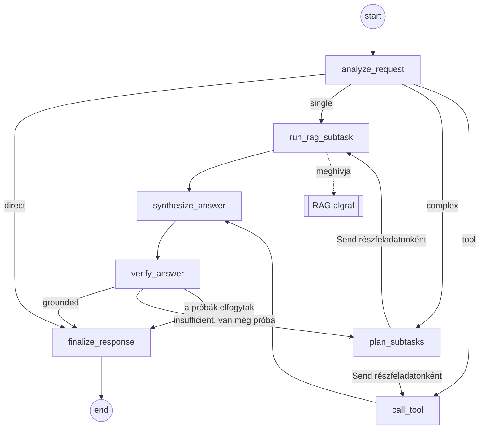

# Projektstruktúra-terv

[English](project-structure-plan.md) | **Magyar**

> **Állapot:** javaslat, 2026. 10. 01. Ez a dokumentum a repository *vázát* és a felépítés sorrendjét tervezi meg. A részletes tervezés (konkrét promptok, metrikák, chunkméretek) a megvalósítás során dől el, és a [README](../README.hu.md)-ben, valamint a `docs/` mappa többi dokumentumában rögzítjük.

## Tartalom

1. [Cél és hatókör](#1-cél-és-hatókör)
2. [Kiindulási állapot](#2-kiindulási-állapot)
3. [A váz elkészítése előtt eldöntendő kérdések](#3-a-váz-elkészítése-előtt-eldöntendő-kérdések)
4. [A repository célstruktúrája](#4-a-repository-célstruktúrája)
5. [A modulok felelősségei](#5-a-modulok-felelősségei)
6. [Konfiguráció és futtatási módok](#6-konfiguráció-és-futtatási-módok)
7. [Konténerizálási terv](#7-konténerizálási-terv)
8. [Felépítési sorrend](#8-felépítési-sorrend)
9. [Követelmények nyomon követése](#9-követelmények-nyomon-követése)
10. [Konvenciók](#10-konvenciók)
11. [Kockázatok és nyitott kérdések](#11-kockázatok-és-nyitott-kérdések)

## 1. Cél és hatókör

A struktúrának mindent hordoznia kell, amit a feladatkiírás elvár, anélkül hogy éles rendszerré nőne:

- **LangGraph fő workflow** legalább 5 node-dal, feltételes elágazással (conditional routing), részfeladatokra bontással és közös állapottal.
- **Moduláris RAG algráf (subgraph)**, amelyet a fő workflow hív meg, és amely nem számít bele az 5 node-ba.
- **Legalább 2 eszköz (tool)**, amelyek közül egy nem visszakeresési célú.
- **Helyi, nyílt forráskódú LLM** (fizetős API-k nélkül), **dummy tartalékkal** a tesztekhez és az olyan gépekhez, amelyeken nem fut modell.
- **Adatbetöltési (ingestion) folyamat** egy kicsi, de jól feldolgozott szöveges korpuszhoz, perzisztens vektorindexszel.
- **Streamlit UI**, amely megjeleníti az ágens lépéseit és a visszakeresett kontextust.
- **Dockerfile** (kötelező) és **Compose stack** (UI + modellkiszolgáló).
- **Funkcionális értékelés** (10–20 kérdés) és **terheléses teszt** (50–200 lekérdezés) node-onkénti válaszidővel, szűkkeresztmetszet-elemzéssel és optimalizálási javaslatokkal.
- **Kétnyelvű dokumentáció** (angol + magyar), amely együtt mozog a kóddal.

A váznak nem része: hitelesítés, többfelhasználós perzisztencia, felhős telepítés, hosztolt tracing szolgáltatások, publikus HTTP API (később opcionális, lásd a [11. szakaszt](#11-kockázatok-és-nyitott-kérdések)).

## 2. Kiindulási állapot

Ami már a repositoryban van:

| Elem | Megjegyzés |
|---|---|
| `README.md`, `README.hu.md` | Kétnyelvű dokumentáció a követelménylistával és a `Kitöltendő` helyőrzőkkel |
| `.gitignore` | Már kizárja a `task/`, `.env`, `models/`, `chroma_db/`, `.chroma/`, `*.gguf`, `*.bin` elemeket, a virtuális környezeteket és a cache-eket |
| `.claude/agents/`, `.claude/skills/` | Négy Claude Code ágens (LangGraph, RAG, Streamlit, Docker) a hozzájuk tartozó skillekkel |
| `docs/` | Üres, diagramoknak és riportoknak fenntartva |
| `task/` | A feladatkiírás (magyar), csak helyben |
| `LICENSE` | MIT |

Helyi környezet, 2026. 10. 01-én ellenőrizve:

| Erőforrás | Érték |
|---|---|
| OS | Windows 11 Pro |
| Python | 3.14.3 (`uv` és `poetry` nincs telepítve) |
| Docker | 29.8.0, Compose v5.5.1 |
| Ollama | 0.35.0 kliens telepítve, a szerver nem fut |
| RAM | 31 GB |
| CPU | Intel Core Ultra 9 275HX, 24 mag |
| GPU | NVIDIA GeForce RTX 5070 Laptop, 8 GB VRAM |

Egy 7–8 milliárd paraméteres, 4 bites kvantálású modell (~4,5–5 GB) úgy fér el a GPU-n, hogy a KV cache-nek is marad hely; egy 3–4 milliárdos modell mellett az embedding modell is futhat a GPU-n.

## 3. A váz elkészítése előtt eldöntendő kérdések

Az alábbi ajánlások azok az alapértelmezések, amelyekre a váz épül. A végleges választás a README *Tervezési döntések* táblázatába kerül, a trade-offjával együtt.

| # | Döntés | Lehetőségek | Ajánlás | Indoklás |
|---|---|---|---|---|
| 1 | Csomagkezelés és Python-verzió | `pip` + `requirements.txt` / `poetry` / `uv` + `pyproject.toml` + `uv.lock` | **`uv`**, Python **3.12** rögzítve a `.python-version`-ben és a Dockerfile-ban | A lock fájl reprodukálhatóvá teszi a buildet, az `uv` maga telepíti a rögzített Pythont, és a 3.12-höz érhető el a legszélesebb wheel-lefedettség az ML stackhez (torch, chromadb). A helyi 3.14-re nincs szükség. |
| 2 | Csomagelrendezés | lapos / `src` elrendezés | **`src/agentic_rag/`** | Megakadályozza a véletlen importot a munkakönyvtárból; tisztán működik a konténerben és a tesztekben. |
| 3 | LLM kiszolgálás | Ollama / `llama-cpp-python` folyamaton belül / csak dummy | **Ollama** Compose szolgáltatásként, fejlesztéshez a gépen futó Ollama is használható, plusz egy **fake provider** | Az Ollama HTTP API-t, GPU-támogatást és tiszta többkonténeres felállást ad. A `llama-cpp-python` a képfájlon belül fordul, ami lassítja a buildet. A fake provider teljesíti a „dummy LLM” tartalékot, és modell nélkülivé teszi a teszteket és a CI-t. |
| 4 | LLM modell | 3–4B vs. 7–8B instruct modellek | Jelöltek: `qwen2.5:7b-instruct`, `llama3.1:8b`, `gemma3:4b` (az aktuális Ollama tageket ellenőrizni kell); alapértelmezésként **7B-osztályú modell Q4 kvantálással** | Elfér 8 GB VRAM-ban. A korpusz nyelve (magyar szöveghez erős többnyelvű lefedettségű modell kell) és a terheléses tesztben mért válaszidő alapján választandó. Egy 3B-s modell maradjon gyors alternatívaként. |
| 5 | Embedding | `sentence-transformers` folyamaton belül / Ollama embedding / `fastembed` | **`sentence-transformers` a `langchain-huggingface` csomagon át**, CPU-s torch wheelekkel | Így a visszakeresés fake módban, Ollama nélkül is működik. Jelöltek: `intfloat/multilingual-e5-small` vegyes nyelvű korpuszhoz, `BAAI/bge-small-en-v1.5` csak angolhoz. Ha a képfájl mérete gond lesz, az Ollama embedding a tartalék. |
| 6 | Vektoradatbázis | Chroma / FAISS / memóriabeli | **Chroma**, perzisztens kliens, `data/chroma_db/` | Perzisztencia és metaadat-alapú szűrés, nincs pickle-deszerializálás, már szerepel a `.gitignore`-ban. |
| 7 | Eszközhívás módja | natív `bind_tools` + `ToolNode` / strukturált kimenetű tervező + explicit tool node-ok | **Strukturált kimenetű tervező + explicit node-ok** | A kis helyi modellek natív eszközhívása megbízhatatlan. Egy tervező, amely tipizált részfeladatok JSON-listáját adja, robusztus, és továbbra is autonóm döntést mutat. |
| 8 | Domain és korpusz | — | **A te döntésed**, a 2. fázis előtt | Szempontok: valós felhasználói igény; kicsi korpusz tiszta licenccel (public domain, CC vagy saját); kellően stabil szöveg a referenciaválaszokhoz; olyan domain, ahol egy nem visszakeresési eszköz természetes. |
| 9 | Nem visszakeresési eszköz | kalkulátor / dátum- és határidőszámítás / mértékegység-átváltás / strukturált táblázatos lekérdezés | A domaintől függ; **determinisztikus és helyi** legyen | Példák: határidőszámítás jogszabályi Q&A-hoz, nettó/bruttó kalkulátor bérszabályokhoz, mértékegység-átváltó műszaki kézikönyvekhez. |
| 10 | HTTP API réteg | nincs / FastAPI szolgáltatás | **A vázban nincs** | A terheléses teszt közvetlenül a lefordított gráfot hajtja, ami tisztább node-onkénti bontást ad. Egy FastAPI szolgáltatás később harmadik Compose komponensként hozzáadható. |

## 4. A repository célstruktúrája

```text
agentic-rag-chatbot-poc/
├── .claude/                          # Claude Code ágensek és skillek (megvan)
├── .github/
│   └── workflows/
│       └── ci.yml                    # opcionális: ruff + pytest fake módban + docker build
├── data/
│   ├── raw/                          # forráskorpusz (kicsi, ellenőrzött licenccel) – vagy az `ingest --download` tölti le
│   ├── eval/
│   │   ├── questions.jsonl           # 10–20 értékelő kérdés referenciaválasszal és elvárt forrásokkal
│   │   └── results/                  # a végleges értékelési és terheléses futások commitolt kimenetei
│   └── chroma_db/                    # felépített vektorindex (gitignore-olva)
├── docs/
│   ├── project-structure-plan.md     # ez a terv (angol)
│   ├── project-structure-plan.hu.md  # ez a terv (magyar)
│   ├── architecture.md               # a két gráf Mermaid exportja, állapotséma, node- és eszköztáblázatok
│   ├── evaluation.md                 # funkcionális értékelés: módszer, eredmények, következtetések
│   └── performance.md                # terheléses teszt: felállás, metrikák, szűk keresztmetszet, javaslatok
├── src/
│   └── agentic_rag/
│       ├── __init__.py
│       ├── __main__.py               # `python -m agentic_rag <parancs>`
│       ├── cli.py                    # ingest · eval · loadtest · export-graph
│       ├── config.py                 # pydantic-settings: provider, modellnevek, útvonalak, top_k
│       ├── llm.py                    # LLM factory: ollama | fake
│       ├── embeddings.py             # embedding modell factory
│       ├── tracing.py                # lépésnyomkövetés (trace) a UI, az értékelés és a terheléses teszt számára
│       ├── ingestion/
│       │   ├── __init__.py
│       │   ├── loaders.py            # PDF / Markdown / szöveg → Document-ek metaadatokkal
│       │   ├── chunking.py           # darabolás (splitter) beállításai
│       │   └── index.py              # a Chroma index felépítése és betöltése
│       ├── rag/                      # RAG algráf (nem számít bele az 5 node-ba)
│       │   ├── __init__.py
│       │   ├── state.py
│       │   ├── nodes.py              # rewrite_query · retrieve · grade_documents · build_context
│       │   └── graph.py              # lefordított `rag_graph`
│       ├── agent/                    # fő agentic workflow
│       │   ├── __init__.py
│       │   ├── state.py              # AgentState reducerekkel
│       │   ├── nodes.py              # a 7 fő node
│       │   ├── routing.py            # feltételes élek függvényei, Send szétosztás
│       │   ├── tools.py              # search_knowledge_base + a nem visszakeresési eszköz(ök)
│       │   └── graph.py              # StateGraph összekötése, lefordított `agent_graph`
│       ├── evaluation/
│       │   ├── __init__.py
│       │   ├── dataset.py            # questions.jsonl betöltése
│       │   ├── metrics.py            # helyesség, faithfulness, hit@k, routing-pontosság
│       │   └── runner.py
│       ├── loadtest/
│       │   ├── __init__.py
│       │   └── runner.py             # aszinkron N lekérdezés × párhuzamosság, percentilisek, node-onkénti válaszidő
│       └── ui/
│           ├── app.py                # Streamlit belépési pont
│           └── components.py         # ágenslépés-panel, visszakeresett források panelje
├── tests/
│   ├── conftest.py                   # fake LLM, apró fixture-korpusz, ideiglenes Chroma könyvtár
│   ├── test_ingestion.py
│   ├── test_rag_subgraph.py
│   ├── test_agent_graph.py           # routing, részfeladatokra bontás, node-szám ≥ 5, korlátos újrapróbálkozás
│   ├── test_tools.py
│   └── test_ui_smoke.py              # streamlit.testing.v1.AppTest
├── .dockerignore
├── .env.example
├── .gitignore                        # megvan
├── .python-version                   # 3.12
├── compose.yaml                      # app + ollama + egyszeri modell-letöltés
├── Dockerfile                        # többlépcsős, uv-alapú, nem root
├── LICENSE                           # megvan
├── pyproject.toml                    # függőségek, ruff, pytest, konzolos belépési pont
├── README.md · README.hu.md          # megvan, fázisonként frissül
├── task/                             # megvan, gitignore-olva
└── uv.lock
```

Elnevezési megjegyzés: a feladatkiírás `docker-compose.yml`-t említ, a Docker dokumentációja és a projekt Docker skillje `compose.yaml`-t használ. A `docker compose` mindkettőt automatikusan felismeri, ezért a repository a `compose.yaml` nevet használja, a README pedig jelzi az egyenértékűséget.

## 5. A modulok felelősségei

### 5.1 Fő agentic workflow (`agent/`)

Hét node, így az 5 node-os minimum akkor is teljesül, ha később kettőt összevonunk.

| # | Node | Típus | Olvassa | Írja |
|---|---|---|---|---|
| 1 | `analyze_request` | LLM | `messages` | `question`, `intent` (`direct` / `single` / `complex` / `tool`) |
| 2 | `plan_subtasks` | LLM | `question`, előző `verdict` | `subtasks` – tipizált lista: `{kind: retrieve \| tool, input}` |
| 3 | `run_rag_subtask` | algráfhívás | egy részfeladat | hozzáfűz a `subtask_results`-hoz (kontextus, források, pontszámok) |
| 4 | `call_tool` | művelet | egy részfeladat | hozzáfűz a `subtask_results`-hoz (az eszköz kimenete) |
| 5 | `synthesize_answer` | LLM | `subtask_results` | `draft_answer` |
| 6 | `verify_answer` | LLM | `draft_answer`, kontextusok | `verdict` (`grounded` / `insufficient`), `retry_count` |
| 7 | `finalize_response` | adat | `draft_answer`, források | `answer`, `sources`, záró `trace` bejegyzés, asszisztensüzenet |

Routing szabályok (feltételes élek):

- `analyze_request` után: `direct` → `finalize_response`; `single` → egy `Send` a `run_rag_subtask`-ra; `complex` → `plan_subtasks`; `tool` → egy `Send` a `call_tool`-ra.
- `plan_subtasks` után: részfeladatonként egy `Send`, a `kind` alapján a `run_rag_subtask` vagy a `call_tool` node-ra. Ez a részfeladatokra bontás és az önálló végrehajtás: a LangGraph párhuzamosan futtatja a Send-eket, és a `synthesize_answer` előtt összegyűjti az eredményeket.
- `verify_answer` után: `grounded` → `finalize_response`; `insufficient` és `retry_count < 2` → `plan_subtasks` (újratervezés a kritikával); egyébként `finalize_response`, kifejezett „részben megválaszolva” megjegyzéssel.



Eszközök (`agent/tools.py`):

- `search_knowledge_base(query)` – a `rag_graph.invoke` burkolója; az egyetlen visszakeresési eszköz.
- Egy, a domainnel együtt kiválasztott nem visszakeresési eszköz (9. döntés), determinisztikus, egységtesztekkel. Mindkettő `@tool` függvényként érhető el, így később átstrukturálás nélkül köthetők egy eszközhívó modellhez is.

### 5.2 RAG algráf (`rag/`)

Saját `RagState` (`query`, `rewritten_query`, `documents`, `scores`, `context`, `sources`). Négy node:

| Node | Szerep |
|---|---|
| `rewrite_query` | Opcionális LLM-es átfogalmazás a visszakereséshez; fake módban kimarad |
| `retrieve` | Top-k hasonlósági keresés pontszámokkal és metaadatokkal a Chromából |
| `grade_documents` | Az irreleváns chunkok elhagyása (pontszámküszöb, opcionálisan LLM-es osztályozás) |
| `build_context` | Duplikátumszűrés, sorrendezés, formázás hivatkozásjelölőkkel |

A fő gráf a `run_rag_subtask` node-ból hívja, explicit be- és kimeneti leképezéssel, így a két állapotséma független marad, és az algráf önállóan is tesztelhető és terhelhető.

### 5.3 Állapot (`agent/state.py`)

```python
class AgentState(TypedDict):
    messages: Annotated[list[AnyMessage], add_messages]
    question: str
    intent: Literal["direct", "single", "complex", "tool"]
    subtasks: list[Subtask]
    subtask_results: Annotated[list[SubtaskResult], operator.add]   # a Send-ek eredményeinek összegyűjtése
    draft_answer: str
    verdict: Literal["grounded", "insufficient"] | None
    retry_count: int
    answer: str
    sources: list[Source]
    trace: Annotated[list[TraceEvent], operator.add]                # a UI és a terheléses teszt használja
```

A nyers adat az állapotban él; a promptokat a node-okon belül formázzuk.

### 5.4 Adatbetöltés (`ingestion/`)

Betöltés → darabolás → embedding → tárolás. A loaderek `source`, `title`, valamint `page` / `section` metaadatokat csatolnak, hogy a UI hivatkozni tudjon. A darabolás ~800–1000 karakteres chunkokkal és 10–20 % átfedéssel indul, és az értékelő készleten hangoljuk. Az `index.py` a `build_index()` és `load_index()` függvényeket adja; a CLI `ingest` parancsa idempotens, és a konténer belépési pontja meghívhatja, ha az indexkönyvtár üres.

### 5.5 UI (`ui/`)

Egyetlen Streamlit belépési pont. Chat `st.chat_message` / `st.chat_input` elemekkel; élő lépéspanel az `agent_graph.stream(..., stream_mode="updates")` kimenetéből; lenyíló panel a visszakeresett chunkokkal, forrásaikkal és pontszámaikkal; oldalsáv a provider, a modell és a top-k beállításához. Fake módban, Ollama nélkül is futnia kell.

### 5.6 Értékelés és terheléses teszt (`evaluation/`, `loadtest/`)

- `evaluation/`: beolvassa a `data/eval/questions.jsonl` fájlt (`question`, `reference_answer`, `expected_sources`, `expected_intent`), lefuttat egy node-ot vagy a teljes gráfot, és pontozza a helyességet (helyi LLM mint bíró vagy szemantikus hasonlóság), a faithfulness-t, a visszakeresési hit@k-t és a routing pontosságát. JSON-t ír a `data/eval/results/` mappába, összefoglalót a `docs/evaluation.md`-be.
- `loadtest/`: aszinkron harness, amely N lekérdezést (50–200) küld adott párhuzamossággal a lefordított gráfnak, rögzíti a kérésenkénti és – a trace-ből – a node-onkénti válaszidőt, és jelenti az átlag / p50 / p95 / p99 / max értékeket, az áteresztőképességet és a hibaarányt. `fake` és `ollama` módban is lefuttatva elkülöníthető az LLM részesedése a válaszidőből – ez a szűkkeresztmetszet-elemzés magja.

### 5.7 Közös modulok (`config.py`, `llm.py`, `embeddings.py`, `tracing.py`)

- `config.py`: egyetlen `Settings` osztály (pydantic-settings), környezeti változókból és `.env`-ből.
- `llm.py`: a `get_chat_model()` `ChatOllama`-t vagy egy szkriptelt fake chatmodellt ad vissza, amelynek válaszai a prompttól függnek (intent JSON, terv JSON, válaszszöveg), így a routing tesztelhető.
- `embeddings.py`: a `get_embeddings()` a helyi embedding modellt adja; indexeléshez és lekérdezéshez ugyanaz a modell.
- `tracing.py`: a gráf stream-frissítéseit `TraceEvent(node, started_at, ended_at, summary)` rekordokká alakítja.

## 6. Konfiguráció és futtatási módok

A `.env.example` (verziókezelt) minden változót dokumentál; a `.env` gitignore-olva van.

| Változó | Alapértelmezés | Cél |
|---|---|---|
| `LLM_PROVIDER` | `ollama` | `ollama` vagy `fake` |
| `OLLAMA_BASE_URL` | `http://localhost:11434` | Compose-on belül `http://ollama:11434`, a gépen futó Ollamához `http://host.docker.internal:11434` |
| `OLLAMA_MODEL` | *(4. döntés)* | chatmodell tag |
| `EMBEDDING_MODEL` | *(5. döntés)* | Hugging Face modellazonosító |
| `CHROMA_DIR` | `data/chroma_db` | az index helye |
| `DATA_DIR` | `data/raw` | a korpusz helye |
| `TOP_K` | `4` | visszakeresési mélység |
| `MAX_RETRIES` | `2` | az ellenőrzés → újratervezés ciklus korlátja |
| `INGEST_ON_START` | `true` | a konténer indulásakor felépíti az indexet, ha hiányzik |
| `LOG_LEVEL` | `INFO` | |

Futtatási módok:

| Mód | LLM | Igényli | Mire való |
|---|---|---|---|
| `fake` | szkriptelt fake | semmit | egységtesztek, CI, UI-fejlesztés, válaszidő-alapvonal LLM nélkül |
| `ollama-host` | Ollama Windowson (már telepítve) | `ollama serve` | gyors helyi fejlesztés |
| `ollama-compose` | Ollama konténer | Docker | a reprodukálható út, amelyet az értékelők futtatnak |

## 7. Konténerizálási terv

- **`Dockerfile`** (kötelező): többlépcsős. A builder lépcső az `uv`-t a `ghcr.io/astral-sh/uv` képfájlból másolja, és `uv sync --frozen --no-dev` paranccsal telepít az `/app/.venv` könyvtárba; a futtató lépcső `python:3.12-slim`, nem root felhasználó, átmásolja a venv-et és az `src/`-t, a `HF_HOME`-ot volume-mal támogatott útvonalra állítja, `EXPOSE 8501`, healthcheck a `/_stcore/health` végponton, `CMD streamlit run src/agentic_rag/ui/app.py --server.address=0.0.0.0`. Opcionálisan az embedding modell már build közben letölthető a teljesen offline induláshoz.
- **`.dockerignore`**: `.git`, `.venv`, `data/chroma_db`, `tests`, `docs`, `task`, `.claude`, cache-ek, `.env`.
- **`compose.yaml`**:
  - `ollama`: `ollama/ollama`, `ollama-data` nevesített volume, `11434` port, healthcheck `ollama list` paranccsal, GPU-foglalás opcionális `gpu` profil alatt (a Docker Desktopnak WSL2 backend kell az NVIDIA GPU átadásához; enélkül CPU-n fut az inferencia).
  - `ollama-pull`: egyszeri szolgáltatás, amely `ollama pull $OLLAMA_MODEL`-t futtat, `depends_on: ollama` healthy állapotban.
  - `app`: `build: .`, `8501` port, `env_file: .env`, `./data:/app/data` bind mount, hogy a korpusz látható legyen és az index megmaradjon, `hf-cache` nevesített volume, `depends_on: ollama-pull` sikeres befejezéssel.
- A képfájlban CPU-s torch wheelek maradnak (`[tool.uv.index]` a PyTorch CPU indexre mutat), mert a GPU-t az Ollama használja, nem az embedding modell.
- A README-ben dokumentálandó: `docker compose up --build`, az első indulás időigénye (modell-letöltés + adatbetöltés), valamint `LLM_PROVIDER=fake docker compose up app` a modell nélküli indításhoz.

## 8. Felépítési sorrend

Minden fázis olyan commitolt állapottal zárul, amely átmegy a saját „kész, ha” ellenőrzésén. A 6–8. fázisnak csak a 4. fázis az előfeltétele; a 6. fázis fake módban már az 1. fázis után elkezdhető.

| Fázis | Leszállítandók | Kész, ha |
|---|---|---|
| **0. Döntések rögzítése** | A README *Tervezési döntések* táblázata kitöltve az 1–9. döntésre; `docs/architecture.md` csonk | Minden sorban van választás és egysoros trade-off |
| **1. Váz** (e terv magja) | `pyproject.toml`, `.python-version`, `uv.lock`, `src/agentic_rag/` csak docstringet tartalmazó modulokkal, `config.py`, `cli.py` csonk parancsokkal, `.env.example`, `tests/conftest.py` + egy smoke teszt, ruff konfiguráció, `.dockerignore`, a README *Projektstruktúra* része frissítve | Az `uv sync` sikeres; az `uv run pytest` zöld; az `uv run python -m agentic_rag --help` kilistázza a parancsokat; az `uv run ruff check .` tiszta |
| **2. Adatbetöltés és index** | korpusz a `data/raw/`-ban (vagy letöltő parancs), loaderek, darabolás, `index.py`, `ingest` parancs, fixture-korpuszos teszt | A `python -m agentic_rag ingest` felépíti az indexet; egy mintalekérdezés a várt chunkot adja vissza metaadatokkal |
| **3. RAG algráf** | `rag/state.py`, `nodes.py`, `graph.py`, tesztek, Mermaid export | A `rag_graph.invoke({"query": ...})` kontextust és forrásokat ad vissza; a tesztek fake módban átmennek |
| **4. Fő workflow és eszközök** | `agent/*`, a fake LLM szkriptelése, `export-graph` parancs, amely a `docs/architecture.md`-t írja | ≥ 5 node, a routing tesztek mind a négy intentet lefedik, a részfeladatokra bontás `Send`-del fut, az újrapróbálkozási ciklus korlátos, Ollamával végponttól végpontig működik egy válasz |
| **5. Streamlit UI** | `ui/app.py`, `components.py`, `AppTest` smoke teszt | A chat válaszol, a lépések élőben megjelennek, a források láthatók, `LLM_PROVIDER=fake` módban is fut |
| **6. Konténerizálás** | `Dockerfile`, `compose.yaml`, belépési pont opcionális adatbetöltéssel, README futtatási útmutató | Friss klónból a `docker compose up --build` a 8501-es porton kiszolgálja a UI-t letöltött modellel és felépített indexszel; a `docker build .` önmagában is sikeres |
| **7. Funkcionális értékelés** | `data/eval/questions.jsonl` (10–20), `evaluation/*`, `eval` parancs, `docs/evaluation.md`, README-szakasz | A `python -m agentic_rag eval` kiírja az eredményeket és az összefoglalót; a következtetések a README-ben vannak |
| **8. Terheléses teszt** | `loadtest/runner.py`, `loadtest` parancs, `docs/performance.md`, README-szakasz | A `python -m agentic_rag loadtest --requests 100 --concurrency 4` kiírja a percentiliseket és a node-onkénti bontást; a szűk keresztmetszet és 1–2 javaslat dokumentálva |
| **9. Dokumentáció és finomítás** | README angolul + magyarul kész, a követelménylista kipipálva, opcionális CI workflow, záró tiszta-klón teszt | Egy értékelő minden állítást reprodukálni tud a dokumentált parancsokkal |

## 9. Követelmények nyomon követése

| Követelmény (feladatkiírás) | Hol | Ellenőrzés |
|---|---|---|
| Valós probléma indoklással | README *Problémafelvetés*, 8. döntés | Átnézés |
| Szabadon választott szöveges forrás, minőségi feldolgozás | `data/raw/`, `ingestion/` | `test_ingestion.py`, `ingest` parancs |
| ≥ 5 node | `agent/graph.py` | A `test_agent_graph.py` ellenőrzi a node-számot |
| Feltételes elágazás (conditional routing) | `agent/routing.py` | Intentenkénti routing tesztek |
| Részfeladatokra bontás és önálló végrehajtás | `plan_subtasks` + `Send` szétosztás | Teszt többrészes kérdéssel |
| Állapot a köztes eredményekhez | `agent/state.py` | Reducer tesztek |
| ≥ 2 eszköz, egy nem visszakeresési | `agent/tools.py` | `test_tools.py` |
| Moduláris, hívható RAG algráf, nem számít bele | `rag/graph.py` | `test_rag_subgraph.py`, Mermaid export `xray=True`-val |
| Nyílt forráskódú helyi LLM indoklással; dummy megengedett | `llm.py`, 3–4. döntés, README | Mindkét providerrel fut |
| Streamlit UI lépésekkel és RAG-eredménnyel | `ui/` | `test_ui_smoke.py`, kézi ellenőrzés |
| Dockerfile, Compose | `Dockerfile`, `compose.yaml` | Tiszta klónból `docker compose up --build` |
| 10–20 kérdéses értékelő készlet | `data/eval/questions.jsonl`, `evaluation/` | `eval` parancs, `docs/evaluation.md` |
| Terheléses teszt 50–200 lekérdezéssel, válaszidő, szűk keresztmetszet, javaslatok | `loadtest/`, `docs/performance.md` | `loadtest` parancs |
| README: probléma, architektúra, eredmények, futtatási útmutató | `README.md`, `README.hu.md` | Követelménylista kipipálva |

## 10. Konvenciók

- Kód, azonosítók, kommentek és commit-üzenetek angolul; a felhasználónak szóló dokumentáció angolul és magyarul.
- `src` elrendezés, mindenhol típusannotáció, modul-docstringek, `ruff` lintre és formázásra, `pytest` a tesztekhez.
- Minden teszt átmegy `LLM_PROVIDER=fake` módban és hálózat nélkül; a modellfüggő ellenőrzések megjelölve, és kimaradnak, ha az Ollama nem elérhető.
- A node-ok részleges állapotfrissítést adnak vissza, és sosem módosítják közvetlenül az állapotot; minden gyűjtő listának van reducere; a ciklusok nevesített node-okon át mennek, korlátos számlálóval.
- Konfiguráció kizárólag a `Settings`-en keresztül; nincs titok a kódban, a képfájlokban vagy a Compose fájlokban.
- A diagramokat a lefordított gráfokból generáljuk (`draw_mermaid()`), nem kézzel rajzoljuk, így a `docs/architecture.md` nem szakadhat el a kódtól.
- Minden dokumentált számhoz (értékelési pontszám, válaszidő) tartozik egy reprodukáló parancs és egy commitolt eredményfájl.
- A README *Projektstruktúra* része és a követelménylista minden fázis végén frissül.

## 11. Kockázatok és nyitott kérdések

- **Képfájlméret**: a torch és a `sentence-transformers` CPU-s wheelekkel is ~1 GB-ot ad hozzá. Tartalék: Ollama embedding (`nomic-embed-text`, `bge-m3`) és torch nélküli képfájl.
- **GPU Dockerben, Windowson**: WSL2 backend és friss NVIDIA driver kell. Tartalék: a gépen futó Ollama a `host.docker.internal` címen, vagy CPU-s inferencia 3B-s modellel.
- **Hidegindítás**: az első Ollama-kérés betölti a modellt (másodpercek); a terheléses tesztnek bemelegítő szakaszt kell tartalmaznia, és azt külön kell jelentenie.
- **A kis modellek magyar nyelvi minősége**: ha a korpusz és a kérdések magyarok, kifejezetten többnyelvű lefedettségű modellt érdemes választani, és az értékelő készleten ellenőrizni, mielőtt véglegesítjük.
- **A korpusz licence**: csak olyan dokumentumot commitolunk, amelynek licence engedi a továbbterjesztést; egyébként letöltő parancs kell, a forrás-URL-ek rögzítésével.
- **Nyitott**: a végleges domain és korpusz (8. döntés), a nem visszakeresési eszköz (9. döntés), a UI nyelve, és hogy megéri-e egy FastAPI szolgáltatást harmadik Compose komponensként hozzáadni a valósághűbb terheléses teszthez.
