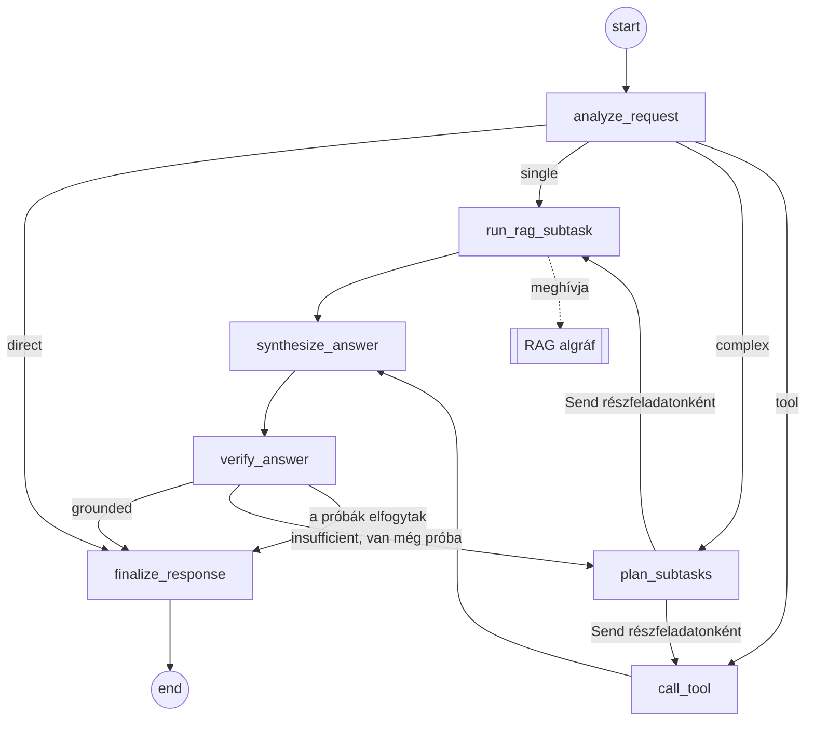

# Projektstruktúra-terv

[English](project-structure-plan.md) | **Magyar**

> **Állapot:** javaslat, 2026. 10. 01. Ez a dokumentum a repository *vázát* és a felépítés sorrendjét tervezi meg. A részletes tervezés (konkrét promptok, metrikák, chunkméretek) a megvalósítás során dől el, és a [README](../README.hu.md)-ben, valamint a `docs/` mappa többi dokumentumában rögzítjük.
>
> **Haladás:** az 1. fázis 2026. 10. 01-jén elkészült. Vele együtt előre hoztuk a 6. fázis konténeres környezetét (`Dockerfile`, `compose.yaml`, `compose.gpu.yaml`) és az 5.7. szakasz közös moduljait (`config.py`, `llm.py`, `embeddings.py`, `tracing.py`), valamint az állapotsémákat, a Streamlit felület vázát és a 2–8. fázis típusannotált vázait. Az alapokat még aznap átnéztük és javítottuk; ezek a változások is a 12. szakaszban szerepelnek. A 8–9. döntés 2026. 10. 02-án született meg (3. szakasz és [12.6. szakasz](#126-domain-és-korpusz-89-döntés)), és a 2. fázis is még aznap elkészült. Következik a 3. fázis. A részletek a [8. szakaszban](#8-felépítési-sorrend) olvashatók, a tervtől való eltérések pedig a [12. szakaszban](#12-eltérések-a-tervtől).

## Tartalom

1. [Cél és hatókör](#1-cél-és-hatókör)
2. [Kiindulási állapot](#2-kiindulási-állapot)
3. [A váz elkészítése előtt eldöntendő kérdések](#3-a-váz-elkészítése-előtt-eldöntendő-kérdések)
4. [A repository célstruktúrája](#4-a-repository-célstruktúrája)
5. [A modulok felelősségei](#5-a-modulok-felelősségei)
6. [Konfiguráció és futtatási módok](#6-konfiguráció-és-futtatási-módok)
7. [Konténerizálási terv](#7-konténerizálási-terv)
8. [Felépítési sorrend](#8-felépítési-sorrend)
9. [Követelmények nyomon követése](#9-követelmények-nyomon-követése)
10. [Konvenciók](#10-konvenciók)
11. [Kockázatok és nyitott kérdések](#11-kockázatok-és-nyitott-kérdések)
12. [Eltérések a tervtől](#12-eltérések-a-tervtől)

## 1. Cél és hatókör

A struktúrának mindent hordoznia kell, amit a feladatkiírás elvár, anélkül hogy éles rendszerré nőne:

- **LangGraph fő workflow** legalább 5 node-dal, feltételes elágazással (conditional routing), részfeladatokra bontással és közös állapottal.
- **Moduláris RAG algráf (subgraph)**, amelyet a fő workflow hív meg, és amely nem számít bele az 5 node-ba.
- **Legalább 2 eszköz (tool)**, amelyek közül egy nem visszakeresési célú.
- **Helyi, nyílt forráskódú LLM** (fizetős API-k nélkül), **dummy tartalékkal** a tesztekhez és az olyan gépekhez, amelyeken nem fut modell.
- **Adatbetöltési (ingestion) folyamat** egy kicsi, de jól feldolgozott szöveges korpuszhoz, perzisztens vektorindexszel.
- **Streamlit UI**, amely megjeleníti az ágens lépéseit és a visszakeresett kontextust.
- **Dockerfile** (kötelező) és **Compose stack** (UI + modellkiszolgáló).
- **Funkcionális értékelés** (10–20 kérdés) és **terheléses teszt** (50–200 lekérdezés) node-onkénti válaszidővel, szűkkeresztmetszet-elemzéssel és optimalizálási javaslatokkal.
- **Kétnyelvű dokumentáció** (angol + magyar), amely együtt mozog a kóddal.

A váznak nem része: hitelesítés, többfelhasználós perzisztencia, felhős telepítés, hosztolt tracing szolgáltatások, publikus HTTP API (később opcionális, lásd a [11. szakaszt](#11-kockázatok-és-nyitott-kérdések)).

## 2. Kiindulási állapot

Ami már a repositoryban van:

| Elem | Megjegyzés |
|---|---|
| `README.md`, `README.hu.md` | Kétnyelvű dokumentáció a követelménylistával és a `Kitöltendő` helyőrzőkkel |
| `.gitignore` | Már kizárja a `task/`, `.env`, `models/`, `chroma_db/`, `.chroma/`, `*.gguf`, `*.bin` elemeket, a virtuális környezeteket és a cache-eket |
| `.claude/agents/`, `.claude/skills/` | Négy Claude Code ágens (LangGraph, RAG, Streamlit, Docker) a hozzájuk tartozó skillekkel |
| `docs/` | Üres, diagramoknak és riportoknak fenntartva |
| `task/` | A feladatkiírás (magyar), csak helyben |
| `LICENSE` | MIT |

Helyi környezet, 2026. 10. 01-én ellenőrizve:

| Erőforrás | Érték |
|---|---|
| OS | Windows 11 Pro |
| Python | 3.14.3 (`uv` és `poetry` nincs telepítve) |
| Docker | 29.8.0, Compose v5.5.1 |
| Ollama | 0.35.0 kliens telepítve, a szerver nem fut |
| RAM | 31 GB |
| CPU | Intel Core Ultra 9 275HX, 24 mag |
| GPU | NVIDIA GeForce RTX 5070 Laptop, 8 GB VRAM |

Egy 7–8 milliárd paraméteres, 4 bites kvantálású modell (~4,5–5 GB) úgy fér el a GPU-n, hogy a KV cache-nek is marad hely; egy 3–4 milliárdos modell mellett az embedding modell is futhat a GPU-n.

## 3. A váz elkészítése előtt eldöntendő kérdések

Az alábbi ajánlások azok az alapértelmezések, amelyekre a váz épül. A végleges választás a README *Tervezési döntések* táblázatába kerül, a trade-offjával együtt.

| # | Döntés | Lehetőségek | Ajánlás | Indoklás |
|---|---|---|---|---|
| 1 | Csomagkezelés és Python-verzió | `pip` + `requirements.txt` / `poetry` / `uv` + `pyproject.toml` + `uv.lock` | **`uv`**, Python **3.12** rögzítve a `.python-version`-ben és a Dockerfile-ban | A lock fájl reprodukálhatóvá teszi a buildet, az `uv` maga telepíti a rögzített Pythont, és a 3.12-höz érhető el a legszélesebb wheel-lefedettség az ML stackhez (torch, chromadb). A helyi 3.14-re nincs szükség. |
| 2 | Csomagelrendezés | lapos / `src` elrendezés | **`src/agentic_rag/`** | Megakadályozza a véletlen importot a munkakönyvtárból; tisztán működik a konténerben és a tesztekben. |
| 3 | LLM kiszolgálás | Ollama / `llama-cpp-python` folyamaton belül / csak dummy | **Ollama** Compose szolgáltatásként, fejlesztéshez a gépen futó Ollama is használható, plusz egy **fake provider** | Az Ollama HTTP API-t, GPU-támogatást és tiszta többkonténeres felállást ad. A `llama-cpp-python` a képfájlon belül fordul, ami lassítja a buildet. A fake provider teljesíti a „dummy LLM” tartalékot, és modell nélkülivé teszi a teszteket és a CI-t. |
| 4 | LLM modell | 3–4B vs. 7–8B instruct modellek | Jelöltek: `qwen2.5:7b-instruct`, `llama3.1:8b`, `gemma3:4b` (az aktuális Ollama tageket ellenőrizni kell); alapértelmezésként **7B-osztályú modell Q4 kvantálással** | Elfér 8 GB VRAM-ban. A korpusz nyelve (magyar szöveghez erős többnyelvű lefedettségű modell kell) és a terheléses tesztben mért válaszidő alapján választandó. Egy 3B-s modell maradjon gyors alternatívaként. |
| 5 | Embedding | `sentence-transformers` folyamaton belül / Ollama embedding / `fastembed` | **`sentence-transformers` a `langchain-huggingface` csomagon át**, CPU-s torch wheelekkel | Így a visszakeresés fake módban, Ollama nélkül is működik. Jelöltek: `intfloat/multilingual-e5-small` vegyes nyelvű korpuszhoz, `BAAI/bge-small-en-v1.5` csak angolhoz. Ha a képfájl mérete gond lesz, az Ollama embedding a tartalék. |
| 6 | Vektoradatbázis | Chroma / FAISS / memóriabeli | **Chroma**, perzisztens kliens, `data/chroma_db/` | Perzisztencia és metaadat-alapú szűrés, nincs pickle-deszerializálás, már szerepel a `.gitignore`-ban. |
| 7 | Eszközhívás módja | natív `bind_tools` + `ToolNode` / strukturált kimenetű tervező + explicit tool node-ok | **Strukturált kimenetű tervező + explicit node-ok** | A kis helyi modellek natív eszközhívása megbízhatatlan. Egy tervező, amely tipizált részfeladatok JSON-listáját adja, robusztus, és továbbra is autonóm döntést mutat. |
| 8 | Domain és korpusz | — | **Eldőlt 2026. 10. 02-án:** **frontend fejlesztői asszisztens** az MDN Web Docs, a React, a Vue, a Next.js, a Nuxt és a TypeScript Handbook hivatalos dokumentációja felett; az üzemeltetés (Kubernetes, Docker) későbbi bővítés | Szempontok: valós felhasználói igény; kicsi korpusz tiszta licenccel (public domain, CC vagy saját); kellően stabil szöveg a referenciaválaszokhoz; olyan domain, ahol egy nem visszakeresési eszköz természetes. A dokumentáció mindegyiknek megfelel: gyakori igény, nyílt licencek (CC BY 4.0, CC BY-SA 2.5, MIT), commitra rögzítve stabil, és a kérdések a magyarázatot olyan ellenőrzésekkel kombinálják, amelyeket egy eszköz ki tud számolni. |
| 9 | Nem visszakeresési eszköz | kalkulátor / dátum- és határidőszámítás / mértékegység-átváltás / strukturált táblázatos lekérdezés | **Eldőlt 2026. 10. 02-án:** három eszköz: **böngészőtámogatás** (MDN `browser-compat-data`), **WCAG színkontraszt** és **CSS specificitás** | Mindegyik determinisztikus és helyi, és olyan kérdésre ad választ, amelynek egyetlen pontos eredménye van, és amelyet a modell különben találgatna. |
| 10 | HTTP API réteg | nincs / FastAPI szolgáltatás | **A vázban nincs** | A terheléses teszt közvetlenül a lefordított gráfot hajtja, ami tisztább node-onkénti bontást ad. Egy FastAPI szolgáltatás később harmadik Compose komponensként hozzáadható. |

## 4. A repository célstruktúrája

```text
agentic-rag-chatbot-poc/
├── .claude/                          # Claude Code ágensek és skillek (megvan)
├── .github/
│   └── workflows/
│       └── ci.yml                    # opcionális: ruff + pytest fake módban + docker build
├── data/
│   ├── raw/                          # forráskorpusz (kicsi, ellenőrzött licenccel) – vagy az `ingest --download` tölti le
│   ├── eval/
│   │   ├── questions.jsonl           # 10–20 értékelő kérdés referenciaválasszal és elvárt forrásokkal
│   │   └── results/                  # a végleges értékelési és terheléses futások commitolt kimenetei
│   └── chroma_db/                    # felépített vektorindex (gitignore-olva)
├── docs/
│   ├── project-structure-plan.md     # ez a terv (angol)
│   ├── project-structure-plan.hu.md  # ez a terv (magyar)
│   ├── architecture.md               # a két gráf Mermaid exportja, állapotséma, node- és eszköztáblázatok
│   ├── evaluation.md                 # funkcionális értékelés: módszer, eredmények, következtetések
│   └── performance.md                # terheléses teszt: felállás, metrikák, szűk keresztmetszet, javaslatok
├── src/
│   └── agentic_rag/
│       ├── __init__.py
│       ├── __main__.py               # `python -m agentic_rag <parancs>`
│       ├── cli.py                    # ingest · eval · loadtest · export-graph
│       ├── config.py                 # pydantic-settings: provider, modellnevek, útvonalak, top_k
│       ├── llm.py                    # LLM factory: ollama | fake
│       ├── embeddings.py             # embedding modell factory
│       ├── tracing.py                # lépésnyomkövetés (trace) a UI, az értékelés és a terheléses teszt számára
│       ├── ingestion/
│       │   ├── __init__.py
│       │   ├── loaders.py            # PDF / Markdown / szöveg → Document-ek metaadatokkal
│       │   ├── chunking.py           # darabolás (splitter) beállításai
│       │   └── index.py              # a Chroma index felépítése és betöltése
│       ├── rag/                      # RAG algráf (nem számít bele az 5 node-ba)
│       │   ├── __init__.py
│       │   ├── state.py
│       │   ├── nodes.py              # rewrite_query · retrieve · grade_documents · build_context
│       │   └── graph.py              # lefordított `rag_graph`
│       ├── agent/                    # fő agentic workflow
│       │   ├── __init__.py
│       │   ├── state.py              # AgentState reducerekkel
│       │   ├── nodes.py              # a 7 fő node
│       │   ├── routing.py            # feltételes élek függvényei, Send szétosztás
│       │   ├── tools.py              # search_knowledge_base + a nem visszakeresési eszköz(ök)
│       │   └── graph.py              # StateGraph összekötése, lefordított `agent_graph`
│       ├── evaluation/
│       │   ├── __init__.py
│       │   ├── dataset.py            # questions.jsonl betöltése
│       │   ├── metrics.py            # helyesség, faithfulness, hit@k, routing-pontosság
│       │   └── runner.py
│       ├── loadtest/
│       │   ├── __init__.py
│       │   └── runner.py             # aszinkron N lekérdezés × párhuzamosság, percentilisek, node-onkénti válaszidő
│       └── ui/
│           ├── app.py                # Streamlit belépési pont
│           └── components.py         # ágenslépés-panel, visszakeresett források panelje
├── tests/
│   ├── conftest.py                   # fake LLM, apró fixture-korpusz, ideiglenes Chroma könyvtár
│   ├── test_ingestion.py
│   ├── test_rag_subgraph.py
│   ├── test_agent_graph.py           # routing, részfeladatokra bontás, node-szám ≥ 5, korlátos újrapróbálkozás
│   ├── test_tools.py
│   └── test_ui_smoke.py              # streamlit.testing.v1.AppTest
├── .dockerignore
├── .env.example
├── .gitignore                        # megvan
├── .python-version                   # 3.12
├── compose.yaml                      # app + ollama + egyszeri modell-letöltés
├── Dockerfile                        # többlépcsős, uv-alapú, nem root
├── LICENSE                           # megvan
├── pyproject.toml                    # függőségek, ruff, pytest, konzolos belépési pont
├── README.md · README.hu.md          # megvan, fázisonként frissül
├── task/                             # megvan, gitignore-olva
└── uv.lock
```

Elnevezési megjegyzés: a feladatkiírás `docker-compose.yml`-t említ, a Docker dokumentációja és a projekt Docker skillje `compose.yaml`-t használ. A `docker compose` mindkettőt automatikusan felismeri, ezért a repository a `compose.yaml` nevet használja, a README pedig jelzi az egyenértékűséget.

## 5. A modulok felelősségei

### 5.1 Fő agentic workflow (`agent/`)

Hét node, így az 5 node-os minimum akkor is teljesül, ha később kettőt összevonunk.

| # | Node | Típus | Olvassa | Írja |
|---|---|---|---|---|
| 1 | `analyze_request` | LLM | `messages` | `question`, `intent` (`direct` / `single` / `complex` / `tool`) |
| 2 | `plan_subtasks` | LLM | `question`, előző `verdict` | `subtasks` – tipizált lista: `{kind: retrieve \| tool, input}` |
| 3 | `run_rag_subtask` | algráfhívás | egy részfeladat | hozzáfűz a `subtask_results`-hoz (kontextus, források, pontszámok) |
| 4 | `call_tool` | művelet | egy részfeladat | hozzáfűz a `subtask_results`-hoz (az eszköz kimenete) |
| 5 | `synthesize_answer` | LLM | `subtask_results` | `draft_answer` |
| 6 | `verify_answer` | LLM | `draft_answer`, kontextusok | `verdict` (`grounded` / `insufficient`), `retry_count` |
| 7 | `finalize_response` | adat | `draft_answer`, források | `answer`, `sources`, záró `trace` bejegyzés, asszisztensüzenet |

Routing szabályok (feltételes élek):

- `analyze_request` után: `direct` → `finalize_response`; `single` → egy `Send` a `run_rag_subtask`-ra; `complex` → `plan_subtasks`; `tool` → egy `Send` a `call_tool`-ra.
- `plan_subtasks` után: részfeladatonként egy `Send`, a `kind` alapján a `run_rag_subtask` vagy a `call_tool` node-ra. Ez a részfeladatokra bontás és az önálló végrehajtás: a LangGraph párhuzamosan futtatja a Send-eket, és a `synthesize_answer` előtt összegyűjti az eredményeket.
- `verify_answer` után: `grounded` → `finalize_response`; `insufficient` és `retry_count < 2` → `plan_subtasks` (újratervezés a kritikával); egyébként `finalize_response`, kifejezett „részben megválaszolva” megjegyzéssel.



Eszközök (`agent/tools.py`):

- `search_knowledge_base(query)` – a `rag_graph.invoke` burkolója; az egyetlen visszakeresési eszköz.
- Egy, a domainnel együtt kiválasztott nem visszakeresési eszköz (9. döntés), determinisztikus, egységtesztekkel. Mindkettő `@tool` függvényként érhető el, így később átstrukturálás nélkül köthetők egy eszközhívó modellhez is.

### 5.2 RAG algráf (`rag/`)

Saját `RagState` (`query`, `rewritten_query`, `documents`, `scores`, `context`, `sources`). Négy node:

| Node | Szerep |
|---|---|
| `rewrite_query` | Opcionális LLM-es átfogalmazás a visszakereséshez; fake módban kimarad |
| `retrieve` | Top-k hasonlósági keresés pontszámokkal és metaadatokkal a Chromából |
| `grade_documents` | Az irreleváns chunkok elhagyása (pontszámküszöb, opcionálisan LLM-es osztályozás) |
| `build_context` | Duplikátumszűrés, sorrendezés, formázás hivatkozásjelölőkkel |

A fő gráf a `run_rag_subtask` node-ból hívja, explicit be- és kimeneti leképezéssel, így a két állapotséma független marad, és az algráf önállóan is tesztelhető és terhelhető.

### 5.3 Állapot (`agent/state.py`)

```python
class AgentState(TypedDict):
    messages: Annotated[list[AnyMessage], add_messages]
    question: str
    intent: Literal["direct", "single", "complex", "tool"]
    subtasks: list[Subtask]
    subtask_results: Annotated[list[SubtaskResult], operator.add]   # a Send-ek eredményeinek összegyűjtése
    draft_answer: str
    verdict: Literal["grounded", "insufficient"] | None
    retry_count: int
    answer: str
    sources: list[Source]
    trace: Annotated[list[TraceEvent], operator.add]                # a UI és a terheléses teszt használja
```

A nyers adat az állapotban él; a promptokat a node-okon belül formázzuk.

### 5.4 Adatbetöltés (`ingestion/`)

Betöltés → darabolás → embedding → tárolás. A loaderek `source`, `title`, valamint `page` / `section` metaadatokat csatolnak, hogy a UI hivatkozni tudjon. A darabolás ~800–1000 karakteres chunkokkal és 10–20 % átfedéssel indul, és az értékelő készleten hangoljuk. Az `index.py` a `build_index()` és `load_index()` függvényeket adja; a CLI `ingest` parancsa idempotens, és a konténer belépési pontja meghívhatja, ha az indexkönyvtár üres.

### 5.5 UI (`ui/`)

Egyetlen Streamlit belépési pont. Chat `st.chat_message` / `st.chat_input` elemekkel; élő lépéspanel az `agent_graph.stream(..., stream_mode="updates")` kimenetéből; lenyíló panel a visszakeresett chunkokkal, forrásaikkal és pontszámaikkal; oldalsáv a provider, a modell és a top-k beállításához. Fake módban, Ollama nélkül is futnia kell.

### 5.6 Értékelés és terheléses teszt (`evaluation/`, `loadtest/`)

- `evaluation/`: beolvassa a `data/eval/questions.jsonl` fájlt (`question`, `reference_answer`, `expected_documents`, `expected_intent`), lefuttat egy node-ot vagy a teljes gráfot, és pontozza a helyességet (helyi LLM mint bíró vagy szemantikus hasonlóság), a faithfulness-t, a visszakeresési hit@k-t és a routing pontosságát. JSON-t ír a `data/eval/results/` mappába, összefoglalót a `docs/evaluation.md`-be.
- `loadtest/`: aszinkron harness, amely N lekérdezést (50–200) küld adott párhuzamossággal a lefordított gráfnak, rögzíti a kérésenkénti és – a trace-ből – a node-onkénti válaszidőt, és jelenti az átlag / p50 / p95 / p99 / max értékeket, az áteresztőképességet és a hibaarányt. `fake` és `ollama` módban is lefuttatva elkülöníthető az LLM részesedése a válaszidőből – ez a szűkkeresztmetszet-elemzés magja.

### 5.7 Közös modulok (`config.py`, `llm.py`, `embeddings.py`, `tracing.py`)

- `config.py`: egyetlen `Settings` osztály (pydantic-settings), környezeti változókból és `.env`-ből.
- `llm.py`: a `get_chat_model()` `ChatOllama`-t vagy egy szkriptelt fake chatmodellt ad vissza, amelynek válaszai a prompttól függnek (intent JSON, terv JSON, válaszszöveg), így a routing tesztelhető.
- `embeddings.py`: a `get_embeddings()` a helyi embedding modellt adja; indexeléshez és lekérdezéshez ugyanaz a modell.
- `tracing.py`: a gráf stream-frissítéseit `TraceEvent(node, started_at, ended_at, summary)` rekordokká alakítja.

## 6. Konfiguráció és futtatási módok

A `.env.example` (verziókezelt) minden változót dokumentál; a `.env` gitignore-olva van.

| Változó | Alapértelmezés | Cél |
|---|---|---|
| `LLM_PROVIDER` | `ollama` | `ollama` vagy `fake` |
| `OLLAMA_BASE_URL` | `http://localhost:11434` | Compose-on belül `http://ollama:11434`, a gépen futó Ollamához `http://host.docker.internal:11434` |
| `OLLAMA_MODEL` | `qwen2.5:7b-instruct` *(4. döntés, ideiglenes)* | chatmodell tag |
| `OLLAMA_NUM_CTX` | `8192` | kontextusablak tokenben, 512–131072, az Ollama `num_ctx` paramétereként elküldve *(új)* |
| `OLLAMA_TIMEOUT_S` | `120.0` | az egyes Ollama-kérések HTTP-időkorlátja másodpercben, > 0 *(új)* |
| `LLM_TEMPERATURE` | `0.0` | mintavételi hőmérséklet, 0,0–2,0 *(új)* |
| `EMBEDDING_PROVIDER` | `huggingface` | `huggingface` vagy `fake` (offline, hash-alapú embedding, modell-letöltés nélkül) *(új)* |
| `EMBEDDING_MODEL` | `intfloat/multilingual-e5-small` *(5. döntés, ideiglenes)* | Hugging Face modellazonosító |
| `CHROMA_DIR` | `data/chroma_db` | az index helye |
| `CHROMA_COLLECTION` | `documents` | a Chroma kollekció neve *(új)* |
| `DATA_DIR` | `data/raw` | a korpusz helye |
| `TOP_K` | `4` | visszakeresési mélység |
| `MAX_RETRIES` | `2` | az ellenőrzés → újratervezés ciklus korlátja |
| `INGEST_ON_START` | `true` | a konténer indulásakor felépíti az indexet, ha hiányzik (amíg a 6. fázis belépési pontja el nem készül, nincs hatása) |
| `LOG_LEVEL` | `INFO` | |

*(új)*: az alapok építése közben vagy az átnézésük után került be. Minden értéket induláskor ellenőrzünk (például `TOP_K` ≥ 1, `MAX_RETRIES` ≥ 0, az `LLM_TEMPERATURE` 0,0 és 2,0 között, valamint a projekt saját szabálya a kollekciónevekre: 3–63 karakter, ami szándékosan szigorúbb a chromadb 512-es korlátjánál, és IPv4-cím nem lehet); az üres érték az alapértéket jelenti, a `.env` csak UTF-8 kódolású lehet, az `agentic-rag config` pedig kiírja az érvényes értékeket. A teljes referencia az [architecture.md](architecture.md#configuration-reference) fájlban található (angolul).

Futtatási módok:

| Mód | LLM | Igényli | Mire való |
|---|---|---|---|
| `fake` | szkriptelt fake | semmit | egységtesztek, CI, UI-fejlesztés, válaszidő-alapvonal LLM nélkül |
| `ollama-host` | Ollama Windowson (már telepítve) | `ollama serve` | gyors helyi fejlesztés |
| `ollama-compose` | Ollama konténer | Docker | a reprodukálható út, amelyet az értékelők futtatnak |

A teljesen offline fake mód az `EMBEDDING_PROVIDER=fake` beállítást is használja; az alapértelmezett `huggingface` providerrel az embedding modell az első használatkor letöltődik. Az `ollama-compose` módban az `app` szolgáltatás `OLLAMA_BASE_URL` értékét maga a `compose.yaml` állítja be.

## 7. Konténerizálási terv

A `Dockerfile` pontja a ténylegesen felépített képfájlt írja le; a szakasz többi eltérését a [12.4. szakasz](#124-konténerek-7-szakasz) sorolja fel.

- **`Dockerfile`** (kötelező): két lépcső a `python:3.12.14-slim-trixie` alapon; az `uv` a `ghcr.io/astral-sh/uv:0.12.6` képfájlból csak a `RUN` lépésekbe van csatolva.
  - A `deps` lépcső az `uv sync --locked --no-dev --no-install-project` paranccsal telepít az `/app/.venv` könyvtárba: csak az `uv.lock`-ban rögzített függőségeket, a `--locked` pedig leállítja a buildet, ha az `uv.lock` nem egyezik a `pyproject.toml`-lal.
  - A futtató lépcső két, a kódtól független rétegben átmásolja a venv-et (`COPY --link`, 1,71 GB), és `compileall`-lal lefordítja a bytecode-ját (415 MB), létrehozza a nem root felhasználót (`APP_UID`/`APP_GID` build argumentumok, alapértékük 10001), majd hozzáadja az `src/` mappát és egy kis, szerkeszthető projektréteget az `uv sync --locked --no-dev --refresh-package agentic-rag-chatbot-poc` paranccsal. Az `src/` módosítása csak az utolsó két réteget építi újra (mérve: 7 s; a képfájl 2,88 GB).
  - A `HF_HOME`-ot volume-mal támogatott útvonalra állítja, `EXPOSE 8501`, healthcheck a `/_stcore/health` végponton, `CMD streamlit run src/agentic_rag/ui/app.py --server.address=0.0.0.0 --server.port=8501`. Az embedding modell build közbeni előzetes letöltése a teljesen offline induláshoz továbbra is opcionális.
- **`.dockerignore`**: `.git`, `.venv`, `data/chroma_db`, `tests`, `docs`, `task`, `.claude`, cache-ek, `.env`.
- **`compose.yaml`**:
  - `ollama`: `ollama/ollama`, `ollama-data` nevesített volume, `11434` port, healthcheck `ollama list` paranccsal, GPU-foglalás opcionális `gpu` profil alatt (a Docker Desktopnak WSL2 backend kell az NVIDIA GPU átadásához; enélkül CPU-n fut az inferencia).
  - `ollama-pull`: egyszeri szolgáltatás, amely `ollama pull $OLLAMA_MODEL`-t futtat, `depends_on: ollama` healthy állapotban.
  - `app`: `build: .`, `8501` port, `env_file: .env`, `./data:/app/data` bind mount, hogy a korpusz látható legyen és az index megmaradjon, `hf-cache` nevesített volume, `depends_on: ollama-pull` sikeres befejezéssel.
- A képfájlban CPU-s torch wheelek maradnak (`[tool.uv.index]` a PyTorch CPU indexre mutat), mert a GPU-t az Ollama használja, nem az embedding modell.
- A README-ben dokumentálandó: `docker compose up --build`, az első indulás időigénye (modell-letöltés + adatbetöltés), valamint `LLM_PROVIDER=fake docker compose up app` a modell nélküli indításhoz.

## 8. Felépítési sorrend

Minden fázis olyan commitolt állapottal zárul, amely átmegy a saját „kész, ha” ellenőrzésén. A 6–8. fázisnak csak a 4. fázis az előfeltétele; a 6. fázis fake módban már az 1. fázis után elkezdhető.

| Fázis | Leszállítandók | Kész, ha |
|---|---|---|
| **0. Döntések rögzítése** | A README *Tervezési döntések* táblázata kitöltve az 1–9. döntésre; `docs/architecture.md` csonk | Minden sorban van választás és egysoros trade-off |
| **1. Váz** (e terv magja) | `pyproject.toml`, `.python-version`, `uv.lock`, `src/agentic_rag/` csak docstringet tartalmazó modulokkal, `config.py`, `cli.py` csonk parancsokkal, `.env.example`, `tests/conftest.py` + egy smoke teszt, ruff konfiguráció, `.dockerignore`, a README *Projektstruktúra* része frissítve | Az `uv sync` sikeres; az `uv run pytest` zöld; az `uv run python -m agentic_rag --help` kilistázza a parancsokat; az `uv run ruff check .` tiszta |
| **2. Adatbetöltés és index** | korpusz a `data/raw/`-ban (vagy letöltő parancs), loaderek, darabolás, `index.py`, `ingest` parancs, fixture-korpuszos teszt | A `python -m agentic_rag ingest` felépíti az indexet; egy mintalekérdezés a várt chunkot adja vissza metaadatokkal |
| **3. RAG algráf** | `rag/state.py`, `nodes.py`, `graph.py`, tesztek, Mermaid export | A `rag_graph.invoke({"query": ...})` kontextust és forrásokat ad vissza; a tesztek fake módban átmennek |
| **4. Fő workflow és eszközök** | `agent/*`, a fake LLM szkriptelése, az `export-graph` kimenete, amely a `docs/architecture.md` kézzel rajzolt diagramjait váltja fel | ≥ 5 node, a routing tesztek mind a négy intentet lefedik, a részfeladatokra bontás `Send`-del fut, az újrapróbálkozási ciklus korlátos, Ollamával végponttól végpontig működik egy válasz |
| **5. Streamlit UI** | `ui/app.py`, `components.py`, `AppTest` smoke teszt | A chat válaszol, a lépések élőben megjelennek, a források láthatók, `LLM_PROVIDER=fake` módban is fut |
| **6. Konténerizálás** | `Dockerfile`, `compose.yaml`, belépési pont opcionális adatbetöltéssel, README futtatási útmutató | Friss klónból a `docker compose up --build` a 8501-es porton kiszolgálja a UI-t letöltött modellel és felépített indexszel; a `docker build .` önmagában is sikeres |
| **7. Funkcionális értékelés** | `data/eval/questions.jsonl` (10–20), `evaluation/*`, `eval` parancs, `docs/evaluation.md`, README-szakasz | A `python -m agentic_rag eval` kiírja az eredményeket és az összefoglalót; a következtetések a README-ben vannak |
| **8. Terheléses teszt** | `loadtest/runner.py`, `loadtest` parancs, `docs/performance.md`, README-szakasz | A `python -m agentic_rag loadtest --requests 100 --concurrency 4` kiírja a percentiliseket és a node-onkénti bontást; a szűk keresztmetszet és 1–2 javaslat dokumentálva |
| **9. Dokumentáció és finomítás** | README angolul + magyarul kész, a követelménylista kipipálva, opcionális CI workflow, záró tiszta-klón teszt | Egy értékelő minden állítást reprodukálni tud a dokumentált parancsokkal |

Haladás 2026. 10. 01-jén:

- **0. fázis:** kész. Az 1–7. döntés szerepel a README *Tervezési döntések* táblázatában (a 4. és az 5. ideiglenes alapértelmezéssel), a 8. és a 9. döntés 2026. 10. 02-án került be a README *Problémafelvetés* részével együtt, és elkészült a `docs/architecture.md` csonk.
- **1. fázis:** kész. Mind a négy „kész, ha” ellenőrzése teljesül, és a `--help` kilistázza az `ingest`, `eval`, `loadtest`, `export-graph` és `config` parancsot.
- **2. fázis:** kész (2026. 10. 02.). A `python -m agentic_rag ingest --download` letölti a hat forrás 1160 oldalát, és felépíti az indexet (18 654 chunk); az olyan kérdések, mint a *Which CSS pseudo-class selects a parent element that contains a specific child?*, a várt chunkot adják vissza (az MDN `:has()` oldalát) a forrásával, címével, szakaszával és URL-jével. A tesztek a `tests/test_ingestion.py` fájlban vannak. A megközelítést és a tervtől való eltéréseket a [12.6. szakasz](#126-domain-és-korpusz-89-döntés) rögzíti.
- **Előre hozva** az alapokba, a saját fázisuk előtt megépítve és tesztelve:
  - a 6. fázisból: a `Dockerfile`, a `compose.yaml`, a `compose.gpu.yaml` GPU override és a README futtatási útmutatója. A képfájl felépül, és az `app` szolgáltatás fake módban egészséges (healthy) állapotban fut. A 6. fázisban marad: a belépési pont az opcionális adatbetöltéssel (`INGEST_ON_START`), valamint a teljes stack futtatása friss klónból, letöltött modellel és felépített indexszel;
  - az 5.7. szakasz közös moduljai: `config.py`, `llm.py` (`ChatOllama` és a szkriptelt fake modell; a fake szabályai a valódi promptokhoz a 4. fázisban készülnek), `embeddings.py` (sentence-transformers és egy offline fake) és `tracing.py`;
  - a 3–4. fázisból: az állapotsémák (`rag/state.py`, `agent/state.py`) és a `search_knowledge_base` eszköz interfésze;
  - az 5. fázisból: a Streamlit felület váza (`ui/app.py`, `ui/components.py`) az `AppTest` tesztjeivel a `tests/test_ui.py` fájlban; az 5. fázisban marad az ellenőrzés a valódi gráffal;
  - a 2., 7. és 8. fázisból: azok az adatsémák és tiszta segédfüggvények, amelyekre ezek a fázisok építenek: a dokumentum- és chunk-metaadatok, a darabolás alapértékei és az `IndexStats`; a kérdésbetöltő, a hit@k, a routing-pontosság és a riportmodellek; a válaszidő-statisztikák.
- **Vázak:** a 2–8. fázis minden más publikus függvénye típusannotált csonkként létezik, és a `planned(...)` segítségével `agentic_rag.errors.PlannedFeatureError` kivételt dob (ez a `NotImplementedError` alosztálya), ezzel az üzenettel: `<qualified name> is planned for Phase <N> (see docs/project-structure-plan.md, section 8)`. Ezek az üzenetek és a tesztek az angol terv e szakaszára hivatkoznak, ezért a szakasz száma és a fázisok számozása maradjon változatlan.
  - **Már rögzített:** a nevek (modulok, publikus függvények és osztályok, `NODE_NAMES`, `RAG_NODE_NAMES`, `NODE_TARGETS`); a függőségi konvenció (a node egyetlen pozicionális paramétere az állapot, a függőségei csak kulcsszóval adhatók meg, és a gráfépítő köti őket; minden könyvtári factory kötelező argumentumként kapja a `settings`-et; lásd az [architecture.md](architecture.md#dependency-injection-and-cheap-builds) *Dependency injection and cheap builds* szakaszát, angolul); valamint az adatsémák (az állapotsémák és rekordok, a riportmodellek, a kérdéskészlet formátuma).
  - **Még bővülhet:** egy későbbi fázis adhat hozzá csak kulcsszóval megadható paramétert, például egy node olyan függőségét, amely a prompt megírásakor derül ki, vagy szűkítheti a visszatérési típust, amíg a meglévő hívók és e szerződések tesztjei működnek. Az ilyen változásokat a 12. szakasz rögzíti.
- **Megjegyzés a 4. fázishoz:** az `export-graph` parancs már létezik (`--graph`, `--format`, `--output`), és kirajzolja a gráfokat, amint elkészülnek. Teljes Markdown fájlt ír, ezért a kimenetét a `docs/architecture.md`-be kell bemásolni vagy külön fájlba írni; az `--output` kapcsolót nem szabad a kézzel írt dokumentumra irányítani.

## 9. Követelmények nyomon követése

| Követelmény (feladatkiírás) | Hol | Ellenőrzés |
|---|---|---|
| Valós probléma indoklással | README *Problémafelvetés*, 8. döntés | Átnézés |
| Szabadon választott szöveges forrás, minőségi feldolgozás | `data/raw/`, `ingestion/` | `test_ingestion.py`, `ingest` parancs |
| ≥ 5 node | `agent/graph.py` | A `test_agent_graph.py` ellenőrzi a node-számot |
| Feltételes elágazás (conditional routing) | `agent/routing.py` | Intentenkénti routing tesztek |
| Részfeladatokra bontás és önálló végrehajtás | `plan_subtasks` + `Send` szétosztás | Teszt többrészes kérdéssel |
| Állapot a köztes eredményekhez | `agent/state.py` | Reducer tesztek |
| ≥ 2 eszköz, egy nem visszakeresési | `agent/tools.py` | `test_tools.py` |
| Moduláris, hívható RAG algráf, nem számít bele | `rag/graph.py` | `test_rag_subgraph.py`, Mermaid export `xray=True`-val |
| Nyílt forráskódú helyi LLM indoklással; dummy megengedett | `llm.py`, 3–4. döntés, README | Mindkét providerrel fut |
| Streamlit UI lépésekkel és RAG-eredménnyel | `ui/` | `test_ui_smoke.py`, kézi ellenőrzés |
| Dockerfile, Compose | `Dockerfile`, `compose.yaml` | Tiszta klónból `docker compose up --build` |
| 10–20 kérdéses értékelő készlet | `data/eval/questions.jsonl`, `evaluation/` | `eval` parancs, `docs/evaluation.md` |
| Terheléses teszt 50–200 lekérdezéssel, válaszidő, szűk keresztmetszet, javaslatok | `loadtest/`, `docs/performance.md` | `loadtest` parancs |
| README: probléma, architektúra, eredmények, futtatási útmutató | `README.md`, `README.hu.md` | Követelménylista kipipálva |

## 10. Konvenciók

- Kód, azonosítók, kommentek és commit-üzenetek angolul; a felhasználónak szóló dokumentáció angolul és magyarul.
- `src` elrendezés, mindenhol típusannotáció, modul-docstringek, `ruff` lintre és formázásra, `pytest` a tesztekhez.
- Minden teszt átmegy `LLM_PROVIDER=fake` módban és hálózat nélkül; a modellfüggő ellenőrzések megjelölve, és kimaradnak, ha az Ollama nem elérhető.
- A node-ok részleges állapotfrissítést adnak vissza, és sosem módosítják közvetlenül az állapotot; minden gyűjtő listának van reducere; a ciklusok nevesített node-okon át mennek, korlátos számlálóval.
- Konfiguráció kizárólag a `Settings`-en keresztül; nincs titok a kódban, a képfájlokban vagy a Compose fájlokban.
- A diagramokat a lefordított gráfokból generáljuk (`draw_mermaid()`), nem kézzel rajzoljuk, így a `docs/architecture.md` nem szakadhat el a kódtól.
- Minden dokumentált számhoz (értékelési pontszám, válaszidő) tartozik egy reprodukáló parancs és egy commitolt eredményfájl.
- A README *Projektstruktúra* része és a követelménylista minden fázis végén frissül.

## 11. Kockázatok és nyitott kérdések

- **Képfájlméret**: a torch és a `sentence-transformers` CPU-s wheelekkel is ~1 GB-ot ad hozzá. Tartalék: Ollama embedding (`nomic-embed-text`, `bge-m3`) és torch nélküli képfájl.
- **GPU Dockerben, Windowson**: WSL2 backend és friss NVIDIA driver kell. Tartalék: a gépen futó Ollama a `host.docker.internal` címen, vagy CPU-s inferencia 3B-s modellel.
- **Hidegindítás**: az első Ollama-kérés betölti a modellt (másodpercek); a terheléses tesztnek bemelegítő szakaszt kell tartalmaznia, és azt külön kell jelentenie.
- **A kis modellek magyar nyelvi minősége**: a korpusz angol, de a kérdések lehetnek magyarok. Ezért az értékelő készlet magyar kérdéseket is tartalmaz, amelyek az embedding modell nyelvek közötti visszakeresését és az LLM magyar válaszait egyaránt ellenőrzik, mielőtt bármelyiket véglegesítjük.
- **A korpusz licence**: csak olyan dokumentumot commitolunk, amelynek licence engedi a továbbterjesztést; egyébként letöltő parancs kell, a forrás-URL-ek rögzítésével. A választott dokumentációt letöltjük, nem commitoljuk (12.6. szakasz).
- **A korpusz terjedelme és verziói**: az MDN nagy, a keretrendszerek dokumentációja pedig verziókat, elavult részeket és azonos nevű API-kat kever (a React `useState` hookja és a Nuxt `useState` composable-je). A 2. fázis rögzített commitokból egy válogatott részt indexel, és minden forrást saját könyvtárban tart, így a hivatkozásokból látszik, honnan származik egy válasz.
- **Nyitott**: a UI nyelve, és hogy megéri-e egy FastAPI szolgáltatást harmadik Compose komponensként hozzáadni a valósághűbb terheléses teszthez.

## 12. Eltérések a tervtől

Az alapok építése közben és az átnézésük után rögzítve (2026. 10. 01.). A fenti szakaszok az eredeti tervet őrzik, kivéve a 6. szakasz beállítástáblázatát és a 7. szakasz `Dockerfile` pontját, amelyek a kódot írják le; ahol eltérnek, a kód és ez a lista az irányadó. A modulokon átívelő szerződéseket egyetlen helyen, az [architecture.md](architecture.md) fájlban írjuk le (angolul).

### 12.1 Konfiguráció (6. szakasz)

- Öt új beállítás: `LLM_TEMPERATURE`, `EMBEDDING_PROVIDER` (`huggingface` vagy `fake`, hogy a tesztekhez és a modell nélküli bemutatókhoz ne kelljen embedding modellt letölteni), `CHROMA_COLLECTION`, valamint az átnézés után az `OLLAMA_NUM_CTX` (alapértéke 8192, 512–131072) és az `OLLAMA_TIMEOUT_S` (alapértéke 120.0, > 0). Az utóbbi kettő `num_ctx`-ként, illetve a HTTP-kliensek időkorlátjaként jut el a `ChatOllama`-hoz: `num_ctx` nélkül a szerver kis alapértelmezett kontextushossza szó nélkül levágná a promptokat, a HTTP-időkorlát pedig az egyetlen korlát egy lassú kérésre, mert a LangGraph egy szinkron node-ot nem tud időkorláttal megszakítani.
- A `CHROMA_COLLECTION` a projekt saját szabályát követi: 3–63 karakter a `[A-Za-z0-9._-]` készletből, mindkét végén betű vagy számjegy, `..` nélkül, és nem lehet IPv4-cím. A 63 karakteres korlát szándékosan szigorúbb a chromadb 1.5.9-nél (3–512), hogy a nevek hordozhatók maradjanak; az IPv4-szabály a chromadb saját ellenőrzésével egyezik. Egy teszt a határeseteket a telepített chromadb-vel is ellenőrzi.
- A `get_settings()` `agentic_rag.errors.ConfigurationError` kivételt dob, ha a `.env` nem olvasható vagy nem UTF-8 kódolású (a Windows PowerShell 5.1 a `>` operátorral UTF-16-ot ír), a `config.describe_invalid_settings()` pedig a parancssori felületnek és a UI-nak egyaránt megnevezi az érvénytelen változókat.
- Az `INGEST_ON_START` létezik, de még nincs hatása: induláskor semmi sem tölt be adatot, amíg el nem készül a 6. fázis belépési pontja, amelyhez a 2. fázis `build_index` függvénye kell. A UI nem tölt be adatot, hogy könnyű maradjon az indulása.
- A chunkméret és az átfedés kódbeli konstans (`ChunkingConfig`: 900 karakter 150 karakteres átfedéssel, az 5.4. szakasz tartományán belül), nem beállítás.

### 12.2 Közös modulok és sémák (5.1–5.3. és 5.7. szakasz)

- A trace-eseményeket a `@traced` node-dekorátor rögzíti, amely minden node állapotfrissítéséhez hozzáfűzi őket, ahelyett hogy a streamből állnának elő. Így az állapotban utaznak: az `invoke` eredménye a teljes trace-t tartalmazza, a RAG algráf eseményeivel együtt, amelyeket a `run_rag_subtask` továbbít. A `TraceEvent` a tervezett mezőkön túl `duration_ms` és `metadata` mezőt is kapott.
- A `search_knowledge_base` nem `@tool` függvény, hanem `BaseTool` alosztály, amely a lefordított RAG algráfot tárolja, `response_format="content_and_artifact"` beállítással (a modellnek a kontextus, az alkalmazásnak a teljes `RagOutput`), mert a gráf építésekor létrejövő függőségre van szüksége. A `run_rag_subtask` ezen az eszközön át hívja az algráfot, ezért a `get_graph(xray=True)` nem ágyazza be az algráfot a fő diagramba: az `export-graph` külön diagramként rajzolja ki, és a 9. szakaszban hivatkozott Mermaid export is így mutatja.
- Az `analyze_request` a `direct` úton a `draft_answer` mezőt, a `single` és a `tool` úton egy egylépéses `subtasks` tervet is ír. A `plan_subtasks` minden tervezési kör elején `Overwrite`-tal nullázza a `subtask_results` listát, így az újratervezés nem keveri bele az elutasított kör eredményeit.
- Az állapotok `total=False` beállítású `TypedDict`-ek explicit be- és kimeneti sémával (`AgentInput` és `AgentOutput`, `RagInput` és `RagOutput`); a `RagState` `trace` kulcsot is kapott.
- A fake LLM szabálymotor (`ScriptedChatModel`: sorrendezett reguláris kifejezések, JSON strukturált kimenet); a valódi promptokhoz tartozó szabályai a 4. fázisban készülnek. Az `EMBEDDING_PROVIDER=fake` a tervezett sentence-transformers modell mellé offline embedding fake-et ad (hash-elt szózsák).
- Az értékelő elem `id`, `tags` és `notes` mezőt is kapott, az ismeretlen kulcsokat pedig elutasítja. A terheléses teszt statisztikái a minimumot is jelentik, a bemelegítő kéréseket pedig külön összesítik.

Az átnézés után változott:

- **Szűkített trace-szerződés.** A `@traced` csak `dict` vagy `None` eredményt fogad el, minden másra – a `Command`-ot is beleértve – `TypeError` kivételt dob; a `trace_events_from_chunk` a `version="v2"` stream részeket, a sima `{node: update}` leképezéseket és a `(namespace, mapping)` tuple-öket fogadja el. A trace-elt node-ok nem kapnak LangGraph `CachePolicy`-t, mert egy cache-találat a régi `TraceEvent`-et játszaná vissza; a gyorsítótárazás a node-on belül történik. A `tracing.py` nem importál LangGraphot.
- **Közös node-konvenció a két gráfban.** A RAG node-ok mostantól az agent node-okhoz hasonlóan csak kulcsszóval megadható függőségeket kapnak: `rewrite_query(state, *, chat_model)`, `retrieve(state, *, vector_store, top_k)`, `grade_documents(state, *, min_score, chat_model)` és `build_context(state)`; a `build_rag_graph(settings)` `functools.partial`-lal köti őket, a vektortárat egy zárral védett, lusta `load_index(settings)`-provideren keresztül. A könyvtári factoryk kötelező argumentumként kapják a `settings`-et, `get_settings()` tartalék nélkül.
- **Végrehajtási modell.** A node-ok szinkronok. Az 5.6. szakasz aszinkron harnessa helyett a terheléses teszt egy `ThreadPoolExecutor(max_workers=concurrency)` szálain hívja a `graph.invoke`-ot; a fake-ek aszinkron felülírásai és a keresőeszköz `_arun`-ra vonatkozó tippje kikerült.
- **Hivatkozások.** A `build_context` RAG-futásonként, rangsor szerint számozza a markereit (`sources[i]` a `[i + 1]`), a `synthesize_answer` pedig egységes, globális számozást ad a részfeladatokon át, amelyet a `finalize_response` `sources`-ként ad vissza.
- **Hibák.** Az `agentic_rag.errors` modul definiálja a `PlannedFeatureError` (a `NotImplementedError` alosztálya, amelyet minden csonk a `planned()` segítségével dob), a `ConfigurationError` és az `InvalidArgumentError` kivételt. A parancssori felület és a UI csak a `PlannedFeatureError`-t kezeli tervezett hiányként; a parancssori felület az `InvalidArgumentError`, a `ConfigurationError` és az érvénytelen beállítások esetén 2-es kilépési kódot ad.
- **Közös modulok.** Az `agent/types.py` LangGraph-importok nélkül tartalmazza az `Intent`, `Verdict` és `SubtaskKind` típust (az `agent/state.py` újraexportálja őket), a `reports.py` pedig a `RESULTS_DIR`-t és a `RunReport`-ot, az `EvalReport` és a `LoadTestReport` alapját, így egy riport betöltése nem tölti be a LangGraphot. A checkpointer engedélylistája (`STATE_RECORD_TYPES`) kikerült; az `agent/state.py` checkpointer nélküli működésről szóló megjegyzése leírja, mi kellene egy checkpointerhez.
- **Értékelés.** Az `expected_sources` neve `expected_documents` lett (a `DATA_DIR`-hez viszonyított, perjeles útvonalak vagy URL-ek), a `retrieved_sources` neve pedig `retrieved_documents`, visszakeresési részfeladatonként egy rangsorolt listával; a hit@k-t visszakeresési részfeladatonként, a `SubtaskResult.sources` alapján számoljuk, sosem az `AgentOutput.sources` alapján. Az `eval --target node` csak a `NODE_TARGETS` node-jait fogadja el (`analyze_request`, `run_rag_subtask`); a `run_evaluation` minden más node-ra `InvalidArgumentError` kivételt dob. Az `EvalItemResult` elutasítja a saját kérdésének ellentmondó ítéleteket.
- **Adatbetöltés.** A `build_index` halmazkülönbséggel egyezteti a kollekciót a korpusszal: minden előállított chunkot upsertel, majd törli azokat a tárolt azonosítókat, amelyeket a futás nem állított elő. Így a sima `ingest` a szerkesztett fájlokat is kezeli, a `--rebuild` pedig csak az embedding módosítása után kell. Az E5 modellek instruct előtagjainak támogatása megszűnt; a `query:` / `passage:` előtagok maradtak.

### 12.3 UI (5.5. szakasz)

- A UI a `stream_mode=["updates", "values"]` (`version="v2"`) beállítással streamel, nem csak `"updates"` módban: az updates részek a lépéspanelt töltik, az utolsó gyökérszintű values rész adja a választ és a forrásokat. A lépéspanel a fő gráf saját lépéseit mutatja; a RAG algráf belső lépései nem szerepelnek benne, az eredménye a visszakeresett kontextus paneljén jelenik meg.
- Az oldalsáv csak olvashatóan mutatja a providert, a modelleket és a top-k értéket. Ezek környezeti változókkal vagy a `.env` fájllal és újraindítással módosíthatók, nem vezérlőelemekkel.
- Az átnézés után került be: a felhasználó által megállított futás a *Stopped before an answer was produced.* üzenetet kapja, így az előzményekben sosem marad megválaszolatlan kérdés; az ágens az új kérdés mellett csak a korábbi megválaszolt kérdéseket és a válaszaikat kapja meg; a válasz megjelenítésekor a kódon kívüli `$` jelek escape-elve jelennek meg, így az összegekből nem lesz LaTeX; notice-ként csak a `PlannedFeatureError` jelenik meg, minden más kivétel naplózódik, és `st.exception`-nel látszik; érvénytelen beállítás vagy olvashatatlan `.env` esetén a chat helyén *Invalid configuration* hiba áll.
- A lépéspanel az átfedő időablakok szerint csoportosítja a párhuzamos lépéseket, ezért az időben nem átfedő `Send` workerek egymás utáni lépésként látszanak; a LangGraph-lépés szerinti csoportosítás az 5. fázis feladata.

### 12.4 Konténerek (7. szakasz)

- A `.dockerignore` engedélylista (allowlist): mindent kizár, majd visszaengedi a `pyproject.toml`, `uv.lock`, `.python-version`, `README.md`, `LICENSE` fájlokat és az `src/` mappát.
- A képfájlok pontos tagekre vannak rögzítve: `python:3.12.14-slim-trixie`, `ghcr.io/astral-sh/uv:0.12.6` és `ollama/ollama:0.35.0`. Belépési szkript még nincs, csak `CMD`.
- Az Ollama portja nincs publikálva a gépre, mert a gépen már futhat Ollama a 11434-es porton, és az API-nak nincs hitelesítése; egy helyi, gitignore-olt `compose.override.yaml` publikálhatja.
- A GPU-támogatás override fájl (`compose.gpu.yaml`), nem `gpu` profil: egy profil teljes szolgáltatásokat kapcsol, ezért egy második `ollama` szolgáltatás kellene hozzá, a `depends_on` pedig nem mutathat két szolgáltatás egyikére.
- Az `app` szolgáltatás a `./data` helyett csak a `./data/raw` mappát csatolja, csak olvashatóan, az index pedig a `chroma-data` nevesített volume-ban van. Ezért az `eval` és a `loadtest` futtatása a gépen ajánlott. A konténerben egy további `./data/eval` bind mount kell hozzájuk, amelyet az alkalmazás felhasználójának (UID/GID 10001) írnia kell tudnia: Linuxos Docker Engine-en a bind mount megtartja a gépen lévő tulajdonost, ezért vagy a `data/eval/results` mappát kell a 10001-es UID számára írhatóvá tenni, vagy az `APP_UID=$(id -u) APP_GID=$(id -g) docker compose build app` paranccsal kell buildelni.
- Az átnézés után: a `Dockerfile` a `--frozen` helyett `uv sync --locked`-ot használ, így az elavult `uv.lock` leállítja a buildet, és egy `deps` lépcsőre, valamint egy futtató lépcsőre oszlik, külön venv-, bytecode-, `src/`- és projektréteggel (7. szakasz), így a kód módosítása már nem építi újra a 2 GB-os függőségi réteget. A `compose.yaml` build argumentumként adja át az `APP_UID` és `APP_GID` értéket (alapértékük 10001). A `docker run` példa a `--mount type=bind,source=./data/raw,target=/app/data/raw,readonly` alakot használja, amelyet a Git Bash nem ír át.
- A `.gitattributes` minden checkoutban LF sorvégeket tart (`* text=auto eol=lf`, CRLF csak a `*.bat` és `*.cmd` fájloknál), így a `core.autocrlf=true` beállítású windowsos klónok ugyanazt a képfájlt építik, és egy későbbi shell belépési pont is működni fog. A `.gitignore` a gyökérhez horgonyozza azokat a könyvtármintákat, amelyek gyakori csomagnevek is (`/build/`, `/dist/`, `/env/`, `/venv/`, `/models/`, `/task/`).
- A Compose számára a `.env` opcionális (`required: false`). A `compose.yaml` az `LLM_PROVIDER`, `EMBEDDING_PROVIDER` és `OLLAMA_MODEL` értéket a shellből vagy a `.env`-ből veszi át, az `OLLAMA_BASE_URL` értékét pedig az `ollama` szolgáltatásra rögzíti.
- Az `ollama-pull` az `ollama show … || ollama pull …` parancsot futtatja, így csak a hiányzó modellt tölti le, az `app` pedig az `ollama` egészséges állapotát is megvárja.
- A modell nélküli indítás: `LLM_PROVIDER=fake EMBEDDING_PROVIDER=fake docker compose up --build --no-deps app`. A `--no-deps` nélkül a Compose az Ollama szolgáltatásokat is elindítaná, az `EMBEDDING_PROVIDER=fake` nélkül pedig letöltődne az embedding modell.
- Az embedding modellt a build nem tölti le előre; ez továbbra is opcionális.

### 12.5 Eszközök és dokumentáció

- A ruff kihagyja a `.claude/` mappát (harmadik féltől származó ágens- és skillfájlok), és nem formázza a `docs/*.md` fájlokat, amelyek kódrészletei szemléltető jellegűek.
- Az alapok tesztjei az általuk lefedett modulokról kapták a nevüket (`test_config.py` … `test_ui.py`). A 4. szakasz tesztfájljai (`test_ingestion.py`, `test_rag_subgraph.py`, `test_agent_graph.py`, `test_tools.py`) a saját fázisukkal érkeznek; a UI `AppTest` tesztjei a `tests/test_ui.py` fájlban vannak, nem a `test_ui_smoke.py`-ban.
- A 10. szakasz generált diagramokat kér. Amíg a 3–4. fázis meg nem építi a gráfokat, a `docs/architecture.md` kézzel rajzolt, ennek megfelelően jelölt céldiagramokat tartalmaz.
- A 10. szakasz szerint a modellfüggő ellenőrzések kimaradnak, ha az Ollama nem elérhető. Ehelyett az élő Ollama-tesztet a pytest alapból kihagyja (`addopts = -m "not ollama"`), így az `uv run pytest` `1 deselected` eredményt mutat, és sosem hív modellt; az `uv run pytest -m ollama` futtatja, és kihagyja, ha a szerver nem érhető el.
- A ruff `D1` pydocstyle-szabályai (google konvenció) az `src/` minden publikus moduljához, osztályához és függvényéhez docstringet követelnek meg; a `tests/` kivétel. A docstringek a kódot dupla backtickkel jelölik.
- A modulokon átívelő szerződéseknek most egyetlen kanonikus leírása van az [architecture.md](architecture.md) fájlban, a modul-docstringek azonban még részben megismétlik őket. A docstringek összevonását úgy, hogy minden szerződés egyszer szerepeljen, a 4. fázissal együtt tervezzük, amikor a node-ok törzse felváltja a csonkok docstringjeinek nagy részét.

### 12.6 Domain és korpusz (8–9. döntés)

Rögzítve 2026. 10. 02-án, a 8. és a 9. döntés és a 2. fázis elkészülte napján; az eszközök a 4. fázisban következnek.

- **Korpusz.** Az MDN Web Docs (válogatott rész), a React, a Vue, a Next.js, a Nuxt és a TypeScript Handbook hivatalos dokumentációja: 1160 oldal. Letöltjük, nem commitoljuk: az `agentic-rag ingest --download` minden forrást egy rögzített commitról tölt le, saját könyvtárba a `data/raw/` alatt (gitignore-olva), a `data/sources.toml` listája alapján (repository, commit, gyökérkönyvtár, include és exclude minták, licenc, név, URL-sablon). A letöltés távol tartja a repositorytól az MDN share-alike licencű (CC BY-SA 2.5) szövegét, és biztosítja, hogy minden futás ugyanazokat a verziókat indexelje; a `data/sources.toml` váltja fel a `data/raw/README.md` dokumentumonkénti listáját, amelyet a [data/README.md](../data/README.md) kért.
- **A forráslista formátuma.** TOML az először tervezett YAML helyett: a `tomllib` a szabványos könyvtár része, egy YAML-feldolgozó viszont új függőség lett volna (a PyYAML csak a langchain-core függőségeként van telepítve).
- **Letöltés.** A rögzített commit sekély, blobok nélküli lekérése, a minták által érintett könyvtárak cone módú ritkított (sparse) checkoutjával (`ingestion/download.py`, git 2.27 vagy újabb), így a 16 000 fájlos MDN repository is néhány másodperc; mind a hat forrás kb. 25 s alatt töltődik le. Minden forráskönyvtár `.source.json` manifestet kap; az egyező manifestű forrást a letöltés kihagyja, a megváltozott forrás pedig egy átmeneti könyvtáron át cseréli le a régit, így egy sikertelen letöltés megtartja azt. A letöltés a `DATA_DIR`-be ír, ezért a gépen fut; a konténer csak olvassa a korpuszt.
- **Formátumok és tisztítás.** Markdown és MDX (és sima szöveg), a dokumentációs repositoryk forrásformátumai, az 5.4. szakasz PDF, Markdown és sima szöveg formátumai helyett. Az `ingestion/markdown.py` eltávolítja a fájlok elején lévő metaadat-fejlécet (a címét és a leírását megtartva), megtisztítja az MDN makróit, a React és a Next.js JSX komponenseit (a Pages Router blokkokkal együtt), a Vue VitePress-konténereit és a Nuxt MDC komponenseit, a kódon kívül eltávolítja a HTML-címkéket, a linkeket a szövegükre cseréli, a kódblokkokat szó szerint megtartja, és az oldalt a H2 és H3 fejléceinél szakaszokra vágja: szakaszonként egy dokumentum.
- **Bővített metaadat-szerződés.** A `DocumentMetadata` és a `Source` egy `url` mezőt kapott, az oldal nyilvános URL-jét, amely a manifest sablonjából áll elő; a UI linkként mutatja. A címek a forrás nevét is tartalmazzák (`useState – React`). A `page` mező megmarad, ez a korpusz nem használja.
- **Darabolás.** Szerkezetkövető, az 5.4. szakasz egyszerű karakteres darabolása helyett: a szakaszok bekezdéshatárokon legfeljebb 900 karakteres chunkokba kerülnek, a kódblokkok a `ChunkingConfig.code_block_limit` (1800, új mező) határig egyben maradnak, egy fejléc soha nem zár le chunkot, és csak a hosszabb blokkok mennek át a `RecursiveCharacterTextSplitter`-en (900/150). Minden chunk egy kontextussorral kezdődik (`cím > szakasz`). Eredmény: 18 654 chunk, a medián 602 karakter.
- **Az index frissítése.** A `build_index` csak azokat a chunkokat ágyazza be, amelyeknek az azonosítója még nincs a kollekcióban, ahelyett hogy minden chunkot upsertelne: a chunk-azonosító a metaadatok, a pozíció és a szöveg hash-e, így egy tárolt azonosító pontosan azt a chunkot tartalmazza. A változatlan korpusz ismételt `ingest`-je 8 s 6 perc helyett, és nem tölti be az embedding modellt. Dokumentumok nélküli korpusz esetén `FileNotFoundError` keletkezik, ahelyett hogy kiürülne az index. Az `EmbeddingMismatchError` a `ConfigurationError` alosztálya lett (2-es kilépési kód), a `fake` providernél pedig csak a providernek kell egyeznie.
- **Parancssori felület.** Az `ingest` `--download` és `--sources PATH` kapcsolót kapott; a hiányzó korpusz és a sikertelen letöltés 1-es kilépési kóddal és az üzenetével áll le, traceback nélkül.
- **Megfigyelés a 3. fázishoz.** A felépített indexen az angol kérdések a várt oldalakat adják vissza, egy magyar kérdésnél viszont a Next.js adatlekéréséről a *Fetching Data* oldal nincs az első három találat között: a többnyelvű E5 modell csak lazán köti össze a nyelveket. Ezért a `rewrite_query` node minden kérdést angol keresőkifejezéssé alakít, az értékelő készlet pedig magyar kérdéseket is tartalmaz ennek mérésére.
- **Eszközök.** Egy helyett három nem visszakeresési eszköz (5.1. szakasz): böngészőtámogatás, WCAG színkontraszt és CSS specificitás. A böngészőtámogatási eszköz a `browser-compat-data` (CC0) egy rögzített kiadását olvassa; a 4. fázis veszi fel a letöltésbe.
- **Üzemeltetési bővítés.** A Kubernetes (CC BY 4.0) és a Docker (Apache 2.0) dokumentációja és eszközei (manifest-ellenőrzés, CronJob-ütemezés, erőforrás-mértékegységek) akkor következnek, amikor a frontend rész már működik: új bejegyzésként a `data/sources.toml`-ban és új eszközökként, a gráfok módosítása nélkül.
