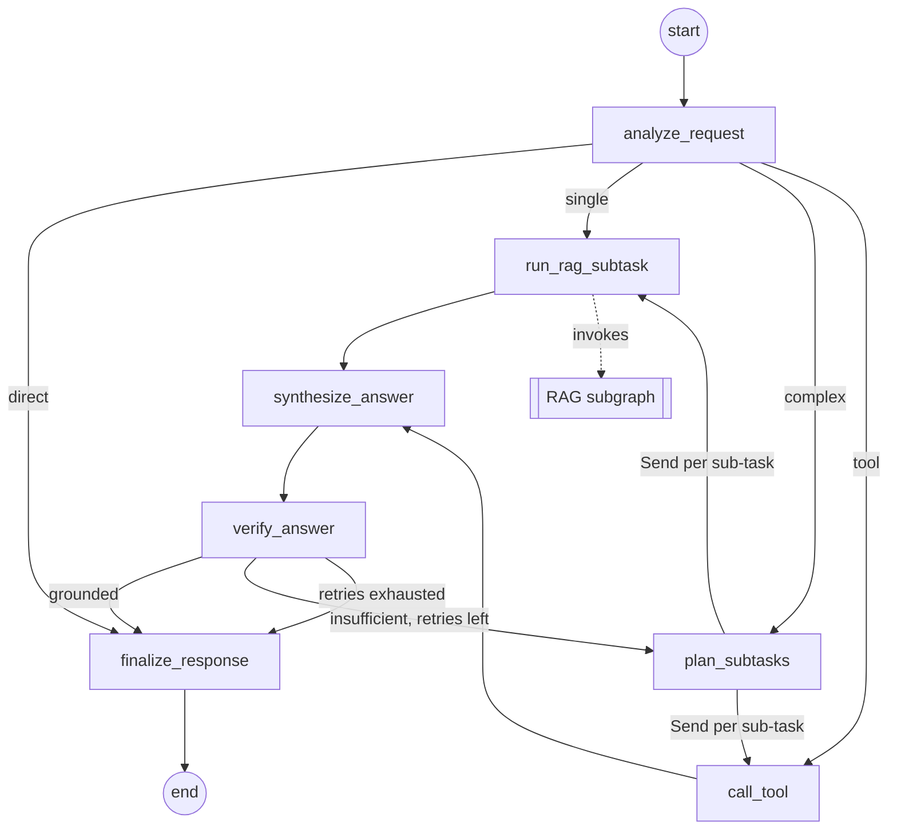

# Project structure plan

**English** | [Magyar](project-structure-plan.hu.md)

> **Status:** proposal, written 2026-10-01. This document plans the *skeleton* of the repository and the order in which to build it. Detailed design (exact prompts, metrics, chunk sizes) is decided while building and recorded in the [README](../README.md) and the other documents in `docs/`.

## Contents

1. [Goal and scope](#1-goal-and-scope)
2. [Starting point](#2-starting-point)
3. [Decisions to lock in before scaffolding](#3-decisions-to-lock-in-before-scaffolding)
4. [Target repository layout](#4-target-repository-layout)
5. [Module responsibilities](#5-module-responsibilities)
6. [Configuration and run modes](#6-configuration-and-run-modes)
7. [Containerization plan](#7-containerization-plan)
8. [Build order](#8-build-order)
9. [Requirement traceability](#9-requirement-traceability)
10. [Conventions](#10-conventions)
11. [Risks and open questions](#11-risks-and-open-questions)

## 1. Goal and scope

The structure has to carry everything the assignment asks for, without growing into a production system:

- A **LangGraph main workflow** with at least 5 nodes, conditional routing, sub-task decomposition and shared state.
- A **modular RAG subgraph** that the main workflow calls and that is not counted towards the 5 nodes.
- **At least 2 tools**, one of which is not retrieval.
- A **local open-source LLM** (no paid APIs) with a **dummy fallback** for tests and for machines that cannot run a model.
- An **ingestion pipeline** for a small, well-processed text corpus and a persistent vector index.
- A **Streamlit UI** that shows the agent's steps and the retrieved context.
- A **Dockerfile** (required) and a **Compose stack** (UI + model server).
- A **functional evaluation** (10–20 questions) and a **load test** (50–200 queries) with per-node latency, bottleneck analysis and optimization proposals.
- **Bilingual documentation** (English + Hungarian) that stays in sync with the code.

Out of scope for the skeleton: authentication, multi-user persistence, cloud deployment, hosted tracing services, a public HTTP API (optional later, see [§11](#11-risks-and-open-questions)).

## 2. Starting point

Already in the repository:

| Item | Notes |
|---|---|
| `README.md`, `README.hu.md` | Bilingual documentation with the requirement checklist and `To be completed` placeholders |
| `.gitignore` | Already ignores `task/`, `.env`, `models/`, `chroma_db/`, `.chroma/`, `*.gguf`, `*.bin`, virtual environments and caches |
| `.claude/agents/`, `.claude/skills/` | Four Claude Code agents (LangGraph, RAG, Streamlit, Docker) with their skills |
| `docs/` | Empty, reserved for diagrams and reports |
| `task/` | The assignment brief (Hungarian), kept local only |
| `LICENSE` | MIT |

Local environment, checked on 2026-10-01:

| Resource | Value |
|---|---|
| OS | Windows 11 Pro |
| Python | 3.14.3 (no `uv`, no `poetry` installed) |
| Docker | 29.8.0, Compose v5.5.1 |
| Ollama | client 0.35.0 installed, server not running |
| RAM | 31 GB |
| CPU | Intel Core Ultra 9 275HX, 24 cores |
| GPU | NVIDIA GeForce RTX 5070 Laptop, 8 GB VRAM |

A 7–8B parameter model in 4-bit quantization (~4.5–5 GB) fits in the GPU with room for the KV cache, and a 3–4B model leaves headroom for running the embedding model on the GPU as well.

## 3. Decisions to lock in before scaffolding

The recommendations below are the defaults the skeleton is built around. Each final choice goes into the *Design decisions* table of the README together with its trade-off.

| # | Decision | Options | Recommendation | Why |
|---|---|---|---|---|
| 1 | Packaging and Python version | `pip` + `requirements.txt` / `poetry` / `uv` + `pyproject.toml` + `uv.lock` | **`uv`**, Python **3.12** pinned in `.python-version` and in the Dockerfile | A lock file makes the build reproducible, `uv` installs the pinned Python itself, and 3.12 has the widest wheel coverage for the ML stack (torch, chromadb). The local 3.14 is not needed. |
| 2 | Package layout | flat / `src` layout | **`src/agentic_rag/`** | Prevents accidental imports from the working directory; works cleanly in the container and in tests. |
| 3 | LLM serving | Ollama / `llama-cpp-python` in-process / dummy only | **Ollama** as a Compose service, with the host's Ollama usable in development, plus a **fake provider** | Ollama gives an HTTP API, GPU support and a clean multi-container story. `llama-cpp-python` compiles inside the image and slows builds. The fake provider satisfies the "dummy LLM" fallback and makes tests and CI model-free. |
| 4 | LLM model | 3–4B vs. 7–8B instruct models | Shortlist: `qwen2.5:7b-instruct`, `llama3.1:8b`, `gemma3:4b` (check the current Ollama tags); default to a **7B-class model at Q4** | Fits 8 GB VRAM. Choose by the language of the corpus (Hungarian text needs a model with strong multilingual coverage) and by the latency measured in the load test. Keep a 3B model as the fast alternative. |
| 5 | Embeddings | `sentence-transformers` in-process / Ollama embeddings / `fastembed` | **`sentence-transformers` via `langchain-huggingface`**, CPU-only torch wheels | Retrieval then works in fake mode without Ollama. Shortlist: `intfloat/multilingual-e5-small` for mixed-language corpora, `BAAI/bge-small-en-v1.5` for English only. Ollama embeddings are the fallback if the image size becomes a problem. |
| 6 | Vector store | Chroma / FAISS / in-memory | **Chroma**, persistent client, `data/chroma_db/` | Persistence plus metadata filtering, no pickle deserialization, already in `.gitignore`. |
| 7 | Tool-calling style | native `bind_tools` + `ToolNode` / structured-output planner + explicit tool nodes | **Structured-output planner + explicit nodes** | Small local models are unreliable at native tool calling. A planner that emits a JSON list of typed sub-tasks is robust and still demonstrates autonomous decisions. |
| 8 | Domain and corpus | — | **Your call**, before Phase 2 | Criteria: a real user need; a small corpus with a clear license (public domain, CC or your own); text that is stable enough for reference answers; a domain where a non-retrieval tool is natural. |
| 9 | Non-retrieval tool | calculator / date and deadline computation / unit conversion / structured table lookup | Depends on the domain; must be **deterministic and local** | Examples: deadline computation for regulation Q&A, a net/gross calculator for payroll rules, a unit converter for technical manuals. |
| 10 | HTTP API layer | none / FastAPI service | **None in the skeleton** | The load test drives the compiled graph directly, which gives a cleaner per-node breakdown. A FastAPI service can be added later as a third Compose component. |

## 4. Target repository layout

```text
agentic-rag-chatbot-poc/
├── .claude/                          # Claude Code agents and skills (present)
├── .github/
│   └── workflows/
│       └── ci.yml                    # optional: ruff + pytest in fake mode + docker build
├── data/
│   ├── raw/                          # source corpus (small, license checked) – or fetched by `ingest --download`
│   ├── eval/
│   │   ├── questions.jsonl           # 10–20 evaluation questions with reference answers and expected sources
│   │   └── results/                  # committed outputs of the final evaluation and load-test runs
│   └── chroma_db/                    # built vector index (gitignored)
├── docs/
│   ├── project-structure-plan.md     # this plan
│   ├── project-structure-plan.hu.md  # this plan, Hungarian
│   ├── architecture.md               # Mermaid export of both graphs, state schema, node and tool tables
│   ├── evaluation.md                 # functional evaluation: method, results, conclusions
│   └── performance.md                # load test: setup, metrics, bottleneck, proposals
├── src/
│   └── agentic_rag/
│       ├── __init__.py
│       ├── __main__.py               # `python -m agentic_rag <command>`
│       ├── cli.py                    # ingest · eval · loadtest · export-graph
│       ├── config.py                 # pydantic-settings: provider, model names, paths, top_k
│       ├── llm.py                    # LLM factory: ollama | fake
│       ├── embeddings.py             # embedding model factory
│       ├── tracing.py                # step-trace collection shared by UI, evaluation and load test
│       ├── ingestion/
│       │   ├── __init__.py
│       │   ├── loaders.py            # PDF / Markdown / text → Documents with metadata
│       │   ├── chunking.py           # splitter configuration
│       │   └── index.py              # build and load the Chroma index
│       ├── rag/                      # RAG subgraph (not counted towards the 5 nodes)
│       │   ├── __init__.py
│       │   ├── state.py
│       │   ├── nodes.py              # rewrite_query · retrieve · grade_documents · build_context
│       │   └── graph.py              # compiled `rag_graph`
│       ├── agent/                    # main agentic workflow
│       │   ├── __init__.py
│       │   ├── state.py              # AgentState with reducers
│       │   ├── nodes.py              # the 7 main nodes
│       │   ├── routing.py            # conditional-edge functions, Send fan-out
│       │   ├── tools.py              # search_knowledge_base + the non-retrieval tool(s)
│       │   └── graph.py              # StateGraph wiring, compiled `agent_graph`
│       ├── evaluation/
│       │   ├── __init__.py
│       │   ├── dataset.py            # load questions.jsonl
│       │   ├── metrics.py            # correctness, faithfulness, hit@k, routing accuracy
│       │   └── runner.py
│       ├── loadtest/
│       │   ├── __init__.py
│       │   └── runner.py             # async N queries × concurrency, percentiles, per-node latency
│       └── ui/
│           ├── app.py                # Streamlit entrypoint
│           └── components.py         # agent-step trace panel, retrieved-sources panel
├── tests/
│   ├── conftest.py                   # fake LLM, tiny fixture corpus, temporary Chroma directory
│   ├── test_ingestion.py
│   ├── test_rag_subgraph.py
│   ├── test_agent_graph.py           # routing, decomposition, node count ≥ 5, bounded retry loop
│   ├── test_tools.py
│   └── test_ui_smoke.py              # streamlit.testing.v1.AppTest
├── .dockerignore
├── .env.example
├── .gitignore                        # present
├── .python-version                   # 3.12
├── compose.yaml                      # app + ollama + one-shot model pull
├── Dockerfile                        # multi-stage, uv-based, non-root
├── LICENSE                           # present
├── pyproject.toml                    # dependencies, ruff, pytest, console entrypoint
├── README.md · README.hu.md          # present, updated per phase
├── task/                             # present, gitignored
└── uv.lock
```

Naming note: the brief says `docker-compose.yml`; the Docker documentation and the project's Docker skill use `compose.yaml`. `docker compose` picks up both automatically, so the repository uses `compose.yaml` and the README mentions the equivalence.

## 5. Module responsibilities

### 5.1 Main agentic workflow (`agent/`)

Seven nodes, so the 5-node minimum still holds if two are merged later.

| # | Node | Kind | Reads | Writes |
|---|---|---|---|---|
| 1 | `analyze_request` | LLM | `messages` | `question`, `intent` (`direct` / `single` / `complex` / `tool`) |
| 2 | `plan_subtasks` | LLM | `question`, previous `verdict` | `subtasks` – typed list: `{kind: retrieve \| tool, input}` |
| 3 | `run_rag_subtask` | subgraph call | one sub-task | appends to `subtask_results` (context, sources, scores) |
| 4 | `call_tool` | action | one sub-task | appends to `subtask_results` (tool output) |
| 5 | `synthesize_answer` | LLM | `subtask_results` | `draft_answer` |
| 6 | `verify_answer` | LLM | `draft_answer`, contexts | `verdict` (`grounded` / `insufficient`), `retry_count` |
| 7 | `finalize_response` | data | `draft_answer`, sources | `answer`, `sources`, final `trace` entry, assistant message |

Routing rules (conditional edges):

- After `analyze_request`: `direct` → `finalize_response`; `single` → one `Send` to `run_rag_subtask`; `complex` → `plan_subtasks`; `tool` → one `Send` to `call_tool`.
- After `plan_subtasks`: one `Send` per sub-task, dispatched to `run_rag_subtask` or `call_tool` by `kind`. This is the decomposition and independent execution: LangGraph runs the sends in parallel and fans in before `synthesize_answer`.
- After `verify_answer`: `grounded` → `finalize_response`; `insufficient` with `retry_count < 2` → `plan_subtasks` (re-plan with the critique); otherwise `finalize_response` with an explicit "partially answered" note.



Tools (`agent/tools.py`):

- `search_knowledge_base(query)` – wraps `rag_graph.invoke`; the only retrieval tool.
- One non-retrieval tool chosen together with the domain (decision 9), deterministic, with unit tests. Both are exposed as `@tool` functions so they can also be bound to a tool-calling model later without restructuring.

### 5.2 RAG subgraph (`rag/`)

Own `RagState` (`query`, `rewritten_query`, `documents`, `scores`, `context`, `sources`). Four nodes:

| Node | Role |
|---|---|
| `rewrite_query` | Optional LLM rewrite for retrieval; skipped in fake mode |
| `retrieve` | Top-k similarity search with scores and metadata from Chroma |
| `grade_documents` | Drop irrelevant chunks (score threshold, optionally an LLM grade) |
| `build_context` | De-duplicate, order, format with citation markers |

The main graph calls it from `run_rag_subtask` with an explicit input/output mapping, so the two state schemas stay independent and the subgraph can be tested and load-tested on its own.

### 5.3 State (`agent/state.py`)

```python
class AgentState(TypedDict):
    messages: Annotated[list[AnyMessage], add_messages]
    question: str
    intent: Literal["direct", "single", "complex", "tool"]
    subtasks: list[Subtask]
    subtask_results: Annotated[list[SubtaskResult], operator.add]   # fan-in from Send
    draft_answer: str
    verdict: Literal["grounded", "insufficient"] | None
    retry_count: int
    answer: str
    sources: list[Source]
    trace: Annotated[list[TraceEvent], operator.add]                # consumed by UI and load test
```

Raw data lives in state; prompts are formatted inside the nodes.

### 5.4 Ingestion (`ingestion/`)

Load → split → embed → store. Loaders attach `source`, `title` and `page` / `section` metadata so the UI can cite. Chunking starts at ~800–1000 characters with 10–20 % overlap and is tuned against the evaluation set. `index.py` exposes `build_index()` and `load_index()`; the CLI `ingest` command is idempotent, and the container entrypoint can call it when the index directory is empty.

### 5.5 UI (`ui/`)

One Streamlit entrypoint. Chat with `st.chat_message` / `st.chat_input`; a live step panel fed by `agent_graph.stream(..., stream_mode="updates")`; an expander with the retrieved chunks, their sources and scores; a sidebar for provider, model and top-k. Must run in fake mode without Ollama.

### 5.6 Evaluation and load test (`evaluation/`, `loadtest/`)

- `evaluation/`: reads `data/eval/questions.jsonl` (`question`, `reference_answer`, `expected_sources`, `expected_intent`), runs either a single node or the full graph, and scores correctness (local LLM-as-judge or semantic similarity), faithfulness, retrieval hit@k and routing accuracy. Writes JSON to `data/eval/results/` and a summary to `docs/evaluation.md`.
- `loadtest/`: async harness that sends N queries (50–200) at a given concurrency against the compiled graph, records per-request latency and per-node latency from the trace, and reports mean / p50 / p95 / p99 / max, throughput and error rate. Running it in both `fake` and `ollama` modes isolates the LLM's share of the latency, which is the core of the bottleneck analysis.

### 5.7 Shared modules (`config.py`, `llm.py`, `embeddings.py`, `tracing.py`)

- `config.py`: one `Settings` class (pydantic-settings) read from the environment and `.env`.
- `llm.py`: `get_chat_model()` returns `ChatOllama` or a scripted fake chat model whose replies depend on the prompt (intent JSON, plan JSON, answer text), so routing is testable.
- `embeddings.py`: `get_embeddings()` returns the local embedding model; the same model is used for indexing and querying.
- `tracing.py`: turns graph stream updates into `TraceEvent(node, started_at, ended_at, summary)` records.

## 6. Configuration and run modes

`.env.example` (committed) documents every variable; `.env` is gitignored.

| Variable | Default | Purpose |
|---|---|---|
| `LLM_PROVIDER` | `ollama` | `ollama` or `fake` |
| `OLLAMA_BASE_URL` | `http://localhost:11434` | `http://ollama:11434` inside Compose, `http://host.docker.internal:11434` for a host Ollama |
| `OLLAMA_MODEL` | *(decision 4)* | chat model tag |
| `EMBEDDING_MODEL` | *(decision 5)* | Hugging Face model id |
| `CHROMA_DIR` | `data/chroma_db` | index location |
| `DATA_DIR` | `data/raw` | corpus location |
| `TOP_K` | `4` | retrieval depth |
| `MAX_RETRIES` | `2` | bound on the verify → re-plan loop |
| `INGEST_ON_START` | `true` | build the index if it is missing when the container starts |
| `LOG_LEVEL` | `INFO` | |

Run modes:

| Mode | LLM | Needs | Used for |
|---|---|---|---|
| `fake` | scripted fake | nothing | unit tests, CI, UI development, latency baseline without the LLM |
| `ollama-host` | Ollama on Windows (already installed) | `ollama serve` | fast local development |
| `ollama-compose` | Ollama container | Docker | the reproducible path reviewers run |

## 7. Containerization plan

- **`Dockerfile`** (required): multi-stage. The builder stage copies `uv` from `ghcr.io/astral-sh/uv` and runs `uv sync --frozen --no-dev` into `/app/.venv`; the runtime stage is `python:3.12-slim`, non-root user, copies the venv and `src/`, sets `HF_HOME` to a volume-backed path, `EXPOSE 8501`, healthcheck on `/_stcore/health`, `CMD streamlit run src/agentic_rag/ui/app.py --server.address=0.0.0.0`. Optionally pre-download the embedding model at build time for fully offline starts.
- **`.dockerignore`**: `.git`, `.venv`, `data/chroma_db`, `tests`, `docs`, `task`, `.claude`, caches, `.env`.
- **`compose.yaml`**:
  - `ollama`: `ollama/ollama`, named volume `ollama-data`, port `11434`, healthcheck via `ollama list`, GPU reservation under an optional `gpu` profile (Docker Desktop needs the WSL2 backend for NVIDIA pass-through; without it inference falls back to CPU).
  - `ollama-pull`: one-shot service that runs `ollama pull $OLLAMA_MODEL`, `depends_on: ollama` healthy.
  - `app`: `build: .`, port `8501`, `env_file: .env`, bind mount `./data:/app/data` so the corpus is visible and the index persists, named volume `hf-cache`, `depends_on: ollama-pull` completed successfully.
- Keep CPU-only torch wheels in the image (`[tool.uv.index]` pointing at the PyTorch CPU index) because the GPU is used by Ollama, not by the embedding model.
- Document in the README: `docker compose up --build`, the first-start duration (model pull + ingestion), and `LLM_PROVIDER=fake docker compose up app` for a model-free start.

## 8. Build order

Each phase ends in a committed state that passes its "done when" check. Phases 6–8 only need Phase 4; Phase 6 can start after Phase 1 in fake mode.

| Phase | Deliverables | Done when |
|---|---|---|
| **0. Lock decisions** | README *Design decisions* table filled for decisions 1–9; `docs/architecture.md` stub | Every row has a choice and a one-line trade-off |
| **1. Scaffold** (this plan's core) | `pyproject.toml`, `.python-version`, `uv.lock`, `src/agentic_rag/` with docstring-only modules, `config.py`, `cli.py` with stub commands, `.env.example`, `tests/conftest.py` + one smoke test, ruff config, `.dockerignore`, README *Repository structure* updated | `uv sync` succeeds; `uv run pytest` is green; `uv run python -m agentic_rag --help` lists the commands; `uv run ruff check .` is clean |
| **2. Ingestion and index** | corpus in `data/raw/` (or a download command), loaders, chunking, `index.py`, `ingest` command, fixture-corpus test | `python -m agentic_rag ingest` builds the index; a sample query returns the expected chunk with metadata |
| **3. RAG subgraph** | `rag/state.py`, `nodes.py`, `graph.py`, tests, Mermaid export | `rag_graph.invoke({"query": ...})` returns context and sources; tests pass in fake mode |
| **4. Main workflow and tools** | `agent/*`, fake LLM scripting, `export-graph` command writing `docs/architecture.md` | ≥ 5 nodes, routing tests cover all four intents, decomposition runs via `Send`, the retry loop is bounded, an end-to-end answer works with Ollama |
| **5. Streamlit UI** | `ui/app.py`, `components.py`, `AppTest` smoke test | Chat answers, steps appear live, sources are shown, runs with `LLM_PROVIDER=fake` |
| **6. Containerization** | `Dockerfile`, `compose.yaml`, entrypoint with optional ingest, README run guide | From a fresh clone `docker compose up --build` serves the UI on 8501 with the model pulled and the index built; `docker build .` alone succeeds |
| **7. Functional evaluation** | `data/eval/questions.jsonl` (10–20), `evaluation/*`, `eval` command, `docs/evaluation.md`, README section | `python -m agentic_rag eval` writes the results and the summary; conclusions are in the README |
| **8. Load test** | `loadtest/runner.py`, `loadtest` command, `docs/performance.md`, README section | `python -m agentic_rag loadtest --requests 100 --concurrency 4` prints percentiles and the per-node breakdown; bottleneck and 1–2 proposals documented |
| **9. Docs and polish** | README EN + HU complete, requirement checklist ticked, optional CI workflow, final clean-clone test | A reviewer can reproduce every claim with the documented commands |

## 9. Requirement traceability

| Requirement (brief) | Where | Verified by |
|---|---|---|
| Real problem with justification | README *Problem statement*, decision 8 | Review |
| Freely chosen text source, quality processing | `data/raw/`, `ingestion/` | `test_ingestion.py`, `ingest` command |
| ≥ 5 nodes | `agent/graph.py` | `test_agent_graph.py` asserts the node count |
| Conditional routing | `agent/routing.py` | Routing tests per intent |
| Decomposition and independent execution | `plan_subtasks` + `Send` fan-out | Test with a multi-part question |
| State for intermediate results | `agent/state.py` | Reducer tests |
| ≥ 2 tools, one non-retrieval | `agent/tools.py` | `test_tools.py` |
| Modular RAG subgraph, callable, not counted | `rag/graph.py` | `test_rag_subgraph.py`, Mermaid export with `xray=True` |
| Open-source local LLM, justified; dummy allowed | `llm.py`, decisions 3–4, README | Runs with both providers |
| Streamlit UI with steps and RAG result | `ui/` | `test_ui_smoke.py`, manual check |
| Dockerfile, Compose | `Dockerfile`, `compose.yaml` | Clean-clone `docker compose up --build` |
| Evaluation set of 10–20 questions | `data/eval/questions.jsonl`, `evaluation/` | `eval` command, `docs/evaluation.md` |
| Load test 50–200 queries, latency, bottleneck, proposals | `loadtest/`, `docs/performance.md` | `loadtest` command |
| README: problem, architecture, results, run guide | `README.md`, `README.hu.md` | Checklist ticked |

## 10. Conventions

- Code, identifiers, comments and commit messages in English; user-facing documentation in English and Hungarian.
- `src` layout, type hints everywhere, module docstrings, `ruff` for lint and format, `pytest` for tests.
- Every test passes with `LLM_PROVIDER=fake` and without network access; model-dependent checks are marked and skipped when Ollama is unavailable.
- Nodes return partial state updates and never mutate state; every accumulated list has a reducer; loops go through named nodes with a bounded counter.
- Configuration only through `Settings`; no secrets in code, images or Compose files.
- Diagrams are generated from the compiled graphs (`draw_mermaid()`), not drawn by hand, so `docs/architecture.md` cannot drift from the code.
- Every documented number (evaluation score, latency) has a command that reproduces it and a committed result file.
- README *Repository structure* and the requirement checklist are updated at the end of each phase.

## 11. Risks and open questions

- **Image size**: torch plus `sentence-transformers` adds ~1 GB even with CPU wheels. Fallback: Ollama embeddings (`nomic-embed-text`, `bge-m3`) and a torch-free image.
- **GPU in Docker on Windows**: requires the WSL2 backend and a current NVIDIA driver. Fallback: host Ollama via `host.docker.internal`, or CPU inference with a 3B model.
- **Cold start**: the first Ollama request loads the model (seconds); the load test must include a warm-up phase and report it separately.
- **Hungarian quality of small models**: if the corpus and questions are Hungarian, prefer a model with explicit multilingual coverage and verify it on the evaluation set before committing to it.
- **Corpus licensing**: only commit documents whose license allows redistribution; otherwise ship a download command and record the source URLs.
- **Open**: the final domain and corpus (decision 8), the non-retrieval tool (decision 9), the UI language, and whether a FastAPI service is worth adding as a third Compose component for a more realistic load test.
