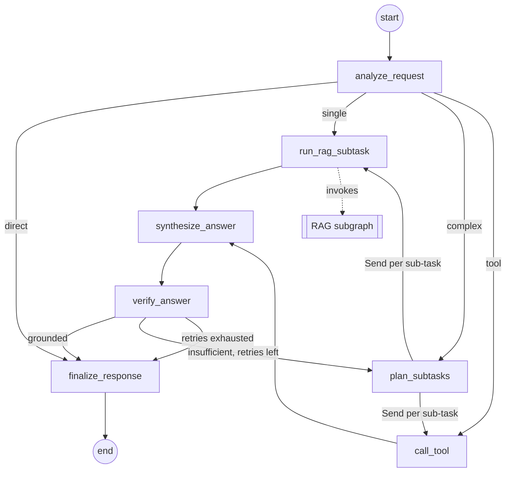

# Project structure plan

**English** | [Magyar](project-structure-plan.hu.md)

> **Status:** proposal, written 2026-10-01. This document plans the *skeleton* of the repository and the order in which to build it. Detailed design (exact prompts, metrics, chunk sizes) is decided while building and recorded in the [README](../README.md) and the other documents in `docs/`.
>
> **Progress:** Phase 1 done on 2026-10-01. Brought forward with it: the container setup of Phase 6 (`Dockerfile`, `compose.yaml`, `compose.gpu.yaml`) and the shared modules of section 5.7 (`config.py`, `llm.py`, `embeddings.py`, `tracing.py`), together with the state contracts, the Streamlit shell and typed skeletons for Phases 2–8. The foundation was then reviewed and revised on the same day; those changes are part of section 12 as well. Decisions 8–9 were made on 2026-10-02 (section 3 and [section 12.6](#126-domain-and-corpus-decisions-89)), and Phases 2 to 5 were done the same day, Phases 6 to 9 on 2026-10-03; every phase is done. Details are in [section 8](#8-build-order); the deviations from this plan are recorded in [section 12](#12-deviations-from-the-plan).

## Contents

1. [Goal and scope](#1-goal-and-scope)
2. [Starting point](#2-starting-point)
3. [Decisions to lock in before scaffolding](#3-decisions-to-lock-in-before-scaffolding)
4. [Target repository layout](#4-target-repository-layout)
5. [Module responsibilities](#5-module-responsibilities)
6. [Configuration and run modes](#6-configuration-and-run-modes)
7. [Containerization plan](#7-containerization-plan)
8. [Build order](#8-build-order)
9. [Requirement traceability](#9-requirement-traceability)
10. [Conventions](#10-conventions)
11. [Risks and open questions](#11-risks-and-open-questions)
12. [Deviations from the plan](#12-deviations-from-the-plan)

## 1. Goal and scope

The structure has to carry everything the assignment asks for, without growing into a production system:

- A **LangGraph main workflow** with at least 5 nodes, conditional routing, sub-task decomposition and shared state.
- A **modular RAG subgraph** that the main workflow calls and that is not counted towards the 5 nodes.
- **At least 2 tools**, one of which is not retrieval.
- A **local open-source LLM** (no paid APIs) with a **dummy fallback** for tests and for machines that cannot run a model.
- An **ingestion pipeline** for a small, well-processed text corpus and a persistent vector index.
- A **Streamlit UI** that shows the agent's steps and the retrieved context.
- A **Dockerfile** (required) and a **Compose stack** (UI + model server).
- A **functional evaluation** (10–20 questions) and a **load test** (50–200 queries) with per-node latency, bottleneck analysis and optimization proposals.
- **Bilingual documentation** (English + Hungarian) that stays in sync with the code.

Out of scope for the skeleton: authentication, multi-user persistence, cloud deployment, hosted tracing services, a public HTTP API (optional later, see [§11](#11-risks-and-open-questions)).

## 2. Starting point

Already in the repository:

| Item | Notes |
|---|---|
| `README.md`, `README.hu.md` | Bilingual documentation with the requirement checklist and `To be completed` placeholders |
| `.gitignore` | Already ignores `task/`, `.env`, `models/`, `chroma_db/`, `.chroma/`, `*.gguf`, `*.bin`, virtual environments and caches |
| `.claude/agents/`, `.claude/skills/` | Four Claude Code agents (LangGraph, RAG, Streamlit, Docker) with their skills |
| `docs/` | Empty, reserved for diagrams and reports |
| `task/` | The assignment brief (Hungarian), kept local only |
| `LICENSE` | MIT |

Local environment, checked on 2026-10-01:

| Resource | Value |
|---|---|
| OS | Windows 11 Pro |
| Python | 3.14.3 (no `uv`, no `poetry` installed) |
| Docker | 29.8.0, Compose v5.5.1 |
| Ollama | client 0.35.0 installed, server not running |
| RAM | 31 GB |
| CPU | Intel Core Ultra 9 275HX, 24 cores |
| GPU | NVIDIA GeForce RTX 5070 Laptop, 8 GB VRAM |

A 7–8B parameter model in 4-bit quantization (~4.5–5 GB) fits in the GPU with room for the KV cache, and a 3–4B model leaves headroom for running the embedding model on the GPU as well.

## 3. Decisions to lock in before scaffolding

The recommendations below are the defaults the skeleton is built around. Each final choice goes into the *Design decisions* table of the README together with its trade-off.

| # | Decision | Options | Recommendation | Why |
|---|---|---|---|---|
| 1 | Packaging and Python version | `pip` + `requirements.txt` / `poetry` / `uv` + `pyproject.toml` + `uv.lock` | **`uv`**, Python **3.12** pinned in `.python-version` and in the Dockerfile | A lock file makes the build reproducible, `uv` installs the pinned Python itself, and 3.12 has the widest wheel coverage for the ML stack (torch, chromadb). The local 3.14 is not needed. |
| 2 | Package layout | flat / `src` layout | **`src/agentic_rag/`** | Prevents accidental imports from the working directory; works cleanly in the container and in tests. |
| 3 | LLM serving | Ollama / `llama-cpp-python` in-process / dummy only | **Ollama** as a Compose service, with the host's Ollama usable in development, plus a **fake provider** | Ollama gives an HTTP API, GPU support and a clean multi-container story. `llama-cpp-python` compiles inside the image and slows builds. The fake provider satisfies the "dummy LLM" fallback and makes tests and CI model-free. |
| 4 | LLM model | 3–4B vs. 7–8B instruct models | Shortlist: `qwen2.5:7b-instruct`, `llama3.1:8b`, `gemma3:4b` (check the current Ollama tags); default to a **7B-class model at Q4** | Fits 8 GB VRAM. Choose by the language of the corpus (Hungarian text needs a model with strong multilingual coverage) and by the latency measured in the load test. Keep a 3B model as the fast alternative. |
| 5 | Embeddings | `sentence-transformers` in-process / Ollama embeddings / `fastembed` | **`sentence-transformers` via `langchain-huggingface`**, CPU-only torch wheels | Retrieval then works in fake mode without Ollama. Shortlist: `intfloat/multilingual-e5-small` for mixed-language corpora, `BAAI/bge-small-en-v1.5` for English only. Ollama embeddings are the fallback if the image size becomes a problem. |
| 6 | Vector store | Chroma / FAISS / in-memory | **Chroma**, persistent client, `data/chroma_db/` | Persistence plus metadata filtering, no pickle deserialization, already in `.gitignore`. |
| 7 | Tool-calling style | native `bind_tools` + `ToolNode` / structured-output planner + explicit tool nodes | **Structured-output planner + explicit nodes** | Small local models are unreliable at native tool calling. A planner that emits a JSON list of typed sub-tasks is robust and still demonstrates autonomous decisions. |
| 8 | Domain and corpus | — | **Decided on 2026-10-02:** a **frontend developer assistant** over the official documentation of MDN Web Docs, React, Vue, Next.js, Nuxt and the TypeScript Handbook; operations (Kubernetes, Docker) as a later extension | Criteria: a real user need; a small corpus with a clear license (public domain, CC or your own); text that is stable enough for reference answers; a domain where a non-retrieval tool is natural. The documentation meets them: a frequent need, open licenses (CC BY 4.0, CC BY-SA 2.5, MIT), stable once pinned to a commit, and questions that combine explanation with checks a tool can compute. |
| 9 | Non-retrieval tool | calculator / date and deadline computation / unit conversion / structured table lookup | **Decided on 2026-10-02:** three tools: **browser support** (MDN `browser-compat-data`), **WCAG colour contrast** and **CSS specificity** | Each is deterministic and local, and answers a question that has one exact result, which the model would otherwise guess. |
| 10 | HTTP API layer | none / FastAPI service | **None in the skeleton** | The load test drives the compiled graph directly, which gives a cleaner per-node breakdown. A FastAPI service can be added later as a third Compose component. |

## 4. Target repository layout

```text
agentic-rag-chatbot-poc/
├── .claude/                          # Claude Code agents and skills (present)
├── .github/
│   └── workflows/
│       └── ci.yml                    # optional: ruff + pytest in fake mode + docker build
├── data/
│   ├── raw/                          # source corpus (small, license checked) – or fetched by `ingest --download`
│   ├── eval/
│   │   ├── questions.jsonl           # 10–20 evaluation questions with reference answers and expected sources
│   │   └── results/                  # committed outputs of the final evaluation and load-test runs
│   └── chroma_db/                    # built vector index (gitignored)
├── docs/
│   ├── project-structure-plan.md     # this plan
│   ├── project-structure-plan.hu.md  # this plan, Hungarian
│   ├── architecture.md               # Mermaid export of both graphs, state schema, node and tool tables
│   ├── evaluation.md                 # functional evaluation: method, results, conclusions
│   └── performance.md                # load test: setup, metrics, bottleneck, proposals
├── src/
│   └── agentic_rag/
│       ├── __init__.py
│       ├── __main__.py               # `python -m agentic_rag <command>`
│       ├── cli.py                    # ingest · eval · loadtest · export-graph
│       ├── config.py                 # pydantic-settings: provider, model names, paths, top_k
│       ├── llm.py                    # LLM factory: ollama | fake
│       ├── embeddings.py             # embedding model factory
│       ├── tracing.py                # step-trace collection shared by UI, evaluation and load test
│       ├── ingestion/
│       │   ├── __init__.py
│       │   ├── loaders.py            # PDF / Markdown / text → Documents with metadata
│       │   ├── chunking.py           # splitter configuration
│       │   └── index.py              # build and load the Chroma index
│       ├── rag/                      # RAG subgraph (not counted towards the 5 nodes)
│       │   ├── __init__.py
│       │   ├── state.py
│       │   ├── nodes.py              # rewrite_query · retrieve · grade_documents · build_context
│       │   └── graph.py              # compiled `rag_graph`
│       ├── agent/                    # main agentic workflow
│       │   ├── __init__.py
│       │   ├── state.py              # AgentState with reducers
│       │   ├── nodes.py              # the 7 main nodes
│       │   ├── routing.py            # conditional-edge functions, Send fan-out
│       │   ├── tools.py              # search_knowledge_base + the non-retrieval tool(s)
│       │   └── graph.py              # StateGraph wiring, compiled `agent_graph`
│       ├── evaluation/
│       │   ├── __init__.py
│       │   ├── dataset.py            # load questions.jsonl
│       │   ├── metrics.py            # correctness, faithfulness, hit@k, routing accuracy
│       │   └── runner.py
│       ├── loadtest/
│       │   ├── __init__.py
│       │   └── runner.py             # async N queries × concurrency, percentiles, per-node latency
│       └── ui/
│           ├── app.py                # Streamlit entrypoint
│           └── components.py         # agent-step trace panel, retrieved-sources panel
├── tests/
│   ├── conftest.py                   # fake LLM, tiny fixture corpus, temporary Chroma directory
│   ├── test_ingestion.py
│   ├── test_rag_subgraph.py
│   ├── test_agent_graph.py           # routing, decomposition, node count ≥ 5, bounded retry loop
│   ├── test_tools.py
│   └── test_ui_smoke.py              # streamlit.testing.v1.AppTest
├── .dockerignore
├── .env.example
├── .gitignore                        # present
├── .python-version                   # 3.12
├── compose.yaml                      # app + ollama + one-shot model pull
├── Dockerfile                        # multi-stage, uv-based, non-root
├── LICENSE                           # present
├── pyproject.toml                    # dependencies, ruff, pytest, console entrypoint
├── README.md · README.hu.md          # present, updated per phase
├── task/                             # present, gitignored
└── uv.lock
```

Naming note: the brief says `docker-compose.yml`; the Docker documentation and the project's Docker skill use `compose.yaml`. `docker compose` picks up both automatically, so the repository uses `compose.yaml` and the README mentions the equivalence.

## 5. Module responsibilities

### 5.1 Main agentic workflow (`agent/`)

Seven nodes, so the 5-node minimum still holds if two are merged later.

| # | Node | Kind | Reads | Writes |
|---|---|---|---|---|
| 1 | `analyze_request` | LLM | `messages` | `question`, `intent` (`direct` / `single` / `complex` / `tool`) |
| 2 | `plan_subtasks` | LLM | `question`, previous `verdict` | `subtasks` – typed list: `{kind: retrieve \| tool, input}` |
| 3 | `run_rag_subtask` | subgraph call | one sub-task | appends to `subtask_results` (context, sources, scores) |
| 4 | `call_tool` | action | one sub-task | appends to `subtask_results` (tool output) |
| 5 | `synthesize_answer` | LLM | `subtask_results` | `draft_answer` |
| 6 | `verify_answer` | LLM | `draft_answer`, contexts | `verdict` (`grounded` / `insufficient`), `retry_count` |
| 7 | `finalize_response` | data | `draft_answer`, sources | `answer`, `sources`, final `trace` entry, assistant message |

Routing rules (conditional edges):

- After `analyze_request`: `direct` → `finalize_response`; `single` → one `Send` to `run_rag_subtask`; `complex` → `plan_subtasks`; `tool` → one `Send` to `call_tool`.
- After `plan_subtasks`: one `Send` per sub-task, dispatched to `run_rag_subtask` or `call_tool` by `kind`. This is the decomposition and independent execution: LangGraph runs the sends in parallel and fans in before `synthesize_answer`.
- After `verify_answer`: `grounded` → `finalize_response`; `insufficient` with `retry_count < 2` → `plan_subtasks` (re-plan with the critique); otherwise `finalize_response` with an explicit "partially answered" note.



Tools (`agent/tools.py`):

- `search_knowledge_base(query)` – wraps `rag_graph.invoke`; the only retrieval tool.
- One non-retrieval tool chosen together with the domain (decision 9), deterministic, with unit tests. Both are exposed as `@tool` functions so they can also be bound to a tool-calling model later without restructuring.

### 5.2 RAG subgraph (`rag/`)

Own `RagState` (`query`, `rewritten_query`, `documents`, `scores`, `context`, `sources`). Four nodes:

| Node | Role |
|---|---|
| `rewrite_query` | Optional LLM rewrite for retrieval; skipped in fake mode |
| `retrieve` | Top-k similarity search with scores and metadata from Chroma |
| `grade_documents` | Drop irrelevant chunks (score threshold, optionally an LLM grade) |
| `build_context` | De-duplicate, order, format with citation markers |

The main graph calls it from `run_rag_subtask` with an explicit input/output mapping, so the two state schemas stay independent and the subgraph can be tested and load-tested on its own.

### 5.3 State (`agent/state.py`)

```python
class AgentState(TypedDict):
    messages: Annotated[list[AnyMessage], add_messages]
    question: str
    intent: Literal["direct", "single", "complex", "tool"]
    subtasks: list[Subtask]
    subtask_results: Annotated[list[SubtaskResult], operator.add]   # fan-in from Send
    draft_answer: str
    verdict: Literal["grounded", "insufficient"] | None
    retry_count: int
    answer: str
    sources: list[Source]
    trace: Annotated[list[TraceEvent], operator.add]                # consumed by UI and load test
```

Raw data lives in state; prompts are formatted inside the nodes.

### 5.4 Ingestion (`ingestion/`)

Load → split → embed → store. Loaders attach `source`, `title` and `page` / `section` metadata so the UI can cite. Chunking starts at ~800–1000 characters with 10–20 % overlap and is tuned against the evaluation set. `index.py` exposes `build_index()` and `load_index()`; the CLI `ingest` command is idempotent, and the container entrypoint can call it when the index directory is empty.

### 5.5 UI (`ui/`)

One Streamlit entrypoint. Chat with `st.chat_message` / `st.chat_input`; a live step panel fed by `agent_graph.stream(..., stream_mode="updates")`; an expander with the retrieved chunks, their sources and scores; a sidebar for provider, model and top-k. Must run in fake mode without Ollama.

### 5.6 Evaluation and load test (`evaluation/`, `loadtest/`)

- `evaluation/`: reads `data/eval/questions.jsonl` (`question`, `reference_answer`, `expected_documents`, `expected_intent`), runs either a single node or the full graph, and scores correctness (local LLM-as-judge or semantic similarity), faithfulness, retrieval hit@k and routing accuracy. Writes JSON to `data/eval/results/` and a summary to `docs/evaluation.md`.
- `loadtest/`: async harness that sends N queries (50–200) at a given concurrency against the compiled graph, records per-request latency and per-node latency from the trace, and reports mean / p50 / p95 / p99 / max, throughput and error rate. Running it in both `fake` and `ollama` modes isolates the LLM's share of the latency, which is the core of the bottleneck analysis.

### 5.7 Shared modules (`config.py`, `llm.py`, `embeddings.py`, `tracing.py`)

- `config.py`: one `Settings` class (pydantic-settings) read from the environment and `.env`.
- `llm.py`: `get_chat_model()` returns `ChatOllama` or a scripted fake chat model whose replies depend on the prompt (intent JSON, plan JSON, answer text), so routing is testable.
- `embeddings.py`: `get_embeddings()` returns the local embedding model; the same model is used for indexing and querying.
- `tracing.py`: turns graph stream updates into `TraceEvent(node, started_at, ended_at, summary)` records.

## 6. Configuration and run modes

`.env.example` (committed) documents every variable; `.env` is gitignored.

| Variable | Default | Purpose |
|---|---|---|
| `LLM_PROVIDER` | `ollama` | `ollama` or `fake` |
| `OLLAMA_BASE_URL` | `http://localhost:11434` | `http://ollama:11434` inside Compose, `http://host.docker.internal:11434` for a host Ollama |
| `OLLAMA_MODEL` | `qwen3.5:4b` *(decision 4, chosen in Phase 8, section 12.12)* | chat model tag |
| `OLLAMA_NUM_CTX` | `8192` | context window in tokens, 512–131072, sent as Ollama's `num_ctx` *(added)* |
| `OLLAMA_TIMEOUT_S` | `120.0` | HTTP timeout in seconds of each Ollama request, > 0 *(added)* |
| `OLLAMA_REASONING` | `false` | thinking mode of reasoning models: `false` or `true` *(added in Phase 7, section 12.11; default `false` since Phase 8, section 12.12)* |
| `LLM_TEMPERATURE` | `0.0` | sampling temperature, 0.0–2.0 *(added)* |
| `EMBEDDING_PROVIDER` | `huggingface` | `huggingface` or `fake` (offline hashing embeddings, no model download) *(added)* |
| `EMBEDDING_MODEL` | `intfloat/multilingual-e5-small` *(decision 5, provisional)* | Hugging Face model id |
| `CHROMA_DIR` | `data/chroma_db` | index location |
| `CHROMA_COLLECTION` | `documents` | Chroma collection name *(added)* |
| `DATA_DIR` | `data/raw` | corpus location |
| `TOP_K` | `4` | retrieval depth |
| `GRADE_WITH_LLM` | `true` | let the chat model drop irrelevant retrieved chunks, one extra LLM call per retrieval *(added in Phase 3)* |
| `MAX_RETRIES` | `2` | bound on the verify → re-plan loop |
| `INGEST_ON_START` | `true` | build the index if it is missing when the container starts (Phase 6: also downloads the missing corpus and keeps the index up to date, section 12.10) |
| `LOG_LEVEL` | `INFO` | |

*(added)*: introduced while building the foundation or after its review. Every value is validated at start-up (for example `TOP_K` ≥ 1, `MAX_RETRIES` ≥ 0, `LLM_TEMPERATURE` between 0.0 and 2.0, and the project's rule for collection names: 3–63 characters, a deliberate limit stricter than chromadb's 512, and no IPv4 addresses); an empty value means the default, `.env` must be UTF-8, and `agentic-rag config` prints the effective values. The full reference is in [architecture.md](architecture.md#configuration-reference).

Run modes:

| Mode | LLM | Needs | Used for |
|---|---|---|---|
| `fake` | scripted fake | nothing | unit tests, CI, UI development, latency baseline without the LLM |
| `ollama-host` | Ollama on Windows (already installed) | `ollama serve` | fast local development |
| `ollama-compose` | Ollama container | Docker | the reproducible path reviewers run |

Fully offline fake mode also sets `EMBEDDING_PROVIDER=fake`; with the default `huggingface` provider the embedding model is downloaded on first use. In the `ollama-compose` mode, `compose.yaml` sets `OLLAMA_BASE_URL` for the `app` service itself.

## 7. Containerization plan

The `Dockerfile` bullet describes the image as built; the other deviations from this section are listed in [section 12.4](#124-containers-section-7).

- **`Dockerfile`** (required): two stages on `python:3.12.14-slim-trixie`, with `uv` mounted from `ghcr.io/astral-sh/uv:0.12.6` into the `RUN` steps only.
  - The `deps` stage runs `uv sync --locked --no-dev --no-install-project` into `/app/.venv`: only the dependencies pinned in `uv.lock`, and `--locked` stops the build when `uv.lock` is out of date with `pyproject.toml`.
  - The runtime stage copies the venv (`COPY --link`, 1.71 GB) and compiles its bytecode with `compileall` (415 MB) in two layers that do not depend on the code, creates the non-root user (`APP_UID`/`APP_GID` build arguments, default 10001), then adds `src/` and a small editable project layer with `uv sync --locked --no-dev --refresh-package agentic-rag-chatbot-poc`. A change to `src/` rebuilds only the last two layers (measured: 7 s). Before them, the runtime stage installs git (105 MB) for the corpus download and copies `data/sources.toml`; the image is 3.02 GB.
  - It sets `HF_HOME` to a volume-backed path, `EXPOSE 8501`, a healthcheck on `/_stcore/health` with a 20-minute start period for the first start, and `CMD agentic-rag serve --address 0.0.0.0 --port 8501`, which prepares the knowledge base before it starts Streamlit (section 12.10). Pre-downloading the embedding model at build time for fully offline starts stays optional.
- **`.dockerignore`**: `.git`, `.venv`, `data/chroma_db`, `tests`, `docs`, `task`, `.claude`, caches, `.env`.
- **`compose.yaml`**:
  - `ollama`: `ollama/ollama`, named volume `ollama-data`, port `11434`, healthcheck via `ollama list`, GPU reservation under an optional `gpu` profile (Docker Desktop needs the WSL2 backend for NVIDIA pass-through; without it inference falls back to CPU).
  - `ollama-pull`: one-shot service that runs `ollama pull $OLLAMA_MODEL`, `depends_on: ollama` healthy.
  - `app`: `build: .`, port `8501`, `env_file: .env`, bind mount `./data:/app/data` so the corpus is visible and the index persists, named volume `hf-cache`, `depends_on: ollama-pull` completed successfully.
- Keep CPU-only torch wheels in the image (`[tool.uv.index]` pointing at the PyTorch CPU index) because the GPU is used by Ollama, not by the embedding model.
- Document in the README: `docker compose up --build`, the first-start duration (model pull + ingestion), and `LLM_PROVIDER=fake docker compose up app` for a model-free start.

## 8. Build order

Each phase ends in a committed state that passes its "done when" check. Phases 6–8 only need Phase 4; Phase 6 can start after Phase 1 in fake mode.

| Phase | Deliverables | Done when |
|---|---|---|
| **0. Lock decisions** | README *Design decisions* table filled for decisions 1–9; `docs/architecture.md` stub | Every row has a choice and a one-line trade-off |
| **1. Scaffold** (this plan's core) | `pyproject.toml`, `.python-version`, `uv.lock`, `src/agentic_rag/` with docstring-only modules, `config.py`, `cli.py` with stub commands, `.env.example`, `tests/conftest.py` + one smoke test, ruff config, `.dockerignore`, README *Repository structure* updated | `uv sync` succeeds; `uv run pytest` is green; `uv run python -m agentic_rag --help` lists the commands; `uv run ruff check .` is clean |
| **2. Ingestion and index** | corpus in `data/raw/` (or a download command), loaders, chunking, `index.py`, `ingest` command, fixture-corpus test | `python -m agentic_rag ingest` builds the index; a sample query returns the expected chunk with metadata |
| **3. RAG subgraph** | `rag/state.py`, `nodes.py`, `graph.py`, tests, Mermaid export | `rag_graph.invoke({"query": ...})` returns context and sources; tests pass in fake mode |
| **4. Main workflow and tools** | `agent/*`, fake LLM scripting, `export-graph` output replacing the hand-drawn diagrams in `docs/architecture.md` | ≥ 5 nodes, routing tests cover all four intents, decomposition runs via `Send`, the retry loop is bounded, an end-to-end answer works with Ollama |
| **5. Streamlit UI** | `ui/app.py`, `components.py`, `AppTest` smoke test | Chat answers, steps appear live, sources are shown, runs with `LLM_PROVIDER=fake` |
| **6. Containerization** | `Dockerfile`, `compose.yaml`, entrypoint with optional ingest, README run guide | From a fresh clone `docker compose up --build` serves the UI on 8501 with the model pulled and the index built; `docker build .` alone succeeds |
| **7. Functional evaluation** | `data/eval/questions.jsonl` (10–20), `evaluation/*`, `eval` command, `docs/evaluation.md`, README section | `python -m agentic_rag eval` writes the results and the summary; conclusions are in the README |
| **8. Load test** | `loadtest/runner.py`, `loadtest` command, `docs/performance.md`, README section | `python -m agentic_rag loadtest --requests 100 --concurrency 4` prints percentiles and the per-node breakdown; bottleneck and 1–2 proposals documented |
| **9. Docs and polish** | README EN + HU complete, requirement checklist ticked, optional CI workflow, final clean-clone test | A reviewer can reproduce every claim with the documented commands |

Progress on 2026-10-01:

- **Phase 0** is done: decisions 1–7 are in the README *Design decisions* table (4 and 5 with provisional defaults), decisions 8 and 9 were added on 2026-10-02 together with the README *Problem statement*, and the `docs/architecture.md` stub exists.
- **Phase 1** is done: its four checks pass, and `--help` lists `ingest`, `eval`, `loadtest`, `export-graph` and `config`.
- **Phase 2** is done (2026-10-02): `python -m agentic_rag ingest --download` downloads the 1 160 pages of the six sources and builds the index (18 654 chunks); queries such as *Which CSS pseudo-class selects a parent element that contains a specific child?* return the expected chunk (MDN's `:has()`) with its source, title, section and URL. The tests are in `tests/test_ingestion.py`. The approach and its deviations from this plan are in [section 12.6](#126-domain-and-corpus-decisions-89).
- **Phase 3** is done (2026-10-02): `build_rag_graph(settings).invoke({"query": ...})` returns a cited `context`, its `sources` and one trace event per node, in fake mode and with Ollama; `export-graph --graph rag` draws the generated diagram that replaced the hand-drawn one in `docs/architecture.md`. The tests are in `tests/test_rag_subgraph.py`, which replaces `tests/test_skeletons_rag.py`; the ingestion contract tests moved to `tests/test_ingestion.py`. The deviations are in [section 12.7](#127-rag-subgraph-phase-3).
- **Phase 4** is done (2026-10-02): `build_agent_graph(settings)` compiles the seven nodes with their routing; the four intents, the parallel `Send` fan-out (two searches, or a tool and a search, in one step) and the bounded re-plan loop are tested in fake mode, and an end-to-end answer works with Ollama (Qwen2.5-7B-Instruct Q4_K_M). The three non-retrieval tools exist, and `export-graph` replaced the hand-drawn diagram of the main workflow. The tests are in `tests/test_agent_graph.py` and `tests/test_tools.py`, which replace `tests/test_skeletons_agent.py`. The deviations are in [section 12.8](#128-main-workflow-and-tools-phase-4).
- **Phase 5** is done (2026-10-02): the Streamlit UI answers with the real main graph in fake mode and with Ollama; the steps appear live, the parallel ones grouped by LangGraph step and every search with the RAG subgraph's steps under it, and the sources are shown. The empty chat offers one example question per route, and the failures a user can fix (no index, an unreachable Ollama) are explained in the chat. The tests are in `tests/test_ui.py`. The deviations are in [section 12.9](#129-ui-against-the-real-graph-phase-5).
- **Phase 6** is done (2026-10-03): from a fresh clone, `docker compose up --build` pulls the model, downloads the corpus, builds the index and serves the UI on 8501 (measured: 25 minutes), and `docker build .` alone succeeds. The container's command, `agentic-rag serve`, prepares the knowledge base at start-up (`INGEST_ON_START`) and then runs Streamlit. The tests are in `tests/test_cli.py` and `tests/test_ingestion.py`. The deviations are in [section 12.10](#1210-containers-at-start-up-phase-6).
- **Phase 7** is done (2026-10-03): `python -m agentic_rag eval` runs the 17 questions of `data/eval/questions.jsonl` through the full graph or one node, writes the JSON report and its Markdown summary to `data/eval/results/`, and judges correctness and faithfulness with a local model. Three runs with Qwen2.5-7B give routing 0.88, hit@4 0.90, correctness 0.88 and faithfulness 0.91; Qwen3.5-4B with thinking off gives 1.00, 0.90, 0.91 and 0.94. `docs/evaluation.md` and the README hold the results and the conclusions. The tests are in `tests/test_evaluation.py` and `tests/test_cli.py`. The deviations are in [section 12.11](#1211-functional-evaluation-phase-7).
- **Phase 8** is done (2026-10-03): `python -m agentic_rag loadtest --requests 100 --concurrency 4` sends the evaluation questions to the compiled graph from four threads and prints the percentiles and the per-node breakdown; every run writes its JSON report and Markdown summary to `data/eval/results/`. The bottleneck is the LLM server, which runs one request at a time; `docs/performance.md` documents it with two proposals, one of them measured (parallel slots: twice the throughput for the 7B model). The load test settled decision 4: `qwen3.5:4b` with thinking off is the default. The tests are in `tests/test_loadtest.py` and `tests/test_cli.py`. The deviations are in [section 12.12](#1212-load-test-phase-8).
- **Phase 9** is done (2026-10-03): the README is complete in English and Hungarian and its requirement checklist is ticked, the module docstrings state each cross-cutting contract once, and `.github/workflows/ci.yml` runs the lint, the offline tests and the image build. Both CI jobs were reproduced on a fresh clone in Linux containers: lint and format clean, the image builds and its CLI runs, and one test failed because it needed the downloaded corpus; it is fixed and passes on a fresh clone. The deviations are in [section 12.13](#1213-docs-and-polish-phase-9).
- **Brought forward** into the foundation, built and tested ahead of their phases:
  - from Phase 6: the `Dockerfile`, `compose.yaml`, the GPU override `compose.gpu.yaml` and the README run guide. The image builds and the `app` service runs healthy in fake mode. Phase 6 added the start-up preparation (`INGEST_ON_START`) and checked the full stack from a fresh clone;
  - the shared modules of section 5.7: `config.py`, `llm.py` (`ChatOllama` and the scripted fake model; the fake's rules for the real prompts stay in Phase 4), `embeddings.py` (sentence-transformers and an offline fake) and `tracing.py`;
  - from Phases 3–4: the state contracts (`rag/state.py`, `agent/state.py`) and the interface of the `search_knowledge_base` tool;
  - from Phase 5: the Streamlit shell (`ui/app.py`, `ui/components.py`) with its `AppTest` tests in `tests/test_ui.py`, which Phase 5 checked against the real graph;
  - from Phases 2, 7 and 8: the data contracts and pure helpers they build on: the document and chunk metadata, the chunking defaults and `IndexStats`; the question-set loader, hit@k, routing accuracy and the report models; the latency statistics.
- **Skeletons:** every other public function of Phases 2–8 exists as a typed stub and raises `agentic_rag.errors.PlannedFeatureError` (a `NotImplementedError` subclass) through `planned(...)`, with the message `<qualified name> is planned for Phase <N> (see docs/project-structure-plan.md, section 8)`. These messages and the tests cite this section, so keep its number and the phase numbers stable. Phase 8 implemented the last of them.
  - **Fixed now:** the names (modules, public functions and classes, `NODE_NAMES`, `RAG_NODE_NAMES`, `NODE_TARGETS`); the dependency convention (the state is a node's only positional parameter, its dependencies are keyword-only and bound by the graph builder, and every library factory takes `settings` as a required argument; see [dependency injection and cheap builds](architecture.md#dependency-injection-and-cheap-builds)); and the data contracts (the state schemas and records, the report models, the question-set format).
  - **May still be extended:** a later phase may add keyword-only parameters, for example a node dependency found while writing its prompt, or narrow a return type, as long as existing callers and the tests of these contracts keep working. Such changes are recorded in section 12.
- **Phase 4 note:** the `export-graph` command already exists (`--graph`, `--format`, `--output`) and draws the graphs once they are built. It writes a complete Markdown file, so its output is pasted into `docs/architecture.md`, or written to a file of its own, rather than pointing `--output` at the hand-written document.

## 9. Requirement traceability

| Requirement (brief) | Where | Verified by |
|---|---|---|
| Real problem with justification | README *Problem statement*, decision 8 | Review |
| Freely chosen text source, quality processing | `data/raw/`, `ingestion/` | `test_ingestion.py`, `ingest` command |
| ≥ 5 nodes | `agent/graph.py` | `test_agent_graph.py` asserts the node count |
| Conditional routing | `agent/routing.py` | Routing tests per intent |
| Decomposition and independent execution | `plan_subtasks` + `Send` fan-out | Test with a multi-part question |
| State for intermediate results | `agent/state.py` | Reducer tests |
| ≥ 2 tools, one non-retrieval | `agent/tools.py` | `test_tools.py` |
| Modular RAG subgraph, callable, not counted | `rag/graph.py` | `test_rag_subgraph.py`, Mermaid export with `xray=True` |
| Open-source local LLM, justified; dummy allowed | `llm.py`, decisions 3–4, README | Runs with both providers |
| Streamlit UI with steps and RAG result | `ui/` | `test_ui_smoke.py`, manual check |
| Dockerfile, Compose | `Dockerfile`, `compose.yaml` | Clean-clone `docker compose up --build` |
| Evaluation set of 10–20 questions | `data/eval/questions.jsonl`, `evaluation/` | `eval` command, `docs/evaluation.md` |
| Load test 50–200 queries, latency, bottleneck, proposals | `loadtest/`, `docs/performance.md` | `loadtest` command |
| README: problem, architecture, results, run guide | `README.md`, `README.hu.md` | Checklist ticked |

## 10. Conventions

- Code, identifiers, comments and commit messages in English; user-facing documentation in English and Hungarian.
- `src` layout, type hints everywhere, module docstrings, `ruff` for lint and format, `pytest` for tests.
- Every test passes with `LLM_PROVIDER=fake` and without network access; model-dependent checks are marked and skipped when Ollama is unavailable.
- Nodes return partial state updates and never mutate state; every accumulated list has a reducer; loops go through named nodes with a bounded counter.
- Configuration only through `Settings`; no secrets in code, images or Compose files.
- Diagrams are generated from the compiled graphs (`draw_mermaid()`), not drawn by hand, so `docs/architecture.md` cannot drift from the code.
- Every documented number (evaluation score, latency) has a command that reproduces it and a committed result file.
- README *Repository structure* and the requirement checklist are updated at the end of each phase.

## 11. Risks and open questions

- **Image size**: torch plus `sentence-transformers` adds ~1 GB even with CPU wheels. Fallback: Ollama embeddings (`nomic-embed-text`, `bge-m3`) and a torch-free image.
- **GPU in Docker on Windows**: requires the WSL2 backend and a current NVIDIA driver. Fallback: host Ollama via `host.docker.internal`, or CPU inference with a 3B model.
- **Cold start**: the first Ollama request loads the model (seconds); the load test must include a warm-up phase and report it separately.
- **Hungarian quality of small models**: the corpus is English, but the questions may be Hungarian. The evaluation set therefore includes Hungarian questions, which check both the cross-lingual retrieval of the embedding model and the Hungarian answers of the LLM before either is confirmed.
- **Corpus licensing**: only commit documents whose license allows redistribution; otherwise ship a download command and record the source URLs. The chosen documentation is downloaded, not committed (section 12.6).
- **Corpus scope and versions**: the MDN is large, and the framework documentation mixes versions, legacy sections and APIs of the same name (React's `useState` hook and Nuxt's `useState` composable). Phase 2 indexes a curated subset from pinned commits and keeps each source in a directory of its own, so the citations show where an answer comes from.
- **Open**: the UI language, and whether a FastAPI service is worth adding as a third Compose component for a more realistic load test.

## 12. Deviations from the plan

Recorded while building the foundation and after its review (2026-10-01). The sections above keep the original plan, except for the settings table of section 6 and the `Dockerfile` bullet of section 7, which describe the code; where they differ, the code and this list are current. The cross-cutting contracts are described once, in [architecture.md](architecture.md).

### 12.1 Configuration (section 6)

- Five settings were added: `LLM_TEMPERATURE`, `EMBEDDING_PROVIDER` (`huggingface` or `fake`, so tests and model-free demos need no embedding download), `CHROMA_COLLECTION`, and, after the review, `OLLAMA_NUM_CTX` (default 8192, 512–131072) and `OLLAMA_TIMEOUT_S` (default 120.0, > 0). The last two reach `ChatOllama` as `num_ctx` and as the timeout of its HTTP clients: without `num_ctx` the server's small default context length would silently truncate the prompts, and the HTTP timeout is the only bound on a slow request, because LangGraph cannot time out a sync node.
- `CHROMA_COLLECTION` follows the project's own rule: 3–63 characters from `[A-Za-z0-9._-]`, a letter or digit at both ends, no `..`, and not an IPv4 address. The 63-character limit is deliberately stricter than chromadb 1.5.9 (3–512), to keep names portable; the IPv4 rule matches chromadb's own check. A test checks the boundary names against the installed chromadb.
- `get_settings()` raises `agentic_rag.errors.ConfigurationError` for a `.env` that cannot be read or is not UTF-8 (Windows PowerShell 5.1 writes UTF-16 with `>`), and `config.describe_invalid_settings()` names the invalid variables for the CLI and the UI alike.
- `INGEST_ON_START` had no effect until Phase 6, which made it the start-up preparation of `agentic-rag serve` (section 12.10). The UI itself does not ingest, to keep its start-up light.
- Chunk size and overlap are code constants (`ChunkingConfig`: 900 characters with a 150-character overlap, inside the range of section 5.4), not settings.

### 12.2 Shared modules and contracts (sections 5.1–5.3 and 5.7)

- Trace events are recorded by the `@traced` node decorator, which appends them to each node's state update, instead of being derived from the stream. They therefore travel in the state: an `invoke` result carries the whole trace, including the RAG subgraph's events, which `run_rag_subtask` forwards. `TraceEvent` also has `duration_ms` and `metadata`.
- `search_knowledge_base` is a `BaseTool` subclass that holds the compiled RAG subgraph, with `response_format="content_and_artifact"` (the context for a model, the whole `RagOutput` for the application), rather than an `@tool` function, because it needs a dependency built at graph-build time. `run_rag_subtask` calls the subgraph through this tool, so `get_graph(xray=True)` does not nest the subgraph in the main diagram: `export-graph` draws it as a diagram of its own, which is also what the Mermaid export cited in section 9 shows.
- `analyze_request` also writes `draft_answer` on the `direct` route and a one-step `subtasks` plan on the `single` and `tool` routes. `plan_subtasks` resets `subtask_results` with `Overwrite` at the start of every planning round, so a re-plan does not mix in the rejected round's results.
- The states are `TypedDict`s with `total=False` and explicit input and output schemas (`AgentInput` and `AgentOutput`, `RagInput` and `RagOutput`); `RagState` also has a `trace` key.
- The fake LLM is a rule engine (`ScriptedChatModel`: ordered regular expressions, JSON structured output); its rules for the real prompts come in Phase 4. `EMBEDDING_PROVIDER=fake` adds an offline embedding fake (a hashed bag of words) next to the planned sentence-transformers model.
- The evaluation item also has `id`, `tags` and `notes`, and unknown keys are rejected. The load-test statistics also report the minimum, and the warm-up requests are summarized separately.

Changed after the review:

- **Trace contract trimmed.** `@traced` accepts a `dict` or `None` result only and raises `TypeError` otherwise, `Command` included; `trace_events_from_chunk` accepts `version="v2"` stream parts, plain `{node: update}` mappings and `(namespace, mapping)` tuples. Traced nodes get no LangGraph `CachePolicy`, because a cache hit would replay the old `TraceEvent`; caching happens inside a node. `tracing.py` imports no LangGraph.
- **Node convention for both graphs.** The RAG nodes now take keyword-only dependencies like the agent nodes: `rewrite_query(state, *, chat_model)`, `retrieve(state, *, vector_store, top_k)`, `grade_documents(state, *, min_score, chat_model)` and `build_context(state)`; `build_rag_graph(settings)` binds them with `functools.partial`, the vector store through a lock-guarded lazy provider of `load_index(settings)`. Library factories take `settings` as a required argument, without a `get_settings()` fallback.
- **Execution model.** The nodes are sync. Instead of the async harness of section 5.6, the load test calls `graph.invoke` from a `ThreadPoolExecutor(max_workers=concurrency)`; the async overrides of the fakes and the `_arun` hint of the search tool were removed.
- **Citations.** `build_context` numbers its markers per RAG run in rank order (`sources[i]` is `[i + 1]`), and `synthesize_answer` assigns one global numbering across the sub-tasks, which `finalize_response` returns as `sources`.
- **Errors.** `agentic_rag.errors` defines `PlannedFeatureError` (a `NotImplementedError` subclass that every stub raises through `planned()`), `ConfigurationError` and `InvalidArgumentError`. The CLI and the UI treat only `PlannedFeatureError` as a planned gap; the CLI maps `InvalidArgumentError`, `ConfigurationError` and invalid settings to exit code 2.
- **Shared modules.** `agent/types.py` holds `Intent`, `Verdict` and `SubtaskKind` without LangGraph imports (`agent/state.py` re-exports them), and `reports.py` holds `RESULTS_DIR` and `RunReport`, the base of `EvalReport` and `LoadTestReport`, so loading a report loads no LangGraph. The checkpointer allowlist `STATE_RECORD_TYPES` was removed; the no-checkpointer note in `agent/state.py` says what a checkpointer would need.
- **Evaluation.** `expected_sources` became `expected_documents` (paths relative to `DATA_DIR` with forward slashes, or URLs) and `retrieved_sources` became `retrieved_documents`, one ranked list per retrieve sub-task; hit@k is computed per retrieve sub-task from `SubtaskResult.sources`, never from `AgentOutput.sources`. `eval --target node` accepts only `NODE_TARGETS` (`analyze_request`, `run_rag_subtask`); `run_evaluation` raises `InvalidArgumentError` for any other node. `EvalItemResult` rejects verdicts that contradict its own item.
- **Ingestion.** `build_index` reconciles the collection with the corpus by set difference: it upserts every produced chunk, then deletes every stored id the run did not produce, so a plain `ingest` handles edited files too and `--rebuild` is needed only after changing the embeddings. Support for the instruct prefixes of E5 models was dropped; the `query:` / `passage:` prefixes stay.

### 12.3 UI (section 5.5)

- The UI streams with `stream_mode=["updates", "values"]` (`version="v2"`) instead of `"updates"` alone: the updates feed the step panel, and the last root values give the answer and the sources. The step panel lists the main graph's own steps; the RAG subgraph's inner steps are not listed, and its result appears in the retrieved-context panel. (Phase 5 lists them under each search, section 12.9.)
- The sidebar shows the provider, the models and top-k read-only. They are changed through environment variables or `.env` and a restart, not through widgets.
- Added after the review: a run the user stops gets the turn *Stopped before an answer was produced.*, so the history never keeps an unanswered question; the agent receives the new question with only the earlier questions that were answered and their answers; `$` signs outside code are escaped when an answer is rendered, so amounts do not turn into LaTeX; only `PlannedFeatureError` is shown as a notice, every other exception is logged and shown with `st.exception`; invalid settings or an unreadable `.env` replace the chat with an *Invalid configuration* error.
- The step panel grouped parallel steps by overlapping time windows, so `Send` workers that did not overlap in time showed as sequential steps; Phase 5 groups them by LangGraph step (section 12.9).

### 12.4 Containers (section 7)

- `.dockerignore` is an allowlist: everything is excluded, then `pyproject.toml`, `uv.lock`, `.python-version`, `README.md`, `LICENSE` and `src/` are re-included.
- The images are pinned to exact tags: `python:3.12.14-slim-trixie`, `ghcr.io/astral-sh/uv:0.12.6` and `ollama/ollama:0.35.0`. There is no entrypoint script: `CMD` runs `agentic-rag serve` (section 12.10).
- The Ollama port is not published on the host, because the host may already run Ollama on 11434 and the API has no authentication; a local, gitignored `compose.override.yaml` can publish it.
- GPU support is an override file, `compose.gpu.yaml`, instead of a `gpu` profile: a profile switches whole services, so it would need a second `ollama` service, and `depends_on` cannot point at either of two services.
- The `app` service mounted `./data/raw` read-only instead of `./data` (since Phase 6 the corpus is in the named volume `corpus-data`, section 12.10), and the index lives in the named volume `chroma-data`. `eval` and `loadtest` are therefore recommended on the host. In the container they need an extra `./data/eval` bind mount, which the app user (UID/GID 10001) must be able to write: on a Linux engine a bind mount keeps the host owner, so either make `data/eval/results` writable for UID 10001 or build with `APP_UID=$(id -u) APP_GID=$(id -g) docker compose build app`.
- After the review: the `Dockerfile` uses `uv sync --locked` instead of `--frozen`, so a stale `uv.lock` stops the build, and is split into a `deps` stage and a runtime with separate venv, bytecode, `src/` and project layers (section 7), so code changes no longer rebuild the 2 GB dependency layer. `compose.yaml` passes `APP_UID` and `APP_GID` (default 10001) as build arguments. The `docker run` example used `--mount type=bind,source=./data/raw,target=/app/data/raw,readonly`, which Git Bash does not rewrite (since Phase 6 it mounts nothing, section 12.10).
- `.gitattributes` keeps LF line endings in every checkout (`* text=auto eol=lf`, CRLF only for `*.bat` and `*.cmd`), so Windows clones with `core.autocrlf=true` build the same image and a future shell entrypoint keeps working. `.gitignore` anchors the directory patterns that are also common package names (`/build/`, `/dist/`, `/env/`, `/venv/`, `/models/`, `/task/`) to the repository root.
- `.env` is optional for Compose (`required: false`). `compose.yaml` passes `LLM_PROVIDER`, `EMBEDDING_PROVIDER` and `OLLAMA_MODEL` from the shell or `.env`, and fixes `OLLAMA_BASE_URL` to the `ollama` service.
- `ollama-pull` runs `ollama show … || ollama pull …`, so it downloads only a missing model, and `app` also waits for `ollama` to be healthy.
- The model-free start is `LLM_PROVIDER=fake EMBEDDING_PROVIDER=fake docker compose up --build --no-deps app`: without `--no-deps` Compose would also start the Ollama services, and without `EMBEDDING_PROVIDER=fake` the embedding model would be downloaded.
- The embedding model is not pre-downloaded at build time; this stays optional.

### 12.5 Tooling and documentation

- Ruff skips `.claude/` (third-party agent and skill files) and does not format `docs/*.md`, whose code snippets are illustrative.
- The foundation's tests are named after the modules they cover (`test_config.py` … `test_ui.py`). The test files of section 4 (`test_ingestion.py`, `test_rag_subgraph.py`, `test_agent_graph.py`, `test_tools.py`) come with their phases; the `AppTest` tests of the UI are in `tests/test_ui.py` rather than `test_ui_smoke.py`.
- Section 10 asks for generated diagrams. The RAG subgraph's diagram is generated (Phase 3); until Phase 4 builds the main workflow, its diagram in `docs/architecture.md` is hand-drawn and labelled as such.
- Section 10 says model-dependent checks are skipped when Ollama is unavailable. The live Ollama test is instead deselected by default (`addopts = -m "not ollama"`), so `uv run pytest` reports `1 deselected` and never calls a model; `uv run pytest -m ollama` runs it and skips it when the server is unreachable.
- Ruff's pydocstyle rules `D1` (google convention) require a docstring on every public module, class and function in `src/`; `tests/` are exempt. Docstrings mark code with double backticks.
- The cross-cutting contracts now have one canonical description in [architecture.md](architecture.md), while the module docstrings still restate parts of them. Consolidating the docstrings so that each contract is stated once was planned together with Phase 4 and moved to Phase 9, which did it (section 12.13).

### 12.6 Domain and corpus (decisions 8–9)

Recorded on 2026-10-02, when decisions 8 and 9 were made and Phase 2 was built; the tools follow in Phase 4.

- **Corpus.** The official documentation of MDN Web Docs (a curated subset), React, Vue, Next.js, Nuxt and the TypeScript Handbook: 1 160 pages. It is downloaded, not committed: `agentic-rag ingest --download` fetches each source from a pinned commit into a directory of its own under `data/raw/` (gitignored), as listed in `data/sources.toml` (repository, commit, root, include and exclude patterns, license, name, URL template). The download keeps the share-alike text of MDN (CC BY-SA 2.5) out of the repository and makes every run index the same versions; `data/sources.toml` replaces the per-document list in `data/raw/README.md` that [data/README.md](../data/README.md) asked for.
- **Source list format.** TOML instead of the YAML first planned: `tomllib` is in the standard library, while a YAML parser would have been a new dependency (PyYAML is installed only as a dependency of langchain-core).
- **Download.** A shallow, blob-less fetch of the pinned commit with a cone-mode sparse checkout of the directories the patterns can match (`ingestion/download.py`, git 2.27 or newer), so the 16 000-file MDN repository costs a few seconds; all six sources download in about 25 s. Each source directory gets a `.source.json` manifest; a source whose manifest matches is skipped, and a changed source replaces its directory through a staging directory, so a failed download keeps the old one. The download writes `DATA_DIR`, so it runs on the host; the container reads the corpus read-only.
- **Formats and cleaning.** Markdown and MDX (and plain text), the source formats of the documentation repositories, instead of the PDF, Markdown and plain text of section 5.4. `ingestion/markdown.py` removes the front matter (keeping its title and description), cleans MDN's macros, the JSX components of React and Next.js (including the Pages Router blocks), Vue's VitePress containers and Nuxt's MDC components, strips HTML tags outside code, replaces links by their text, keeps code blocks verbatim, and splits the page at its H2 and H3 headings: one document per section.
- **Metadata contract extended.** `DocumentMetadata` and `Source` gained `url`, the page's public URL, built from the manifest's template; the UI links it. Titles carry the source's name (`useState – React`). `page` stays, unused by this corpus.
- **Chunking.** Structure-aware instead of the plain character splitting of section 5.4: sections are packed into chunks of up to 900 characters at paragraph boundaries, code blocks stay whole up to `ChunkingConfig.code_block_limit` (1 800, a new field), a heading never ends a chunk, and only longer blocks go through `RecursiveCharacterTextSplitter` (900/150). Every chunk starts with a context line, `title > section`. Result: 18 654 chunks, median 602 characters.
- **Index updates.** `build_index` embeds only the chunks whose id the collection does not hold yet, instead of upserting every chunk: a chunk id is a hash of the metadata, position and text, so a stored id already holds that chunk. A repeated `ingest` of the unchanged corpus takes 8 s instead of 6 minutes and does not load the embedding model. A corpus without documents raises `FileNotFoundError` instead of emptying the index. `EmbeddingMismatchError` became a `ConfigurationError` (exit code 2), and for the `fake` provider only the provider has to match.
- **CLI.** `ingest` gained `--download` and `--sources PATH`; a missing corpus and a failed download exit with code 1 and their message, without a traceback.
- **Finding for Phase 3.** On the built index, English questions retrieve the expected pages, but a Hungarian question about data fetching in Next.js misses the *Fetching Data* page in the top three: the multilingual E5 model bridges the languages only loosely. The `rewrite_query` node therefore rewrites every question into an English search query, and the evaluation set includes Hungarian questions to measure it.
- **Tools.** Three non-retrieval tools instead of one (section 5.1): browser support, WCAG colour contrast and CSS specificity. The browser-support tool reads a pinned release of `browser-compat-data` (CC0); Phase 4 adds it to the download.
- **Operations extension.** The Kubernetes (CC BY 4.0) and Docker (Apache 2.0) documentation and their tools (manifest validation, CronJob schedules, resource units) follow once the frontend scope works, as new entries in `data/sources.toml` and new tools, without changes to the graphs.

### 12.7 RAG subgraph (Phase 3)

Recorded on 2026-10-02, when Phase 3 was built.

- **English rewrite.** `rewrite_query` always asks for one English search query, because the corpus is English and the questions may be Hungarian (finding of section 12.6). It keeps the names of APIs, hooks, components and CSS features as the documentation writes them, and reduces the reply to its first line (no quotes, no `Query:` prefix, no `<think>` block of a reasoning model); an empty or overlong reply keeps the original query. With Ollama, the Hungarian question of section 12.6 is rewritten to *How do I fetch data on the server in Next.js App Router?* and finds the *Fetching Data* page.
- **One grading call.** `grade_documents` grades all chunks above the threshold in one structured-output call (`RelevanceGrade`, `{"relevant": [1, 3]}`) instead of one call per chunk, so the cost is one LLM call per retrieval. A grade that is not valid JSON keeps every chunk above the threshold.
- **New setting.** `GRADE_WITH_LLM` (default `true`) turns the LLM grade off, a ready lever for the load test (Phase 8). It is the sixth setting added to section 6.
- **Thresholds measured on the index, not on the evaluation set.** The evaluation set comes in Phase 7, so `MIN_SCORES` was measured with eight frontend and eight unrelated questions: 0.83 for `intfloat/multilingual-e5-small` (best chunk 0.89–0.93 against 0.72–0.86), 0.0 for the hashing fake, whose groups overlap. Phase 7 measures them again.
- **Failure handling.** An unusable model reply falls back to the input and logs a warning; errors of the model server propagate, for the main workflow's retry policy.
- **Trace summaries.** Every RAG node records a one-line summary and small counts as trace metadata (the search query, the number and scores of the chunks, the number of sources), for the evaluation, the load test and a later UI view of the subgraph.
- **Measured with Ollama** (Qwen2.5-7B-Instruct Q4_K_M, the same model and quantization as the default `qwen2.5:7b-instruct`, laptop RTX 5070, warm): rewrite 100–180 ms, grade 290–360 ms, search 10–20 ms. A single search query covers one subject, so *the difference between Nuxt's and React's useState* retrieves Nuxt pages only: splitting such a question into one retrieval per framework is the main workflow's `plan_subtasks` (Phase 4).

### 12.8 Main workflow and tools (Phase 4)

Recorded on 2026-10-02, when Phase 4 was built.

- **Three tools in their own modules.** `agent/contrast.py`, `agent/specificity.py` and `agent/compat.py` hold the pure logic, `agent/tools.py` the LangChain tools `check_contrast`, `css_specificity` and `browser_support` with `extra="forbid"` argument schemas. The contrast ratio is rounded down, so 4.478 shows as 4.47:1 and never passes a threshold it misses.
- **browser-compat-data as a data source.** BCD is a seventh entry of `data/sources.toml` with the new field `index = false`: downloaded at a pinned commit like the corpus (`api`, `css`, `html`, `javascript` and `browsers`, 2 344 files), skipped by the loaders. `mirror` statements are resolved through the browsers' engine versions, as BCD's own build does.
- **Prompts in their own module.** `agent/prompts.py` holds the four prompts, the structured-output schemas (`RequestAnalysis`, `Plan`, `Verification`) and the tool catalog. Few-shot examples, Hungarian ones included, were added after the first live run, in which the 7B model sent a greeting and a contrast question to the search and planned `browser_support` for a React API.
- **State extended.** `AgentState` gained `critique` (what `verify_answer` found missing, for the re-plan and the partial-answer note) and `language` (the language of the message, named in English, because the 7B model followed "answer in Hungarian" but not "answer in the user's language").
- **Re-plans keep what worked.** `plan_subtasks` keeps the successful results of a rejected round (`Overwrite(kept)`), tells the model what is already available and what is missing, and drops sub-tasks that repeat a kept or planned step.
- **Fallbacks.** An unreadable structured reply falls back instead of failing: the analysis and the plan search for the question, the verification accepts the draft, so a broken verification never loops.
- **Verbatim tool output.** `finalize_response` appends every successful tool output to the answer. Live runs showed the 7B model restating a tool verdict wrongly in Hungarian (*passes* for 4.47:1); the deterministic result stays visible.
- **Fake rules.** `FakeRule` gained `expand`, so a rule can copy groups of its match (two colours, two selectors, a feature and a browser) into a JSON reply; `DEFAULT_FAKE_RULES` scripts every route of the workflow, and a test checks the rules against the real prompts.
- **Not consolidated yet.** The module docstrings still restate parts of the cross-cutting contracts; that consolidation moves to Phase 9 (done, section 12.13).
- **Finding for decision 4.** Routing, decomposition and tools work with Qwen2.5-7B; its Hungarian is the weak point (a misstated verdict, a verification that let it through or rejected a correct draft, one answer that drifted into Chinese). Phase 7 measures it on the evaluation set before the model is confirmed or replaced.

### 12.9 UI against the real graph (Phase 5)

Recorded on 2026-10-02, when Phase 5 was built.

- **Grouping by LangGraph step.** `TraceEvent` gained `step`, the LangGraph step that ran the node, which `traced` reads from the run config (`langgraph_step`). The step panel groups the main steps by it, so the `Send` workers of one round always form one parallel step, also a fast tool that finished before the next worker started. Events without a step (recorded outside a graph) are still grouped by overlapping time.
- **RAG sub-steps in the step panel.** Unlike section 12.3, the panel lists the RAG subgraph's steps: every main step is an `AgentStep`, the node's own event with the events it forwarded from the subgraph, so each search shows the rewritten English query, the retrieved and the kept chunks with their timings. A single search lists them in a table under it, parallel searches as indented rows in the table of their parallel step.
- **Redraws that leave nothing behind.** The live panel is redrawn into one `st.empty()` slot, and a container that replaces a container keeps the old children it does not overwrite. Emptying the slot first does not help, because Streamlit's message queue folds the empty element into the next container. So every timeline step always draws three elements (summary, details, table; empty placeholders where there is nothing to show), and the timeline only grows. Live runs had shown the first worker's table left below the parallel table.
- **Explained failures.** A missing index, an index built with other embeddings, an Ollama that cannot be reached and a model that Ollama does not have are explained in the assistant turn, with the remedy, and logged as a warning without the traceback (`describe_failure`); other failures still show their traceback. `IndexNotFoundError` and `EmbeddingMismatchError` moved to `agentic_rag.errors` (re-exported by `ingestion/index.py`), so the UI recognizes them without loading Chroma.
- **Example questions.** The empty chat offers five questions, one per route: a search, a comparison asked in Hungarian (two parallel searches), and one question for each tool. The fake LLM routes them the same way, so the demo works without a model.
- **Sidebar.** It also shows whether the LLM grades the retrieved chunks (`GRADE_WITH_LLM`; never with the fake LLM).
- **Tests.** `tests/test_ui.py` runs the real main graph in fake mode on a small indexed corpus (a comparison with two parallel searches and a tool question) besides the stand-in graphs; the tracing tests check the recorded steps.

### 12.10 Containers at start-up (Phase 6)

Recorded on 2026-10-03, when Phase 6 was built.

- **A start-up command instead of an entrypoint script.** The image runs `agentic-rag serve --address 0.0.0.0 --port 8501`, a CLI command that is tested like the others and works the same on the host. With `INGEST_ON_START` it prepares the knowledge base (`ingestion/prepare.py`), then replaces its process with Streamlit (`os.execv`), which becomes the container's main process; on Windows it runs Streamlit as a child process. While the preparation runs, SIGTERM interrupts it (exit code 130), so `docker stop` does not wait for the timeout.
- **The container downloads the corpus.** A fresh clone has no corpus, so the container downloads it: into the named volume `corpus-data`, writable for the app user, instead of the read-only bind mount of `./data/raw` (section 12.4), which a Linux engine would not let UID 10001 write. The image therefore contains git (a 105 MB layer; the image is 3.02 GB) and `data/sources.toml`. The host's `data/raw` is no longer mounted.
- **`INGEST_ON_START` does more than planned.** Section 6 planned "build the index if it is missing". At start-up the preparation downloads the missing sources (up-to-date ones without network access), then reconciles the index with the corpus, which embeds nothing when nothing changed, so an image with new chunking code also updates an existing index; an index built with other embeddings (`index_state`) is rebuilt instead of failing. A failure the user can fix (no network, no corpus) is logged and the UI starts anyway, explaining the missing index in the chat.
- **One index per embedding provider in Compose.** `compose.yaml` fixes `DATA_DIR` and sets `CHROMA_DIR=/app/data/chroma_db/<EMBEDDING_PROVIDER>`, so trying fake mode and then the full stack does not rebuild the index each time, and a host path from `.env` cannot reach the container.
- **No separate ingestion service.** A one-shot `ingest` service, like `ollama-pull`, could have run the preparation in parallel with the model pull. It was left out: `serve` alone also covers `docker run` and `--no-deps`, and the first start only adds the embedding time after the pull.
- **Healthcheck.** The start period is 20 minutes, because the first start embeds the corpus before the UI listens; the 2-second start interval still reports the container healthy as soon as the UI answers.
- **Measured** on the development machine (Windows 11, Docker Desktop, 24 CPU threads, about 7 MB/s download): the full stack from a fresh clone was healthy after 25 minutes (19 minutes of it the Ollama image and the model, 6 minutes the corpus download and the embedding), a restart after 11 s; a fake-mode container is healthy 46 s after `docker run` (download 21 s, fake index 20 s). Answers of the real graph in the container took 20–60 s on the CPU (the `ollama` container used 7.7 GB of RAM) and 3–10 s warm with the GPU override (all 29 layers on an RTX 5070 Laptop GPU).

### 12.11 Functional evaluation (Phase 7)

Recorded on 2026-10-03, when Phase 7 was built. [docs/evaluation.md](evaluation.md) has the results.

- **A verdict, not a score.** The judge picks one of three verdicts per metric (correct / partially correct / incorrect, supported / partially supported / unsupported), mapped to 1, 0.5 and 0, because a 7B model gives a verdict far more consistently than a number. It is the Ollama model of the settings by default; `--judge-model` fixes it for a comparison of models. The fake LLM provider judges nothing, instead of reporting scripted scores.
- **Faithfulness also without material.** A run that searched or called a tool is judged even when that produced nothing, so figures invented after a failed tool call count as unsupported; only `direct` replies are not judged.
- **The summary next to the report.** Every run writes its JSON report and a Markdown summary to `data/eval/results/`; `docs/evaluation.md` is written by hand from the committed runs, instead of being generated, because it holds the analysis.
- **Three runs per configuration.** At temperature 0 the 7B runs still differ (correctness 0.82 to 0.91), so the results are the mean of three runs.
- **Fixes found by the evaluation.** A question outside the topic now goes to a search instead of the `direct` route, whose model-written reply had answered it from general knowledge; the router prompt got a specificity example and a rule for questions that need the same tool twice; `SubtaskResult` gained `tool_name`, so kept tool results keep their name, and a repeated tool output is shown once; the judge's correctness prompt treats a justified refusal as correct and a wrong figure as incorrect. Two items got further expected documents that also answer them.
- **`OLLAMA_REASONING` added.** Qwen3.5-4B, the comparison model, thinks before every call by default, which took minutes per question; the setting turns the thinking mode of such models off or on.
- **Decision 4 not switched yet.** Qwen3.5-4B with thinking off beats the default on routing (1.00 against 0.88), Hungarian and stability, and is smaller. The default changes after the load test (Phase 8) has compared the two models' latency (it did, section 12.12).
- **Run on the host.** The evaluation ran against Ollama on the host, with the `hf.co/bartowski/Qwen2.5-7B-Instruct-GGUF:Q4_K_M` build, the same weights and quantization as the `qwen2.5:7b-instruct` default.

### 12.12 Load test (Phase 8)

Recorded on 2026-10-03, when Phase 8 was built. [docs/performance.md](performance.md) has the results and the analysis.

- **The evaluation set as the load.** `run_load_test` sends the questions of `data/eval/questions.jsonl` (or `--dataset`) in turn, so the load mixes the routes in the proportions of the set, instead of a query list of its own. The warm-up requests run one after the other before the measured ones, which come from a thread pool calling `graph.invoke` (decision 10: no HTTP layer).
- **Report extended.** `LoadTestReport` gained `subgraph_nodes`, so the summary marks the RAG subgraph's nodes as part of `run_rag_subtask` instead of counting their time twice, and `error_samples`, up to five distinct error messages of failed requests. Every run writes a Markdown summary next to its JSON report, as the evaluation does; `loadtest` prints it and gained `--dataset`.
- **Decision 4 settled.** Qwen3.5-4B (`qwen3.5:4b`) with thinking off replaced the provisional `qwen2.5:7b-instruct`. With the server's defaults and four concurrent requests it served 12.2 requests per minute against 9.5, with a p95 of 35 s against 58 s, and it had already won the evaluation. It is a 4B model, not the 7B class that section 3 recommends, and not on its shortlist, which predates Qwen3.5. `OLLAMA_REASONING` now defaults to `false` instead of empty (the model's default), because Qwen3.5 thinks by default and is about ten times slower so; the setting accepts `true` and `false`, and models without a thinking mode ignore `false`.
- **The bottleneck is the LLM server.** LLM calls take 99 % of a request; from one to four concurrent requests the throughput grows by 6 % and the median latency fivefold, because Ollama runs one request at a time. Parallel slots (`OLLAMA_NUM_PARALLEL=4`) double the throughput of the 7B transformer but do nothing for Qwen3.5, whose hybrid architecture this Ollama version does not batch. The README and `docs/performance.md` state this trade-off of the model choice.
- **Grading kept.** `GRADE_WITH_LLM=false`, the lever of section 12.7, made the run slower (10.7 against 12.2 requests per minute), because more chunks reach the answer prompt, so the grading stays on by default.
- **Server settings outside the report.** The Ollama server's own settings (parallel slots, flash attention) are invisible to the client, so `docs/performance.md` names them for every run. Two runs, one stopped without a report and one that overlapped other measurements, are left out and named in its limitations.

### 12.13 Docs and polish (Phase 9)

Recorded on 2026-10-03, when Phase 9 was done.

- **CI.** `.github/workflows/ci.yml` runs two jobs on every push and pull request: `test` (uv 0.12.6, the version that wrote `uv.lock` and that the `Dockerfile` pins; `uv sync --locked`, `ruff check`, `ruff format --check` and `pytest` in fake mode) and `image` (`docker build`, then `agentic-rag --version` in the image). It needs no model, GPU or corpus. It has not run on GitHub yet; it runs with the next push.
- **Clean-clone check.** Both jobs were reproduced on a fresh clone in Linux containers (`python:3.12.14-slim-trixie`, the `Dockerfile`'s base image, with uv 0.12.6): `uv sync --locked` succeeded, lint and format were clean, 802 tests passed, 4 were skipped (the download tests, because the container had no git; the GitHub runner has it) and 1 failed; the image built and printed its version. The failed test passed only with the downloaded corpus: it took the committed `data/raw/.gitkeep` for a corpus and looked for the expected documents in it. It now checks the documents of the sources that have a download manifest, and passes on a fresh clone. A second Linux run of the whole suite was stopped when the development machine ran short of memory; the first GitHub run repeats it.
- **Docstrings consolidated.** The node convention is stated once, in `agentic_rag.agent.graph`; `agent/nodes.py` and `rag/nodes.py` refer to it and add only what is particular to their nodes. The execution model is described in [architecture.md](architecture.md#execution-model), the trace contract in `agentic_rag.tracing`.
- **README final.** The status describes the finished prototype, *What works* no longer says that the chatbot cannot answer, and the repository tree lists `docs/evaluation.md`, `docs/performance.md` and the CI workflow.
